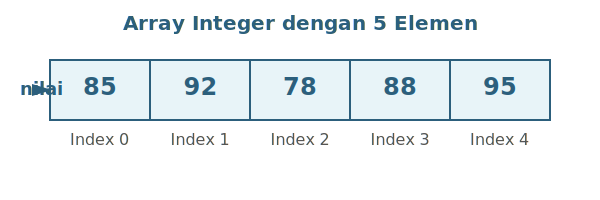
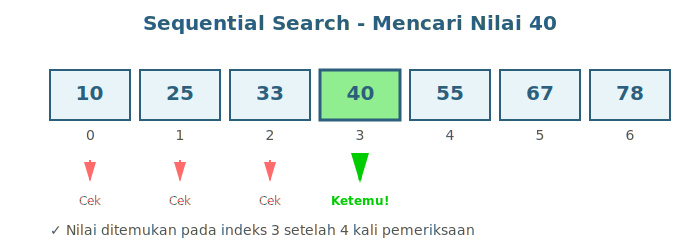

# BAB 9: ARRAY 1D DAN OPERASINYA

## 9.1 Pendahuluan

Selamat datang di pertemuan kesembilan mata kuliah Dasar-Dasar Pemrograman. Setelah mempelajari berbagai struktur kontrol dan fungsi, kita akan memasuki topik yang sangat penting dalam pemrograman: array atau larik. Array merupakan struktur data fundamental yang memungkinkan kita menyimpan dan mengelola sekumpulan data dengan tipe yang sama secara terorganisir.

Bayangkan Anda diminta untuk menyimpan nilai ujian dari 50 mahasiswa. Tanpa array, Anda harus membuat 50 variabel terpisah: nilai1, nilai2, nilai3, dan seterusnya hingga nilai50. Hal ini tentu sangat tidak efisien dan sulit untuk dikelola. Dengan array, kita dapat menyimpan semua nilai tersebut dalam satu struktur data yang dapat diakses menggunakan indeks.

Pada bab ini, kita akan mempelajari konsep dasar array satu dimensi, cara mendeklarasikan dan menginisialisasi array, bagaimana mengakses dan memanipulasi elemen array, serta berbagai operasi dan algoritma yang dapat diterapkan pada array seperti pencarian. Pemahaman mendalam tentang array akan menjadi fondasi penting untuk mempelajari struktur data yang lebih kompleks di masa depan.

## 9.2 Konsep Dasar Array

### 9.2.1 Pengertian Array

Array adalah struktur data yang dapat menyimpan sekumpulan elemen dengan tipe data yang sama dalam satu nama variabel. Setiap elemen dalam array disimpan secara berurutan di dalam memori komputer dan dapat diakses menggunakan indeks atau posisi elemennya. Array dapat diibaratkan seperti deretan loker di sekolah, dimana setiap loker memiliki nomor (indeks) dan dapat menyimpan barang (data).

Dalam bahasa C++, array memiliki karakteristik khusus yang membedakannya dari variabel biasa. Pertama, semua elemen dalam array harus memiliki tipe data yang sama. Jika kita mendeklarasikan array bertipe integer, maka semua elemen di dalamnya harus berupa integer. Kedua, ukuran array bersifat tetap setelah dideklarasikan. Ketiga, elemen array disimpan secara berurutan dalam memori, sehingga akses ke elemen array sangat efisien.

Keuntungan menggunakan array adalah kita dapat mengelola data dalam jumlah besar dengan lebih mudah. Kita dapat menggunakan perulangan untuk memproses seluruh elemen array tanpa harus menulis kode yang berulang-ulang. Selain itu, array juga memudahkan kita dalam menerapkan berbagai algoritma pengolahan data seperti pencarian dan perhitungan statistik.

### 9.2.2 Indeks Array

Setiap elemen dalam array memiliki posisi yang disebut indeks. Hal yang sangat penting untuk diingat adalah bahwa di bahasa C++, indeks array dimulai dari 0 (zero-based indexing). Ini berarti elemen pertama dalam array berada pada indeks 0, elemen kedua pada indeks 1, dan seterusnya. Jika array memiliki n elemen, maka indeks terakhir adalah n-1.

Konsep indeks yang dimulai dari 0 sering membingungkan bagi pemula, namun ada alasan teknis di baliknya. Dalam implementasi di tingkat memori, indeks sebenarnya merepresentasikan offset atau perpindahan dari alamat awal array. Elemen pertama tidak memiliki offset (offset 0), sehingga menggunakan indeks 0.

Memahami sistem indeks yang dimulai dari 0 sangat penting untuk menghindari kesalahan umum seperti "array index out of bounds" yaitu mencoba mengakses indeks yang tidak ada dalam array. Misalnya, jika kita memiliki array dengan 10 elemen, mencoba mengakses elemen dengan indeks 10 akan menyebabkan error karena indeks yang valid hanya 0 sampai 9.

### 9.2.3 Visualisasi Array dalam Memori

Untuk memahami array dengan lebih baik, mari kita visualisasikan bagaimana array disimpan dalam memori komputer. Misalkan kita memiliki array integer bernama "nilai" dengan 5 elemen. Array ini akan disimpan dalam memori sebagai berikut:



**Gambar 9.1:** Visualisasi array integer "nilai" dengan 5 elemen yang disimpan secara berurutan dalam memori. Setiap kotak merepresentasikan satu elemen array dengan indeks yang dimulai dari 0.

## 9.3 Deklarasi dan Inisialisasi Array

### 9.3.1 Deklarasi Array

Untuk menggunakan array dalam program C++, kita harus terlebih dahulu mendeklarasikannya. Deklarasi array memberitahu compiler tentang tipe data elemen array, nama array, dan jumlah elemen yang akan disimpan. Sintaks dasar deklarasi array adalah sebagai berikut:

```
tipe_data nama_array[ukuran];
```

Di sini, `tipe_data` adalah tipe data dari elemen-elemen array (seperti int, float, double, atau char), `nama_array` adalah identifier atau nama yang kita berikan untuk array tersebut, dan `ukuran` adalah jumlah elemen yang dapat ditampung oleh array. Ukuran array harus berupa konstanta atau nilai literal, bukan variabel yang nilainya baru diketahui saat program berjalan.

Berikut adalah beberapa contoh deklarasi array:

```cpp
int nilai[10];           // Array integer dengan 10 elemen
float suhu[7];           // Array float dengan 7 elemen  
double gaji[50];         // Array double dengan 50 elemen
char nama[30];           // Array karakter dengan 30 elemen
```

**Kode 9.1:** Contoh deklarasi array dengan berbagai tipe data dan ukuran.

Setelah deklarasi, array tersebut telah dialokasikan dalam memori dan siap digunakan. Namun perlu diingat bahwa nilai awal elemen array yang baru dideklarasikan bersifat tidak terdefinisi (garbage value), kecuali jika array dideklarasikan sebagai variabel global atau static, yang secara otomatis akan diinisialisasi dengan nilai 0.

### 9.3.2 Inisialisasi Array

Inisialisasi array adalah proses memberikan nilai awal kepada elemen-elemen array. Ada beberapa cara untuk menginisialisasi array dalam C++. Cara yang paling sederhana adalah dengan memberikan nilai-nilai awal saat deklarasi menggunakan daftar inisialisasi yang diapit oleh kurung kurawal.

```cpp
int angka[5] = {10, 20, 30, 40, 50};
```

**Kode 9.2:** Inisialisasi array dengan memberikan semua nilai elemen saat deklarasi.

Dalam contoh di atas, kita mendeklarasikan array `angka` dengan 5 elemen dan langsung memberikan nilai ke semua elemen. Elemen pertama (indeks 0) berisi nilai 10, elemen kedua (indeks 1) berisi 20, dan seterusnya.

Jika jumlah nilai dalam daftar inisialisasi lebih sedikit dari ukuran array, maka elemen-elemen yang tidak disebutkan akan diinisialisasi dengan nilai 0:

```cpp
int data[7] = {5, 10, 15};  // data[0]=5, data[1]=10, data[2]=15
                            // data[3]=0, data[4]=0, data[5]=0, data[6]=0
```

**Kode 9.3:** Inisialisasi parsial - elemen yang tidak disebutkan akan bernilai 0.

Kita juga dapat menginisialisasi semua elemen array dengan nilai 0 dengan cara berikut:

```cpp
int kosong[10] = {0};  // Semua 10 elemen bernilai 0
```

**Kode 9.4:** Cara cepat menginisialisasi semua elemen array dengan nilai 0.

Dalam C++11 dan versi yang lebih baru, kita dapat menggunakan sintaks inisialisasi list tanpa tanda sama dengan:

```cpp
int nilai[5] {85, 90, 78, 92, 88};
```

**Kode 9.5:** Sintaks inisialisasi modern C++11 tanpa menggunakan tanda sama dengan.

### 9.3.3 Array dengan Ukuran Implisit

C++ memungkinkan kita untuk mendeklarasikan array tanpa menentukan ukurannya secara eksplisit, asalkan kita melakukan inisialisasi. Compiler akan secara otomatis menentukan ukuran array berdasarkan jumlah elemen dalam daftar inisialisasi:

```cpp
int primes[] = {2, 3, 5, 7, 11, 13};  // Ukuran array otomatis 6
```

**Kode 9.6:** Deklarasi array dengan ukuran implisit - compiler menghitung jumlah elemen.

Pendekatan ini berguna ketika kita tidak ingin menghitung manual jumlah elemen yang kita inisialisasi, dan juga memudahkan ketika kita ingin menambah atau mengurangi elemen tanpa harus mengubah ukuran array secara manual.

### 9.3.4 Menggunakan Konstanta untuk Ukuran Array

Dalam praktik pemrograman yang baik, disarankan untuk menggunakan konstanta bernama ketika mendefinisikan ukuran array, bukan angka literal. Ini membuat kode lebih mudah dibaca dan dipelihara:

```cpp
const int UKURAN = 50;
int nilai[UKURAN];

// Atau menggunakan #define (cara lama)
#define MAX_MAHASISWA 100
float ipk[MAX_MAHASISWA];
```

**Kode 9.7:** Menggunakan konstanta untuk mendefinisikan ukuran array - praktik pemrograman yang baik.

Dengan menggunakan konstanta, jika kita perlu mengubah ukuran array di kemudian hari, kita hanya perlu mengubah nilai konstanta di satu tempat, bukan mencari dan mengubah semua angka literal di seluruh program.

## 9.4 Akses dan Manipulasi Elemen Array

### 9.4.1 Mengakses Elemen Array

Setelah array dideklarasikan dan diinisialisasi, kita dapat mengakses elemen individual menggunakan operator subscript atau tanda kurung siku `[]`. Untuk mengakses elemen tertentu, kita menuliskan nama array diikuti dengan indeks elemen dalam kurung siku:

```cpp
#include <iostream>
using namespace std;

int main() {
    int nilai[5] = {85, 92, 78, 88, 95};
    
    // Mengakses dan menampilkan elemen array
    cout << "Nilai pertama: " << nilai[0] << endl;
    cout << "Nilai ketiga: " << nilai[2] << endl;
    cout << "Nilai terakhir: " << nilai[4] << endl;
    
    return 0;
}
```

**Kode 9.8:** Program untuk mengakses dan menampilkan elemen-elemen tertentu dari array.

Output program:
```
Nilai pertama: 85
Nilai ketiga: 78
Nilai terakhir: 95
```

Perhatikan bahwa untuk mengakses elemen terakhir dari array dengan 5 elemen, kita menggunakan indeks 4, bukan 5. Ini karena indeks array dimulai dari 0.

### 9.4.2 Memodifikasi Elemen Array

Kita dapat mengubah nilai elemen array dengan mengakses elemen tersebut melalui indeksnya dan memberikan nilai baru menggunakan operator assignment:

```cpp
#include <iostream>
using namespace std;

int main() {
    int skor[3] = {75, 80, 85};
    
    cout << "Nilai awal:" << endl;
    cout << "skor[0] = " << skor[0] << endl;
    cout << "skor[1] = " << skor[1] << endl;
    cout << "skor[2] = " << skor[2] << endl;
    
    // Memodifikasi nilai elemen
    skor[0] = 90;
    skor[1] = 95;
    skor[2] = 88;
    
    cout << "\nNilai setelah dimodifikasi:" << endl;
    cout << "skor[0] = " << skor[0] << endl;
    cout << "skor[1] = " << skor[1] << endl;
    cout << "skor[2] = " << skor[2] << endl;
    
    return 0;
}
```

**Kode 9.9:** Program yang mendemonstrasikan perubahan nilai elemen array.

Output program:
```
Nilai awal:
skor[0] = 75
skor[1] = 80
skor[2] = 85

Nilai setelah dimodifikasi:
skor[0] = 90
skor[1] = 95
skor[2] = 88
```

### 9.4.3 Menggunakan Perulangan untuk Memproses Array

Salah satu kekuatan array adalah kemampuannya untuk diproses menggunakan perulangan. Dengan perulangan, kita dapat mengakses dan memanipulasi semua elemen array secara efisien tanpa harus menulis kode yang berulang-ulang:

```cpp
#include <iostream>
using namespace std;

int main() {
    const int UKURAN = 5;
    int nilai[UKURAN];
    
    // Input nilai menggunakan loop
    cout << "Masukkan " << UKURAN << " nilai:" << endl;
    for (int i = 0; i < UKURAN; i++) {
        cout << "Nilai ke-" << (i + 1) << ": ";
        cin >> nilai[i];
    }
    
    // Menampilkan nilai menggunakan loop
    cout << "\nNilai yang dimasukkan:" << endl;
    for (int i = 0; i < UKURAN; i++) {
        cout << "nilai[" << i << "] = " << nilai[i] << endl;
    }
    
    return 0;
}
```

**Kode 9.10:** Program yang menggunakan perulangan for untuk input dan output array.

Perhatikan bahwa dalam perulangan, kita menggunakan kondisi `i < UKURAN` bukan `i <= UKURAN`. Ini penting untuk menghindari akses ke indeks yang tidak valid (array index out of bounds).

### 9.4.4 Range-Based For Loop (C++11)

C++11 memperkenalkan range-based for loop yang membuat iterasi melalui array menjadi lebih sederhana dan mudah dibaca:

```cpp
#include <iostream>
using namespace std;

int main() {
    int angka[] = {10, 20, 30, 40, 50};
    
    cout << "Elemen array menggunakan range-based for:" << endl;
    for (int n : angka) {
        cout << n << " ";
    }
    cout << endl;
    
    return 0;
}
```

**Kode 9.11:** Program menggunakan range-based for loop untuk iterasi array (C++11).

Range-based for loop sangat berguna ketika kita hanya perlu membaca nilai elemen tanpa perlu tahu indeksnya. Namun, jika kita perlu memodifikasi elemen atau tahu posisi indeks, kita harus menggunakan perulangan for tradisional atau menggunakan referensi dalam range-based for.

## 9.5 Array sebagai Parameter Fungsi

### 9.5.1 Passing Array ke Fungsi

Array dapat dikirimkan sebagai parameter ke fungsi, memungkinkan kita untuk membuat fungsi yang dapat memproses array. Ketika array dikirimkan ke fungsi, yang sebenarnya dikirim adalah alamat memori dari elemen pertama array (pointer), bukan salinan seluruh array. Ini berarti modifikasi yang dilakukan terhadap array di dalam fungsi akan mempengaruhi array aslinya.

Sintaks untuk mendeklarasikan fungsi yang menerima array sebagai parameter:

```cpp
void nama_fungsi(tipe_data nama_array[], int ukuran)
```

Perhatikan bahwa kita biasanya juga mengirimkan ukuran array sebagai parameter terpisah, karena fungsi tidak dapat mengetahui ukuran array hanya dari parameter array itu sendiri.

```cpp
#include <iostream>
using namespace std;

void tampilkanArray(int arr[], int n) {
    cout << "Elemen array: ";
    for (int i = 0; i < n; i++) {
        cout << arr[i] << " ";
    }
    cout << endl;
}

int main() {
    int data[] = {5, 10, 15, 20, 25};
    int ukuran = 5;
    
    tampilkanArray(data, ukuran);
    
    return 0;
}
```

**Kode 9.12:** Program dengan fungsi yang menerima array sebagai parameter dan menampilkan isinya.

### 9.5.2 Memodifikasi Array dalam Fungsi

Karena array dikirim by reference (melalui pointer), setiap perubahan yang kita lakukan terhadap array di dalam fungsi akan mempengaruhi array aslinya:

```cpp
#include <iostream>
using namespace std;

void kalikanDua(int arr[], int n) {
    for (int i = 0; i < n; i++) {
        arr[i] *= 2;  // Kalikan setiap elemen dengan 2
    }
}

void tampilkan(int arr[], int n) {
    for (int i = 0; i < n; i++) {
        cout << arr[i] << " ";
    }
    cout << endl;
}

int main() {
    int angka[] = {1, 2, 3, 4, 5};
    int ukuran = 5;
    
    cout << "Array sebelum dimodifikasi: ";
    tampilkan(angka, ukuran);
    
    kalikanDua(angka, ukuran);
    
    cout << "Array setelah dimodifikasi: ";
    tampilkan(angka, ukuran);
    
    return 0;
}
```

**Kode 9.13:** Program yang mendemonstrasikan modifikasi array melalui fungsi.

Output program:
```
Array sebelum dimodifikasi: 1 2 3 4 5 
Array setelah dimodifikasi: 2 4 6 8 10
```

### 9.5.3 Fungsi yang Mengembalikan Nilai dari Array

Meskipun kita tidak dapat mengembalikan array secara langsung dari fungsi (return array), kita dapat membuat fungsi yang melakukan operasi pada array dan mengembalikan nilai tertentu, seperti hasil perhitungan:

```cpp
#include <iostream>
using namespace std;

int hitungJumlah(int arr[], int n) {
    int total = 0;
    for (int i = 0; i < n; i++) {
        total += arr[i];
    }
    return total;
}

double hitungRataRata(int arr[], int n) {
    int total = hitungJumlah(arr, n);
    return (double)total / n;
}

int main() {
    int nilai[] = {85, 90, 78, 92, 88};
    int ukuran = 5;
    
    int jumlah = hitungJumlah(nilai, ukuran);
    double rataRata = hitungRataRata(nilai, ukuran);
    
    cout << "Jumlah nilai: " << jumlah << endl;
    cout << "Rata-rata nilai: " << rataRata << endl;
    
    return 0;
}
```

**Kode 9.14:** Program dengan fungsi yang menghitung jumlah dan rata-rata elemen array.

Output program:
```
Jumlah nilai: 433
Rata-rata nilai: 86.6
```

## 9.6 Operasi Dasar pada Array

### 9.6.1 Mencari Nilai Maksimum dan Minimum

Salah satu operasi yang sering dilakukan pada array adalah mencari nilai terbesar (maksimum) dan terkecil (minimum). Algoritma dasarnya adalah dengan mengasumsikan elemen pertama sebagai nilai maksimum atau minimum, kemudian membandingkannya dengan elemen-elemen lainnya:

```cpp
#include <iostream>
using namespace std;

int cariMaksimum(int arr[], int n) {
    int maks = arr[0];  // Asumsikan elemen pertama adalah maksimum
    for (int i = 1; i < n; i++) {
        if (arr[i] > maks) {
            maks = arr[i];
        }
    }
    return maks;
}

int cariMinimum(int arr[], int n) {
    int min = arr[0];  // Asumsikan elemen pertama adalah minimum
    for (int i = 1; i < n; i++) {
        if (arr[i] < min) {
            min = arr[i];
        }
    }
    return min;
}

int main() {
    int data[] = {45, 23, 67, 12, 89, 34, 56};
    int ukuran = 7;
    
    int maks = cariMaksimum(data, ukuran);
    int min = cariMinimum(data, ukuran);
    
    cout << "Nilai maksimum: " << maks << endl;
    cout << "Nilai minimum: " << min << endl;
    
    return 0;
}
```

**Kode 9.15:** Program untuk mencari nilai maksimum dan minimum dalam array.

Output program:
```
Nilai maksimum: 89
Nilai minimum: 12
```

### 9.6.2 Menghitung Statistik Dasar

Array sangat berguna untuk menyimpan data yang akan dianalisis secara statistik. Kita dapat menghitung berbagai statistik dasar seperti jumlah, rata-rata, dan varian:

```cpp
#include <iostream>
#include <iomanip>
#include <cmath>
using namespace std;

double hitungRataRata(int arr[], int n) {
    double total = 0;
    for (int i = 0; i < n; i++) {
        total += arr[i];
    }
    return total / n;
}

double hitungVariansi(int arr[], int n) {
    double rataRata = hitungRataRata(arr, n);
    double jumlahKuadratSelisih = 0;
    
    for (int i = 0; i < n; i++) {
        double selisih = arr[i] - rataRata;
        jumlahKuadratSelisih += selisih * selisih;
    }
    
    return jumlahKuadratSelisih / n;
}

double hitungStandarDeviasi(int arr[], int n) {
    return sqrt(hitungVariansi(arr, n));
}

int main() {
    int nilai[] = {85, 90, 78, 92, 88, 76, 95, 82};
    int ukuran = 8;
    
    double rataRata = hitungRataRata(nilai, ukuran);
    double variansi = hitungVariansi(nilai, ukuran);
    double stdDev = hitungStandarDeviasi(nilai, ukuran);
    
    cout << fixed << setprecision(2);
    cout << "Rata-rata: " << rataRata << endl;
    cout << "Variansi: " << variansi << endl;
    cout << "Standar Deviasi: " << stdDev << endl;
    
    return 0;
}
```

**Kode 9.16:** Program untuk menghitung statistik dasar dari data dalam array.

### 9.6.3 Membalik Urutan Array

Operasi lain yang sering dilakukan adalah membalik urutan elemen dalam array (reverse). Algoritma yang efisien adalah dengan menukar elemen dari kedua ujung array secara bertahap menuju tengah:

```cpp
#include <iostream>
using namespace std;

void balikArray(int arr[], int n) {
    int awal = 0;
    int akhir = n - 1;
    
    while (awal < akhir) {
        // Tukar elemen pada posisi awal dan akhir
        int temp = arr[awal];
        arr[awal] = arr[akhir];
        arr[akhir] = temp;
        
        // Geser pointer
        awal++;
        akhir--;
    }
}

void tampilkanArray(int arr[], int n) {
    for (int i = 0; i < n; i++) {
        cout << arr[i] << " ";
    }
    cout << endl;
}

int main() {
    int angka[] = {1, 2, 3, 4, 5, 6, 7, 8};
    int ukuran = 8;
    
    cout << "Array sebelum dibalik: ";
    tampilkanArray(angka, ukuran);
    
    balikArray(angka, ukuran);
    
    cout << "Array setelah dibalik: ";
    tampilkanArray(angka, ukuran);
    
    return 0;
}
```

**Kode 9.17:** Program untuk membalik urutan elemen dalam array.

Output program:
```
Array sebelum dibalik: 1 2 3 4 5 6 7 8 
Array setelah dibalik: 8 7 6 5 4 3 2 1
```

### 9.6.4 Menyalin Array

Karena di C++ kita tidak dapat menyalin array dengan operator assignment biasa, kita perlu membuat fungsi khusus untuk menyalin elemen dari satu array ke array lain:

```cpp
#include <iostream>
using namespace std;

void salinArray(int sumber[], int tujuan[], int n) {
    for (int i = 0; i < n; i++) {
        tujuan[i] = sumber[i];
    }
}

void tampilkanArray(int arr[], int n) {
    for (int i = 0; i < n; i++) {
        cout << arr[i] << " ";
    }
    cout << endl;
}

int main() {
    int asli[] = {10, 20, 30, 40, 50};
    int salinan[5];
    int ukuran = 5;
    
    cout << "Array asli: ";
    tampilkanArray(asli, ukuran);
    
    salinArray(asli, salinan, ukuran);
    
    cout << "Array salinan: ";
    tampilkanArray(salinan, ukuran);
    
    // Modifikasi array salinan tidak mempengaruhi array asli
    salinan[0] = 99;
    
    cout << "\nSetelah mengubah salinan[0] = 99:" << endl;
    cout << "Array asli: ";
    tampilkanArray(asli, ukuran);
    cout << "Array salinan: ";
    tampilkanArray(salinan, ukuran);
    
    return 0;
}
```

**Kode 9.18:** Program untuk menyalin array dan mendemonstrasikan independensi antara array asli dan salinan.

### 9.6.5 Menggabungkan Dua Array

Menggabungkan dua array menjadi satu array yang lebih besar adalah operasi yang sering diperlukan. Berikut adalah implementasinya:

```cpp
#include <iostream>
using namespace std;

void gabungArray(int arr1[], int n1, int arr2[], int n2, int hasil[]) {
    // Salin elemen dari array pertama
    for (int i = 0; i < n1; i++) {
        hasil[i] = arr1[i];
    }
    
    // Salin elemen dari array kedua
    for (int i = 0; i < n2; i++) {
        hasil[n1 + i] = arr2[i];
    }
}

void tampilkanArray(int arr[], int n) {
    for (int i = 0; i < n; i++) {
        cout << arr[i] << " ";
    }
    cout << endl;
}

int main() {
    int array1[] = {1, 3, 5, 7};
    int array2[] = {2, 4, 6, 8, 10};
    int ukuran1 = 4;
    int ukuran2 = 5;
    int ukuranHasil = ukuran1 + ukuran2;
    int hasil[9];  // ukuran1 + ukuran2
    
    cout << "Array 1: ";
    tampilkanArray(array1, ukuran1);
    
    cout << "Array 2: ";
    tampilkanArray(array2, ukuran2);
    
    gabungArray(array1, ukuran1, array2, ukuran2, hasil);
    
    cout << "Array hasil penggabungan: ";
    tampilkanArray(hasil, ukuranHasil);
    
    return 0;
}
```

**Kode 9.19:** Program untuk menggabungkan dua array menjadi satu array.

Output program:
```
Array 1: 1 3 5 7 
Array 2: 2 4 6 8 10 
Array hasil penggabungan: 1 3 5 7 2 4 6 8 10
```

## 9.7 Algoritma Pencarian pada Array

### 9.7.1 Sequential Search (Pencarian Berurutan)

Sequential search atau pencarian berurutan adalah algoritma pencarian paling sederhana. Algoritma ini bekerja dengan memeriksa setiap elemen array satu per satu dari awal hingga akhir sampai elemen yang dicari ditemukan atau seluruh array telah diperiksa.



**Gambar 9.2:** Ilustrasi proses sequential search. Algoritma memeriksa setiap elemen secara berurutan dari kiri ke kanan hingga nilai yang dicari ditemukan.

Implementasi algoritma sequential search dalam C++:

```cpp
#include <iostream>
using namespace std;

int sequentialSearch(int arr[], int n, int kunci) {
    for (int i = 0; i < n; i++) {
        if (arr[i] == kunci) {
            return i;  // Mengembalikan indeks jika ditemukan
        }
    }
    return -1;  // Mengembalikan -1 jika tidak ditemukan
}

int main() {
    int data[] = {10, 25, 33, 40, 55, 67, 78};
    int ukuran = 7;
    int nilaiDicari;
    
    cout << "Masukkan nilai yang ingin dicari: ";
    cin >> nilaiDicari;
    
    int hasil = sequentialSearch(data, ukuran, nilaiDicari);
    
    if (hasil != -1) {
        cout << "Nilai " << nilaiDicari << " ditemukan pada indeks " << hasil << endl;
    } else {
        cout << "Nilai " << nilaiDicari << " tidak ditemukan dalam array" << endl;
    }
    
    return 0;
}
```

**Kode 9.20:** Implementasi algoritma sequential search untuk mencari nilai dalam array.

### 9.7.2 Analisis Kompleksitas Sequential Search

Sequential search memiliki kompleksitas waktu O(n) dimana n adalah jumlah elemen dalam array. Dalam kasus terbaik (best case), elemen yang dicari berada di posisi pertama, sehingga hanya memerlukan satu kali pemeriksaan. Dalam kasus terburuk (worst case), elemen yang dicari berada di posisi terakhir atau tidak ada dalam array, sehingga memerlukan n kali pemeriksaan.

Keuntungan sequential search adalah algoritma ini sangat sederhana dan dapat digunakan pada array yang tidak terurut. Namun, kelemahannya adalah efisiensi yang rendah untuk array berukuran besar, karena harus memeriksa elemen satu per satu.

### 9.7.3 Sequential Search dengan Pencatatan Posisi

Terkadang kita perlu mencari semua kemunculan suatu nilai dalam array, bukan hanya kemunculan pertama. Berikut adalah implementasi yang mencatat semua posisi kemunculan:

```cpp
#include <iostream>
using namespace std;

void cariSemuaPosisi(int arr[], int n, int kunci) {
    bool ditemukan = false;
    
    cout << "Mencari nilai " << kunci << " dalam array..." << endl;
    
    for (int i = 0; i < n; i++) {
        if (arr[i] == kunci) {
            cout << "Ditemukan pada indeks " << i << endl;
            ditemukan = true;
        }
    }
    
    if (!ditemukan) {
        cout << "Nilai " << kunci << " tidak ditemukan dalam array" << endl;
    }
}

int main() {
    int data[] = {5, 3, 8, 5, 2, 8, 5, 1, 3, 8};
    int ukuran = 10;
    int nilaiDicari;
    
    cout << "Array: ";
    for (int i = 0; i < ukuran; i++) {
        cout << data[i] << " ";
    }
    cout << endl;
    
    cout << "\nMasukkan nilai yang ingin dicari: ";
    cin >> nilaiDicari;
    
    cariSemuaPosisi(data, ukuran, nilaiDicari);
    
    return 0;
}
```

**Kode 9.21:** Program sequential search yang mencari semua kemunculan suatu nilai.

### 9.7.4 Sequential Search dengan Counter

Variasi lain dari sequential search adalah menghitung berapa kali suatu nilai muncul dalam array:

```cpp
#include <iostream>
using namespace std;

int hitungKemunculan(int arr[], int n, int kunci) {
    int jumlah = 0;
    for (int i = 0; i < n; i++) {
        if (arr[i] == kunci) {
            jumlah++;
        }
    }
    return jumlah;
}

int main() {
    int data[] = {5, 3, 8, 5, 2, 8, 5, 1, 3, 8};
    int ukuran = 10;
    int nilaiDicari;
    
    cout << "Array: ";
    for (int i = 0; i < ukuran; i++) {
        cout << data[i] << " ";
    }
    cout << endl;
    
    cout << "\nMasukkan nilai yang ingin dicari: ";
    cin >> nilaiDicari;
    
    int jumlah = hitungKemunculan(data, ukuran, nilaiDicari);
    
    if (jumlah > 0) {
        cout << "Nilai " << nilaiDicari << " muncul sebanyak " << jumlah << " kali" << endl;
    } else {
        cout << "Nilai " << nilaiDicari << " tidak ditemukan dalam array" << endl;
    }
    
    return 0;
}
```

**Kode 9.22:** Program untuk menghitung berapa kali suatu nilai muncul dalam array.

## 9.8 Studi Kasus: Aplikasi Array

### 9.8.1 Sistem Nilai Mahasiswa

Berikut adalah contoh aplikasi lengkap yang menggunakan array untuk mengelola data nilai mahasiswa:

```cpp
#include <iostream>
#include <iomanip>
using namespace std;

const int MAX_MHS = 50;

void inputData(int nilai[], int &jumlah) {
    cout << "Masukkan jumlah mahasiswa (max " << MAX_MHS << "): ";
    cin >> jumlah;
    
    if (jumlah > MAX_MHS) {
        jumlah = MAX_MHS;
        cout << "Jumlah dibatasi hingga " << MAX_MHS << " mahasiswa" << endl;
    }
    
    for (int i = 0; i < jumlah; i++) {
        cout << "Nilai mahasiswa ke-" << (i + 1) << ": ";
        cin >> nilai[i];
    }
}

double hitungRataRata(int nilai[], int jumlah) {
    double total = 0;
    for (int i = 0; i < jumlah; i++) {
        total += nilai[i];
    }
    return total / jumlah;
}

int nilaiTertinggi(int nilai[], int jumlah) {
    int maks = nilai[0];
    for (int i = 1; i < jumlah; i++) {
        if (nilai[i] > maks) {
            maks = nilai[i];
        }
    }
    return maks;
}

int nilaiTerendah(int nilai[], int jumlah) {
    int min = nilai[0];
    for (int i = 1; i < jumlah; i++) {
        if (nilai[i] < min) {
            min = nilai[i];
        }
    }
    return min;
}

int hitungLulus(int nilai[], int jumlah, int batasLulus) {
    int jumlahLulus = 0;
    for (int i = 0; i < jumlah; i++) {
        if (nilai[i] >= batasLulus) {
            jumlahLulus++;
        }
    }
    return jumlahLulus;
}

void tampilkanStatistik(int nilai[], int jumlah) {
    cout << "\n=== STATISTIK NILAI MAHASISWA ===" << endl;
    cout << fixed << setprecision(2);
    cout << "Jumlah mahasiswa: " << jumlah << endl;
    cout << "Rata-rata nilai: " << hitungRataRata(nilai, jumlah) << endl;
    cout << "Nilai tertinggi: " << nilaiTertinggi(nilai, jumlah) << endl;
    cout << "Nilai terendah: " << nilaiTerendah(nilai, jumlah) << endl;
    
    int batasLulus = 60;
    int lulus = hitungLulus(nilai, jumlah, batasLulus);
    int tidakLulus = jumlah - lulus;
    
    cout << "Jumlah lulus (>= " << batasLulus << "): " << lulus << endl;
    cout << "Jumlah tidak lulus: " << tidakLulus << endl;
    cout << "Persentase kelulusan: " << (lulus * 100.0 / jumlah) << "%" << endl;
}

int main() {
    int nilai[MAX_MHS];
    int jumlahMahasiswa;
    
    cout << "=== SISTEM PENGELOLAAN NILAI MAHASISWA ===" << endl;
    inputData(nilai, jumlahMahasiswa);
    tampilkanStatistik(nilai, jumlahMahasiswa);
    
    return 0;
}
```

**Kode 9.23:** Aplikasi lengkap sistem pengelolaan nilai mahasiswa menggunakan array dan fungsi-fungsi.

### 9.8.2 Program Analisis Frekuensi Data

Berikut adalah contoh program yang menganalisis frekuensi kemunculan nilai dalam array:

```cpp
#include <iostream>
using namespace std;

void hitungFrekuensi(int data[], int n) {
    bool sudahDihitung[100] = {false};  // Asumsi nilai max 100
    
    cout << "\n=== FREKUENSI KEMUNCULAN DATA ===" << endl;
    
    for (int i = 0; i < n; i++) {
        if (!sudahDihitung[data[i]]) {
            int frek = 0;
            for (int j = 0; j < n; j++) {
                if (data[j] == data[i]) {
                    frek++;
                }
            }
            cout << "Nilai " << data[i] << " muncul " << frek << " kali" << endl;
            sudahDihitung[data[i]] = true;
        }
    }
}

int main() {
    int data[] = {5, 3, 8, 5, 2, 8, 5, 1, 3, 8, 2, 5};
    int ukuran = 12;
    
    cout << "Data: ";
    for (int i = 0; i < ukuran; i++) {
        cout << data[i] << " ";
    }
    cout << endl;
    
    hitungFrekuensi(data, ukuran);
    
    return 0;
}
```

**Kode 9.24:** Program untuk menganalisis frekuensi kemunculan data dalam array.

### 9.8.3 Program Pencarian Nilai Unik

Program ini mencari dan menampilkan semua nilai unik (yang tidak duplikat) dalam array:

```cpp
#include <iostream>
using namespace std;

void tampilkanNilaiUnik(int arr[], int n) {
    cout << "Nilai-nilai unik dalam array: ";
    
    for (int i = 0; i < n; i++) {
        bool unik = true;
        
        // Cek apakah nilai sudah pernah muncul sebelumnya
        for (int j = 0; j < i; j++) {
            if (arr[i] == arr[j]) {
                unik = false;
                break;
            }
        }
        
        // Jika unik, tampilkan
        if (unik) {
            cout << arr[i] << " ";
        }
    }
    cout << endl;
}

int main() {
    int data[] = {5, 3, 8, 5, 2, 8, 5, 1, 3, 8, 2, 5, 9};
    int ukuran = 13;
    
    cout << "Data asli: ";
    for (int i = 0; i < ukuran; i++) {
        cout << data[i] << " ";
    }
    cout << endl;
    
    tampilkanNilaiUnik(data, ukuran);
    
    return 0;
}
```

**Kode 9.25:** Program untuk mencari dan menampilkan nilai-nilai unik dalam array.

Output program:
```
Data asli: 5 3 8 5 2 8 5 1 3 8 2 5 9 
Nilai-nilai unik dalam array: 5 3 8 2 1 9
```

## Ringkasan Bab

Pada bab ini kita telah mempelajari konsep fundamental array satu dimensi dalam pemrograman C++. Array adalah struktur data yang memungkinkan kita menyimpan sekumpulan data dengan tipe yang sama dalam satu variabel, dengan setiap elemen dapat diakses menggunakan indeks yang dimulai dari 0.

Poin-poin penting yang telah kita pelajari meliputi: pertama, cara mendeklarasikan dan menginisialisasi array dengan berbagai metode; kedua, cara mengakses dan memanipulasi elemen array baik secara individual maupun menggunakan perulangan; ketiga, penggunaan array sebagai parameter fungsi dan implikasinya; keempat, operasi-operasi dasar pada array seperti mencari nilai maksimum/minimum, menghitung statistik, membalik array, dan menyalin array.

Selain itu, kita juga telah mempelajari algoritma sequential search untuk pencarian data dalam array, termasuk variasi-variasinya untuk mencari semua kemunculan dan menghitung frekuensi. Terakhir, kita melihat aplikasi praktis array melalui studi kasus sistem pengelolaan nilai mahasiswa dan analisis frekuensi data.

Pemahaman mendalam tentang array sangat penting karena array merupakan fondasi untuk mempelajari struktur data yang lebih kompleks seperti array multidimensi, pointer, dan struktur data dinamis. Konsep-konsep yang dipelajari dalam bab ini akan terus digunakan dalam pembelajaran pemrograman tingkat lanjut.

## Soal Latihan

### Latihan 1: Operasi Dasar Array
Buatlah program yang melakukan operasi berikut pada array integer:
1. Input 10 bilangan ke dalam array
2. Tampilkan semua elemen array
3. Hitung dan tampilkan jumlah semua elemen
4. Hitung dan tampilkan rata-rata
5. Tampilkan elemen pada indeks ganjil saja
6. Tampilkan elemen dengan nilai genap saja

### Latihan 2: Manipulasi Array
Buatlah program yang memiliki menu untuk:
1. Input array (maksimal 20 elemen)
2. Tampilkan array
3. Cari nilai tertentu dalam array (sequential search)
4. Balik urutan array
5. Hitung nilai maksimum dan minimum
6. Keluar

### Latihan 3: Statistik Lanjutan
Buatlah program untuk menganalisis data nilai ujian:
1. Input jumlah siswa dan nilai masing-masing
2. Hitung rata-rata, nilai tertinggi, dan nilai terendah
3. Tentukan grade (A: 85-100, B: 70-84, C: 60-69, D: 50-59, E: 0-49)
4. Tampilkan distribusi grade
5. Tampilkan siswa dengan nilai di atas rata-rata

### Latihan 4: Merge Two Arrays
Buatlah program yang:
1. Input dua array
2. Gabungkan kedua array menjadi satu array
3. Tampilkan array hasil penggabungan
4. Hitung dan tampilkan rata-rata array hasil penggabungan

Contoh:
```
Array 1: [10, 20, 30]
Array 2: [40, 50]
Hasil: [10, 20, 30, 40, 50]
```

### Latihan 5: Rotasi Array
Buatlah fungsi untuk merotasi array ke kanan sebanyak k posisi. Misalnya, jika array = [1, 2, 3, 4, 5] dan k = 2, maka hasil rotasi adalah [4, 5, 1, 2, 3].

### Latihan 6: Penghapusan Duplikat
Buatlah program yang menghapus elemen duplikat dari array dan menampilkan array dengan elemen unik saja.

Contoh:
```
Input: [1, 2, 2, 3, 4, 4, 4, 5, 6, 6]
Output: [1, 2, 3, 4, 5, 6]
```

### Latihan 7: Mencari Elemen Terbesar Kedua
Buatlah program yang mencari nilai terbesar kedua dalam array tanpa menggunakan algoritma sorting.

### Latihan 8: Analisis Data Penjualan
Buatlah program untuk menganalisis data penjualan harian selama sebulan (30 hari):
1. Input data penjualan per hari
2. Hitung total penjualan bulan tersebut
3. Hitung rata-rata penjualan per hari
4. Tampilkan hari dengan penjualan tertinggi dan terendah
5. Hitung berapa hari penjualan di atas rata-rata

## Soal Diskusi

### Diskusi 1: Efisiensi Memori
Diskusikan kelebihan dan kekurangan array dibandingkan dengan membuat banyak variabel terpisah. Dalam situasi apa array lebih efisien, dan dalam situasi apa mungkin tidak diperlukan?

### Diskusi 2: Index Out of Bounds
Jelaskan apa yang terjadi jika kita mengakses elemen array di luar batas yang valid (misalnya, mengakses indeks 10 pada array dengan ukuran 5). Mengapa compiler C++ tidak selalu memberikan error saat kompilasi? Bagaimana cara mencegah error ini?

### Diskusi 3: Pass by Reference vs Pass by Value
Jelaskan mengapa array secara otomatis dikirim by reference (melalui pointer) ke fungsi, sementara variabel biasa dikirim by value. Apa implikasi dari perbedaan ini dalam pemrograman?

### Diskusi 4: Kompleksitas Sequential Search
Sequential search memiliki kompleksitas O(n). Diskusikan:
- Apa artinya kompleksitas O(n) dalam praktik?
- Bagaimana performa sequential search jika ukuran array diperbesar 10 kali lipat?
- Dalam kondisi apa sequential search masih merupakan pilihan yang baik?

### Diskusi 5: Array Statis vs Dinamis
Array yang kita pelajari dalam bab ini adalah array statis (ukuran tetap saat deklarasi). Diskusikan keterbatasan array statis dan apa saja masalah yang mungkin timbul dari keterbatasan ini. Bagaimana Anda akan menangani situasi di mana ukuran data tidak diketahui sebelumnya?

### Diskusi 6: Optimasi Pencarian
Diskusikan cara-cara untuk mengoptimasi pencarian dalam array, misalnya:
- Menyimpan elemen yang sering dicari di awal array
- Menggunakan array terurut untuk pencarian yang lebih cepat
- Menggunakan struktur data tambahan untuk mempercepat pencarian
Kapan optimasi-optimasi ini berguna dan kapan tidak perlu dilakukan?

### Diskusi 7: Aplikasi Nyata Array
Sebutkan dan jelaskan beberapa aplikasi nyata dari array dalam kehidupan sehari-hari atau dalam sistem komputer. Misalnya, bagaimana array digunakan dalam pengolahan gambar, pengolahan suara, atau sistem database? Berikan contoh konkret penggunaan array.

### Diskusi 8: Trade-off dalam Pemrograman
Dalam beberapa operasi array (seperti pencarian semua kemunculan atau penghapusan duplikat), kita sering menggunakan nested loop yang menghasilkan kompleksitas O(n²). Diskusikan trade-off antara:
- Kesederhanaan kode vs efisiensi
- Memory usage vs processing time
- Kapan kita harus memprioritaskan efisiensi dan kapan kesederhanaan lebih penting?

## Referensi

1. Deitel, P. & Deitel, H. (2020). *C++ How to Program* (10th ed.). Pearson Education. Chapter 7: Arrays and Vectors.

2. Savitch, W. (2017). *Problem Solving with C++* (10th ed.). Pearson. Chapter 7: Arrays.

3. Stroustrup, B. (2014). *Programming: Principles and Practice Using C++* (2nd ed.). Addison-Wesley Professional. Chapter 20: Containers and Iterators.

4. Lippman, S. B., Lajoie, J., & Moo, B. E. (2012). *C++ Primer* (5th ed.). Addison-Wesley Professional. Chapter 3: Strings, Vectors, and Arrays.

5. Prata, S. (2011). *C++ Primer Plus* (6th ed.). Addison-Wesley Professional. Chapter 4: Compound Types (Arrays).

6. Malik, D. S. (2017). *C++ Programming: From Problem Analysis to Program Design* (8th ed.). Cengage Learning. Chapter 8: Arrays and Strings.

7. Cormen, T. H., Leiserson, C. E., Rivest, R. L., & Stein, C. (2009). *Introduction to Algorithms* (3rd ed.). MIT Press. Chapter 2: Getting Started.

---

*Bahan Ajar Pertemuan 9: Array 1D dan Operasinya*  
*Mata Kuliah: Dasar-Dasar Pemrograman*  
*CPMK 3 - Sub-CPMK 3.2*
