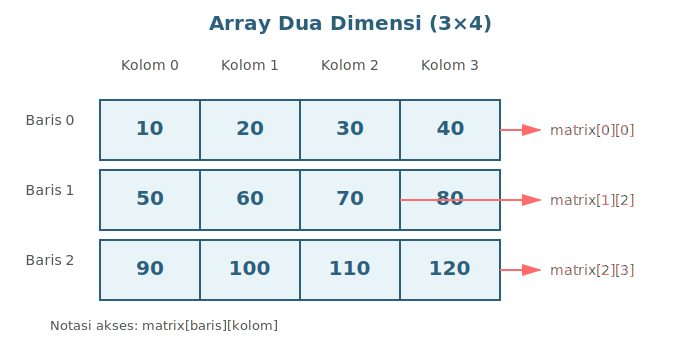
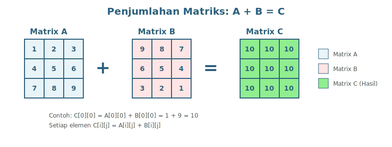

# BAB 10: ARRAY MULTIDIMENSI

[Slide](https://anindito.github.io/pertemuan-10/)

## 10.1 Pendahuluan

Selamat datang di pertemuan kesepuluh mata kuliah Dasar-Dasar Pemrograman. Pada pertemuan sebelumnya, kita telah mempelajari array satu dimensi yang dapat menyimpan sekumpulan data dalam bentuk baris. Pada pertemuan ini, kita akan melangkah lebih jauh dengan mempelajari array multidimensi, khususnya array dua dimensi yang sangat berguna untuk merepresentasikan data dalam bentuk tabel atau matriks.

Bayangkan Anda diminta untuk menyimpan nilai ujian dari 30 mahasiswa untuk 5 mata kuliah yang berbeda. Dengan array satu dimensi, Anda akan kesulitan mengorganisir data tersebut. Namun dengan array dua dimensi, Anda dapat menyimpan data dalam bentuk tabel dimana setiap baris merepresentasikan mahasiswa dan setiap kolom merepresentasikan mata kuliah.

Pada bab ini, kita akan mempelajari konsep array multidimensi, cara mendeklarasikan dan menginisialisasi array dua dimensi, bagaimana mengakses dan memanipulasi elemen-elemennya, serta berbagai operasi matriks seperti penjumlahan, perkalian, dan transpose. Pemahaman tentang array multidimensi akan sangat berguna dalam berbagai aplikasi seperti pengolahan gambar, game development, dan komputasi ilmiah.

## 10.2 Konsep Dasar Array Multidimensi

### 10.2.1 Pengertian Array Multidimensi

Array multidimensi adalah array yang memiliki lebih dari satu dimensi. Jika array satu dimensi dapat diibaratkan sebagai satu baris kotak, maka array dua dimensi dapat diibaratkan sebagai tabel dengan baris dan kolom. Array dua dimensi sering juga disebut sebagai matriks dalam konteks matematika.

Dalam C++, array multidimensi yang paling umum digunakan adalah array dua dimensi. Namun, kita juga dapat membuat array dengan tiga dimensi atau lebih, meskipun penggunaannya lebih jarang dan lebih kompleks. Array dua dimensi sangat berguna untuk merepresentasikan data tabular, matriks matematika, papan permainan (seperti catur atau tic-tac-toe), peta dalam game, dan pixel dalam gambar.

Sama seperti array satu dimensi, semua elemen dalam array multidimensi harus memiliki tipe data yang sama. Ukuran setiap dimensi juga bersifat tetap setelah dideklarasikan. Elemen-elemen dalam array multidimensi disimpan secara berurutan dalam memori menggunakan row-major order, yaitu elemen-elemen pada baris pertama disimpan terlebih dahulu, kemudian baris kedua, dan seterusnya.

### 10.2.2 Indeks pada Array Dua Dimensi

Untuk mengakses elemen dalam array dua dimensi, kita memerlukan dua indeks: indeks baris dan indeks kolom. Sama seperti array satu dimensi, indeks dimulai dari 0. Jika kita memiliki array dengan m baris dan n kolom, maka indeks baris yang valid adalah 0 sampai m-1, dan indeks kolom yang valid adalah 0 sampai n-1.

Notasi untuk mengakses elemen array dua dimensi adalah `namaArray[baris][kolom]`. Misalnya, `nilai[0][0]` mengacu pada elemen di baris pertama dan kolom pertama, sedangkan `nilai[2][3]` mengacu pada elemen di baris ketiga dan kolom keempat.

### 10.2.3 Visualisasi Array Dua Dimensi

Untuk memahami array dua dimensi dengan lebih baik, mari kita visualisasikan sebuah array integer 3×4 (3 baris, 4 kolom) bernama "matriks":



**Gambar 10.1:** Visualisasi array dua dimensi dengan 3 baris dan 4 kolom. Setiap elemen diakses menggunakan dua indeks: [baris][kolom].

## 10.3 Deklarasi dan Inisialisasi Array Multidimensi

### 10.3.1 Deklarasi Array Dua Dimensi

Sintaks dasar untuk mendeklarasikan array dua dimensi dalam C++ adalah:

```
tipe_data nama_array[jumlah_baris][jumlah_kolom];
```

Ukuran pertama menentukan jumlah baris, dan ukuran kedua menentukan jumlah kolom dalam array. Berikut adalah beberapa contoh deklarasi array dua dimensi:

```cpp
int nilai[3][4];           // Array 3 baris, 4 kolom
float suhu[7][24];         // Array 7 baris (hari), 24 kolom (jam)
double matrix[10][10];     // Array persegi 10×10
char papan[8][8];          // Array untuk papan catur
```

**Kode 10.1:** Contoh deklarasi array dua dimensi dengan berbagai ukuran.

Setelah deklarasi, array telah dialokasikan dalam memori dengan total ruang untuk jumlah_baris × jumlah_kolom elemen. Dalam contoh pertama di atas, array `nilai` memiliki kapasitas untuk 3 × 4 = 12 elemen integer.

### 10.3.2 Inisialisasi Array Dua Dimensi

Ada beberapa cara untuk menginisialisasi array dua dimensi. Cara yang paling eksplisit adalah dengan menggunakan nested braces (kurung kurawal bersarang) dimana setiap baris diapit oleh sepasang kurung kurawal:

```cpp
int matrix[3][4] = {
    {1, 2, 3, 4},      // Baris 0
    {5, 6, 7, 8},      // Baris 1
    {9, 10, 11, 12}    // Baris 2
};
```

**Kode 10.2:** Inisialisasi array 2D dengan nested braces - setiap baris dalam kurung kurawal terpisah.

Kita juga dapat menginisialisasi array tanpa nested braces, dan compiler akan mengisi elemen secara berurutan dari kiri ke kanan, atas ke bawah:

```cpp
int matrix[3][4] = {1, 2, 3, 4, 5, 6, 7, 8, 9, 10, 11, 12};
```

**Kode 10.3:** Inisialisasi array 2D tanpa nested braces - elemen diisi secara berurutan.

Jika jumlah nilai inisialisasi kurang dari kapasitas array, elemen yang tidak diinisialisasi akan diisi dengan nilai 0:

```cpp
int matrix[3][4] = {
    {1, 2},         // Baris 0: {1, 2, 0, 0}
    {3, 4, 5},      // Baris 1: {3, 4, 5, 0}
    {6}             // Baris 2: {6, 0, 0, 0}
};
```

**Kode 10.4:** Inisialisasi parsial - elemen yang tidak disebutkan akan bernilai 0.

Untuk menginisialisasi semua elemen dengan nilai 0:

```cpp
int matrix[3][4] = {0};  // Semua elemen bernilai 0
```

**Kode 10.5:** Inisialisasi semua elemen array 2D dengan nilai 0.

### 10.3.3 Deklarasi dengan Ukuran Implisit

Pada array dua dimensi, kita dapat menghilangkan ukuran baris (dimensi pertama) jika kita melakukan inisialisasi, tetapi kita HARUS menentukan ukuran kolom (dimensi kedua):

```cpp
int matrix[][4] = {
    {1, 2, 3, 4},
    {5, 6, 7, 8},
    {9, 10, 11, 12}
};
// Compiler otomatis menentukan 3 baris
```

**Kode 10.6:** Deklarasi array 2D dengan ukuran baris implisit - compiler menghitung jumlah baris.

Namun, kita TIDAK dapat menghilangkan ukuran kolom karena compiler memerlukan informasi ini untuk menghitung offset memori dengan benar:

```cpp
// int matrix[3][] = {...};  // ERROR! Tidak boleh
// int matrix[][] = {...};   // ERROR! Tidak boleh
```

**Kode 10.7:** Contoh deklarasi yang TIDAK diperbolehkan - ukuran kolom harus selalu ditentukan.

## 10.4 Akses dan Manipulasi Elemen Array Multidimensi

### 10.4.1 Mengakses Elemen Array Dua Dimensi

Untuk mengakses elemen dalam array dua dimensi, kita menggunakan dua indeks dalam kurung siku terpisah:

```cpp
#include <iostream>
using namespace std;

int main() {
    int matrix[3][4] = {
        {10, 20, 30, 40},
        {50, 60, 70, 80},
        {90, 100, 110, 120}
    };
    
    cout << "Elemen [0][0]: " << matrix[0][0] << endl;  // 10
    cout << "Elemen [1][2]: " << matrix[1][2] << endl;  // 70
    cout << "Elemen [2][3]: " << matrix[2][3] << endl;  // 120
    
    return 0;
}
```

**Kode 10.8:** Program untuk mengakses elemen-elemen tertentu dari array 2D.

Output program:
```
Elemen [0][0]: 10
Elemen [1][2]: 70
Elemen [2][3]: 120
```

### 10.4.2 Memodifikasi Elemen Array Dua Dimensi

Sama seperti array satu dimensi, kita dapat mengubah nilai elemen array dua dimensi dengan mengakses posisinya:

```cpp
#include <iostream>
using namespace std;

int main() {
    int matrix[2][3] = {
        {1, 2, 3},
        {4, 5, 6}
    };
    
    cout << "Matrix awal:" << endl;
    cout << matrix[0][0] << " " << matrix[0][1] << " " << matrix[0][2] << endl;
    cout << matrix[1][0] << " " << matrix[1][1] << " " << matrix[1][2] << endl;
    
    // Modifikasi beberapa elemen
    matrix[0][1] = 20;
    matrix[1][2] = 60;
    
    cout << "\nMatrix setelah modifikasi:" << endl;
    cout << matrix[0][0] << " " << matrix[0][1] << " " << matrix[0][2] << endl;
    cout << matrix[1][0] << " " << matrix[1][1] << " " << matrix[1][2] << endl;
    
    return 0;
}
```

**Kode 10.9:** Program yang mendemonstrasikan modifikasi elemen array 2D.

Output program:
```
Matrix awal:
1 2 3
4 5 6

Matrix setelah modifikasi:
1 20 3
4 5 60
```

### 10.4.3 Nested Loop untuk Array Dua Dimensi

Untuk memproses seluruh elemen array dua dimensi, kita menggunakan nested loop (perulangan bersarang). Loop luar mengiterasi baris, dan loop dalam mengiterasi kolom:

```cpp
#include <iostream>
using namespace std;

int main() {
    const int BARIS = 3;
    const int KOLOM = 4;
    int matrix[BARIS][KOLOM];
    
    // Input elemen matrix menggunakan nested loop
    cout << "Masukkan elemen matrix " << BARIS << "x" << KOLOM << ":" << endl;
    for (int i = 0; i < BARIS; i++) {
        for (int j = 0; j < KOLOM; j++) {
            cout << "Elemen [" << i << "][" << j << "]: ";
            cin >> matrix[i][j];
        }
    }
    
    // Tampilkan matrix
    cout << "\nMatrix yang dimasukkan:" << endl;
    for (int i = 0; i < BARIS; i++) {
        for (int j = 0; j < KOLOM; j++) {
            cout << matrix[i][j] << "\t";
        }
        cout << endl;
    }
    
    return 0;
}
```

**Kode 10.10:** Program menggunakan nested loop untuk input dan output array 2D.

### 10.4.4 Iterasi dengan Range-Based For Loop

C++11 memungkinkan penggunaan range-based for loop untuk array multidimensi, tetapi dengan beberapa keterbatasan:

```cpp
#include <iostream>
using namespace std;

int main() {
    int matrix[3][4] = {
        {1, 2, 3, 4},
        {5, 6, 7, 8},
        {9, 10, 11, 12}
    };
    
    cout << "Menampilkan matrix dengan range-based for:" << endl;
    for (auto& baris : matrix) {
        for (auto& elemen : baris) {
            cout << elemen << "\t";
        }
        cout << endl;
    }
    
    return 0;
}
```

**Kode 10.11:** Menggunakan range-based for loop untuk iterasi array 2D (C++11).

Perhatikan bahwa untuk loop luar kita perlu menggunakan referensi (`auto&`) agar baris diperlakukan sebagai array, bukan pointer.

## 10.5 Array Multidimensi sebagai Parameter Fungsi

### 10.5.1 Passing Array Dua Dimensi ke Fungsi

Ketika mengirim array dua dimensi sebagai parameter fungsi, kita HARUS menentukan ukuran semua dimensi kecuali dimensi pertama. Ini karena compiler memerlukan informasi ukuran kolom untuk menghitung offset memori dengan benar:

```cpp
#include <iostream>
using namespace std;

// Ukuran kolom HARUS ditentukan
void tampilkanMatrix(int matrix[][4], int baris) {
    for (int i = 0; i < baris; i++) {
        for (int j = 0; j < 4; j++) {
            cout << matrix[i][j] << "\t";
        }
        cout << endl;
    }
}

int main() {
    int data[3][4] = {
        {1, 2, 3, 4},
        {5, 6, 7, 8},
        {9, 10, 11, 12}
    };
    
    cout << "Matrix:" << endl;
    tampilkanMatrix(data, 3);
    
    return 0;
}
```

**Kode 10.12:** Fungsi yang menerima array 2D sebagai parameter - ukuran kolom harus ditentukan.

### 10.5.2 Fungsi untuk Operasi pada Array Dua Dimensi

Kita dapat membuat berbagai fungsi untuk melakukan operasi pada array dua dimensi:

```cpp
#include <iostream>
using namespace std;

const int MAX_BARIS = 10;
const int MAX_KOLOM = 10;

void isiMatrix(int matrix[][MAX_KOLOM], int baris, int kolom, int nilai) {
    for (int i = 0; i < baris; i++) {
        for (int j = 0; j < kolom; j++) {
            matrix[i][j] = nilai;
        }
    }
}

int cariMaksimum(int matrix[][MAX_KOLOM], int baris, int kolom) {
    int maks = matrix[0][0];
    for (int i = 0; i < baris; i++) {
        for (int j = 0; j < kolom; j++) {
            if (matrix[i][j] > maks) {
                maks = matrix[i][j];
            }
        }
    }
    return maks;
}

double hitungRataRata(int matrix[][MAX_KOLOM], int baris, int kolom) {
    int jumlah = 0;
    int totalElemen = baris * kolom;
    
    for (int i = 0; i < baris; i++) {
        for (int j = 0; j < kolom; j++) {
            jumlah += matrix[i][j];
        }
    }
    
    return (double)jumlah / totalElemen;
}

int main() {
    int data[3][MAX_KOLOM] = {
        {10, 20, 30},
        {40, 50, 60},
        {70, 80, 90}
    };
    
    cout << "Nilai maksimum: " << cariMaksimum(data, 3, 3) << endl;
    cout << "Rata-rata: " << hitungRataRata(data, 3, 3) << endl;
    
    return 0;
}
```

**Kode 10.13:** Fungsi-fungsi untuk operasi dasar pada array 2D.

## 10.6 Operasi Matriks

### 10.6.1 Penjumlahan Matriks

Penjumlahan dua matriks dilakukan dengan menjumlahkan elemen-elemen yang berposisi sama. Dua matriks hanya dapat dijumlahkan jika memiliki ukuran yang sama:



**Gambar 10.2:** Ilustrasi penjumlahan dua matriks dengan ukuran yang sama.

Implementasi penjumlahan matriks:

```cpp
#include <iostream>
using namespace std;

const int MAX = 10;

void jumlahkanMatrix(int A[][MAX], int B[][MAX], int C[][MAX], 
                     int baris, int kolom) {
    for (int i = 0; i < baris; i++) {
        for (int j = 0; j < kolom; j++) {
            C[i][j] = A[i][j] + B[i][j];
        }
    }
}

void tampilkanMatrix(int matrix[][MAX], int baris, int kolom) {
    for (int i = 0; i < baris; i++) {
        for (int j = 0; j < kolom; j++) {
            cout << matrix[i][j] << "\t";
        }
        cout << endl;
    }
}

int main() {
    int A[3][MAX] = {
        {1, 2, 3},
        {4, 5, 6},
        {7, 8, 9}
    };
    
    int B[3][MAX] = {
        {9, 8, 7},
        {6, 5, 4},
        {3, 2, 1}
    };
    
    int C[3][MAX];
    
    jumlahkanMatrix(A, B, C, 3, 3);
    
    cout << "Matrix A:" << endl;
    tampilkanMatrix(A, 3, 3);
    
    cout << "\nMatrix B:" << endl;
    tampilkanMatrix(B, 3, 3);
    
    cout << "\nMatrix C (A + B):" << endl;
    tampilkanMatrix(C, 3, 3);
    
    return 0;
}
```

**Kode 10.14:** Program untuk penjumlahan dua matriks.

### 10.6.2 Perkalian Matriks

Perkalian matriks lebih kompleks daripada penjumlahan. Untuk mengalikan matriks A (m×n) dengan matriks B (n×p), hasil perkaliannya adalah matriks C (m×p). Elemen C[i][j] adalah hasil perkalian dot product dari baris ke-i matriks A dengan kolom ke-j matriks B:

```cpp
#include <iostream>
using namespace std;

const int MAX = 10;

void kalikanMatrix(int A[][MAX], int B[][MAX], int C[][MAX],
                   int barisA, int kolomA, int kolomB) {
    // Inisialisasi matrix hasil dengan 0
    for (int i = 0; i < barisA; i++) {
        for (int j = 0; j < kolomB; j++) {
            C[i][j] = 0;
        }
    }
    
    // Perkalian matrix
    for (int i = 0; i < barisA; i++) {
        for (int j = 0; j < kolomB; j++) {
            for (int k = 0; k < kolomA; k++) {
                C[i][j] += A[i][k] * B[k][j];
            }
        }
    }
}

void tampilkanMatrix(int matrix[][MAX], int baris, int kolom) {
    for (int i = 0; i < baris; i++) {
        for (int j = 0; j < kolom; j++) {
            cout << matrix[i][j] << "\t";
        }
        cout << endl;
    }
}

int main() {
    int A[2][MAX] = {
        {1, 2, 3},
        {4, 5, 6}
    };  // 2x3
    
    int B[3][MAX] = {
        {7, 8},
        {9, 10},
        {11, 12}
    };  // 3x2
    
    int C[2][MAX];  // 2x2
    
    kalikanMatrix(A, B, C, 2, 3, 2);
    
    cout << "Matrix A (2x3):" << endl;
    tampilkanMatrix(A, 2, 3);
    
    cout << "\nMatrix B (3x2):" << endl;
    tampilkanMatrix(B, 3, 2);
    
    cout << "\nMatrix C (A × B) (2x2):" << endl;
    tampilkanMatrix(C, 2, 2);
    
    return 0;
}
```

**Kode 10.15:** Program untuk perkalian dua matriks.

### 10.6.3 Transpose Matriks

Transpose matriks adalah operasi yang menukar baris dan kolom. Jika A adalah matriks m×n, maka transpose-nya (A^T) adalah matriks n×m:

```cpp
#include <iostream>
using namespace std;

const int MAX = 10;

void transposeMatrix(int A[][MAX], int T[][MAX], int baris, int kolom) {
    for (int i = 0; i < baris; i++) {
        for (int j = 0; j < kolom; j++) {
            T[j][i] = A[i][j];
        }
    }
}

void tampilkanMatrix(int matrix[][MAX], int baris, int kolom) {
    for (int i = 0; i < baris; i++) {
        for (int j = 0; j < kolom; j++) {
            cout << matrix[i][j] << "\t";
        }
        cout << endl;
    }
}

int main() {
    int A[3][MAX] = {
        {1, 2, 3, 4},
        {5, 6, 7, 8},
        {9, 10, 11, 12}
    };  // 3x4
    
    int T[4][MAX];  // 4x3 (transpose)
    
    transposeMatrix(A, T, 3, 4);
    
    cout << "Matrix A (3x4):" << endl;
    tampilkanMatrix(A, 3, 4);
    
    cout << "\nMatrix Transpose A (4x3):" << endl;
    tampilkanMatrix(T, 4, 3);
    
    return 0;
}
```

**Kode 10.16:** Program untuk menghitung transpose matriks.

### 10.6.4 Matriks Identitas

Matriks identitas adalah matriks persegi dimana elemen diagonal utamanya bernilai 1 dan elemen lainnya bernilai 0:

```cpp
#include <iostream>
using namespace std;

const int MAX = 10;

void buatMatrixIdentitas(int I[][MAX], int ukuran) {
    for (int i = 0; i < ukuran; i++) {
        for (int j = 0; j < ukuran; j++) {
            if (i == j) {
                I[i][j] = 1;  // Diagonal utama
            } else {
                I[i][j] = 0;  // Elemen lainnya
            }
        }
    }
}

void tampilkanMatrix(int matrix[][MAX], int ukuran) {
    for (int i = 0; i < ukuran; i++) {
        for (int j = 0; j < ukuran; j++) {
            cout << matrix[i][j] << "\t";
        }
        cout << endl;
    }
}

int main() {
    int I[5][MAX];
    
    buatMatrixIdentitas(I, 5);
    
    cout << "Matrix Identitas 5x5:" << endl;
    tampilkanMatrix(I, 5);
    
    return 0;
}
```

**Kode 10.17:** Program untuk membuat matriks identitas.

Output program:
```
Matrix Identitas 5x5:
1	0	0	0	0	
0	1	0	0	0	
0	0	1	0	0	
0	0	0	1	0	
0	0	0	0	1
```

## 10.7 Aplikasi Array Multidimensi

### 10.7.1 Sistem Nilai Mahasiswa Multi Mata Kuliah

Berikut adalah aplikasi lengkap untuk mengelola nilai mahasiswa dari beberapa mata kuliah:

```cpp
#include <iostream>
#include <iomanip>
using namespace std;

const int MAX_MAHASISWA = 50;
const int MAX_MATKUL = 10;

void inputNilai(int nilai[][MAX_MATKUL], int jmlMhs, int jmlMatkul) {
    for (int i = 0; i < jmlMhs; i++) {
        cout << "\nMahasiswa ke-" << (i + 1) << ":" << endl;
        for (int j = 0; j < jmlMatkul; j++) {
            cout << "  Mata Kuliah ke-" << (j + 1) << ": ";
            cin >> nilai[i][j];
        }
    }
}

double hitungRataMhs(int nilai[][MAX_MATKUL], int idxMhs, int jmlMatkul) {
    int total = 0;
    for (int j = 0; j < jmlMatkul; j++) {
        total += nilai[idxMhs][j];
    }
    return (double)total / jmlMatkul;
}

double hitungRataMatkul(int nilai[][MAX_MATKUL], int jmlMhs, int idxMatkul) {
    int total = 0;
    for (int i = 0; i < jmlMhs; i++) {
        total += nilai[i][idxMatkul];
    }
    return (double)total / jmlMhs;
}

void tampilkanStatistik(int nilai[][MAX_MATKUL], int jmlMhs, int jmlMatkul) {
    cout << "\n=== STATISTIK NILAI ===" << endl;
    cout << fixed << setprecision(2);
    
    // Rata-rata per mahasiswa
    cout << "\nRata-rata per Mahasiswa:" << endl;
    for (int i = 0; i < jmlMhs; i++) {
        cout << "Mahasiswa " << (i + 1) << ": " 
             << hitungRataMhs(nilai, i, jmlMatkul) << endl;
    }
    
    // Rata-rata per mata kuliah
    cout << "\nRata-rata per Mata Kuliah:" << endl;
    for (int j = 0; j < jmlMatkul; j++) {
        cout << "Mata Kuliah " << (j + 1) << ": " 
             << hitungRataMatkul(nilai, jmlMhs, j) << endl;
    }
}

int main() {
    int nilai[MAX_MAHASISWA][MAX_MATKUL];
    int jmlMhs, jmlMatkul;
    
    cout << "=== SISTEM NILAI MAHASISWA ===" << endl;
    cout << "Jumlah mahasiswa: ";
    cin >> jmlMhs;
    cout << "Jumlah mata kuliah: ";
    cin >> jmlMatkul;
    
    inputNilai(nilai, jmlMhs, jmlMatkul);
    tampilkanStatistik(nilai, jmlMhs, jmlMatkul);
    
    return 0;
}
```

**Kode 10.18:** Aplikasi lengkap sistem nilai mahasiswa dengan multiple mata kuliah.

### 10.7.2 Game Tic-Tac-Toe

Berikut adalah implementasi game tic-tac-toe sederhana menggunakan array 2D:

```cpp
#include <iostream>
using namespace std;

void inisialisasiPapan(char papan[3][3]) {
    for (int i = 0; i < 3; i++) {
        for (int j = 0; j < 3; j++) {
            papan[i][j] = ' ';
        }
    }
}

void tampilkanPapan(char papan[3][3]) {
    cout << "\n";
    for (int i = 0; i < 3; i++) {
        cout << " " << papan[i][0] << " | " 
             << papan[i][1] << " | " << papan[i][2] << endl;
        if (i < 2) cout << "---|---|---" << endl;
    }
    cout << "\n";
}

bool cekMenang(char papan[3][3], char pemain) {
    // Cek baris
    for (int i = 0; i < 3; i++) {
        if (papan[i][0] == pemain && papan[i][1] == pemain && 
            papan[i][2] == pemain) {
            return true;
        }
    }
    
    // Cek kolom
    for (int j = 0; j < 3; j++) {
        if (papan[0][j] == pemain && papan[1][j] == pemain && 
            papan[2][j] == pemain) {
            return true;
        }
    }
    
    // Cek diagonal
    if (papan[0][0] == pemain && papan[1][1] == pemain && 
        papan[2][2] == pemain) {
        return true;
    }
    if (papan[0][2] == pemain && papan[1][1] == pemain && 
        papan[2][0] == pemain) {
        return true;
    }
    
    return false;
}

bool papanPenuh(char papan[3][3]) {
    for (int i = 0; i < 3; i++) {
        for (int j = 0; j < 3; j++) {
            if (papan[i][j] == ' ') {
                return false;
            }
        }
    }
    return true;
}

int main() {
    char papan[3][3];
    int baris, kolom;
    char pemainSekarang = 'X';
    
    inisialisasiPapan(papan);
    
    cout << "=== TIC-TAC-TOE ===" << endl;
    cout << "Koordinat: baris (0-2), kolom (0-2)" << endl;
    
    while (true) {
        tampilkanPapan(papan);
        
        cout << "Pemain " << pemainSekarang << ", masukkan posisi:" << endl;
        cout << "Baris: ";
        cin >> baris;
        cout << "Kolom: ";
        cin >> kolom;
        
        // Validasi input
        if (baris < 0 || baris > 2 || kolom < 0 || kolom > 2) {
            cout << "Posisi tidak valid!" << endl;
            continue;
        }
        
        if (papan[baris][kolom] != ' ') {
            cout << "Posisi sudah terisi!" << endl;
            continue;
        }
        
        // Tempatkan tanda
        papan[baris][kolom] = pemainSekarang;
        
        // Cek menang
        if (cekMenang(papan, pemainSekarang)) {
            tampilkanPapan(papan);
            cout << "Pemain " << pemainSekarang << " MENANG!" << endl;
            break;
        }
        
        // Cek seri
        if (papanPenuh(papan)) {
            tampilkanPapan(papan);
            cout << "SERI!" << endl;
            break;
        }
        
        // Ganti pemain
        pemainSekarang = (pemainSekarang == 'X') ? 'O' : 'X';
    }
    
    return 0;
}
```

**Kode 10.19:** Implementasi game Tic-Tac-Toe menggunakan array 2D.

### 10.7.3 Pengolahan Data Tabular

Array multidimensi sangat berguna untuk mengolah data dalam bentuk tabel:

```cpp
#include <iostream>
#include <iomanip>
using namespace std;

const int BULAN = 12;
const int PRODUK = 5;

void tampilkanTabel(int penjualan[][PRODUK], 
                    string namaBulan[], string namaProduk[]) {
    cout << "\n" << setw(12) << "Bulan";
    for (int j = 0; j < PRODUK; j++) {
        cout << setw(10) << namaProduk[j];
    }
    cout << setw(10) << "Total" << endl;
    cout << string(72, '-') << endl;
    
    for (int i = 0; i < BULAN; i++) {
        cout << setw(12) << namaBulan[i];
        int totalBulan = 0;
        for (int j = 0; j < PRODUK; j++) {
            cout << setw(10) << penjualan[i][j];
            totalBulan += penjualan[i][j];
        }
        cout << setw(10) << totalBulan << endl;
    }
    
    cout << string(72, '-') << endl;
    cout << setw(12) << "Total";
    for (int j = 0; j < PRODUK; j++) {
        int totalProduk = 0;
        for (int i = 0; i < BULAN; i++) {
            totalProduk += penjualan[i][j];
        }
        cout << setw(10) << totalProduk;
    }
    cout << endl;
}

int main() {
    int penjualan[BULAN][PRODUK] = {
        {120, 150, 180, 90, 110},   // Jan
        {130, 160, 170, 95, 115},   // Feb
        {140, 155, 175, 100, 120},  // Mar
        {135, 165, 185, 105, 125},  // Apr
        {145, 170, 190, 110, 130},  // Mei
        {150, 175, 195, 115, 135},  // Jun
        {155, 180, 200, 120, 140},  // Jul
        {160, 185, 205, 125, 145},  // Agu
        {165, 190, 210, 130, 150},  // Sep
        {170, 195, 215, 135, 155},  // Okt
        {175, 200, 220, 140, 160},  // Nov
        {180, 205, 225, 145, 165}   // Des
    };
    
    string namaBulan[] = {"Jan", "Feb", "Mar", "Apr", "Mei", "Jun",
                          "Jul", "Agu", "Sep", "Okt", "Nov", "Des"};
    string namaProduk[] = {"Prod-A", "Prod-B", "Prod-C", "Prod-D", "Prod-E"};
    
    cout << "=== LAPORAN PENJUALAN TAHUNAN ===" << endl;
    tampilkanTabel(penjualan, namaBulan, namaProduk);
    
    return 0;
}
```

**Kode 10.20:** Program untuk menampilkan dan mengolah data penjualan dalam bentuk tabel.

## 10.8 Array Tiga Dimensi dan Lebih

### 10.8.1 Konsep Array Tiga Dimensi

Array tiga dimensi dapat divisualisasikan sebagai kumpulan matriks (array 2D) yang disusun berlapis. Misalnya, array tiga dimensi dapat digunakan untuk merepresentasikan data nilai mahasiswa di beberapa kelas, dimana dimensi pertama adalah kelas, dimensi kedua adalah mahasiswa, dan dimensi ketiga adalah mata kuliah.

Deklarasi array tiga dimensi:

```cpp
int nilai[5][30][8];  // 5 kelas, 30 mahasiswa per kelas, 8 mata kuliah
```

**Kode 10.21:** Deklarasi array tiga dimensi untuk data nilai multi-kelas.

Akses dan manipulasi array tiga dimensi memerlukan tiga nested loop:

```cpp
#include <iostream>
using namespace std;

int main() {
    int kubus[2][3][4];  // 2 lapisan, 3 baris, 4 kolom
    int nilai = 1;
    
    // Isi array
    for (int i = 0; i < 2; i++) {
        for (int j = 0; j < 3; j++) {
            for (int k = 0; k < 4; k++) {
                kubus[i][j][k] = nilai++;
            }
        }
    }
    
    // Tampilkan array per lapisan
    for (int i = 0; i < 2; i++) {
        cout << "Lapisan " << i << ":" << endl;
        for (int j = 0; j < 3; j++) {
            for (int k = 0; k < 4; k++) {
                cout << kubus[i][j][k] << "\t";
            }
            cout << endl;
        }
        cout << endl;
    }
    
    return 0;
}
```

**Kode 10.22:** Program untuk mengisi dan menampilkan array 3D.

### 10.8.2 Kapan Menggunakan Array Multidimensi

Array multidimensi sebaiknya digunakan ketika:
- Data memiliki struktur natural dalam bentuk tabel atau matriks
- Diperlukan akses random ke elemen berdasarkan posisi baris dan kolom
- Ukuran data sudah diketahui dan tetap
- Diperlukan operasi matematis pada matriks

Namun, untuk data yang sangat besar atau ukuran yang dinamis, pertimbangkan untuk menggunakan struktur data alternatif seperti vector of vectors atau alokasi memori dinamis.

## Ringkasan Bab

Pada bab ini kita telah mempelajari konsep array multidimensi, khususnya array dua dimensi yang sangat berguna untuk merepresentasikan data dalam bentuk tabel atau matriks. Array dua dimensi menggunakan dua indeks untuk mengakses elemen: indeks baris dan indeks kolom, keduanya dimulai dari 0.

Poin-poin penting yang telah kita pelajari meliputi: pertama, cara mendeklarasikan dan menginisialisasi array multidimensi dengan berbagai metode; kedua, cara mengakses dan memanipulasi elemen menggunakan nested loop; ketiga, penggunaan array multidimensi sebagai parameter fungsi dengan catatan bahwa ukuran kolom harus selalu ditentukan; keempat, berbagai operasi matriks seperti penjumlahan, perkalian, dan transpose.

Selain itu, kita juga melihat berbagai aplikasi praktis array multidimensi seperti sistem nilai mahasiswa multi mata kuliah, game tic-tac-toe, dan pengolahan data tabular. Kita juga memahami konsep array tiga dimensi dan kapan sebaiknya menggunakan array multidimensi.

Pemahaman tentang array multidimensi sangat penting untuk berbagai aplikasi seperti pengolahan gambar, simulasi fisika, game development, dan komputasi ilmiah. Konsep-konsep yang dipelajari dalam bab ini akan menjadi fondasi untuk mempelajari topik-topik lanjutan seperti dynamic memory allocation dan struktur data yang lebih kompleks.

## Soal Latihan

### Latihan 1: Operasi Dasar Array 2D
Buatlah program yang:
1. Membuat array 2D berukuran 4×5
2. Mengisi array dengan bilangan random (1-100)
3. Menampilkan isi array dalam bentuk tabel
4. Mencari nilai maksimum dan minimum beserta posisinya
5. Menghitung rata-rata semua elemen

### Latihan 2: Matriks Diagonal
Buatlah program yang:
1. Membuat matriks persegi berukuran n×n (input dari user)
2. Mengisi elemen diagonal utama dengan nilai tertentu
3. Mengisi elemen di atas diagonal dengan 0
4. Mengisi elemen di bawah diagonal dengan 1
5. Menampilkan matriks hasil

### Latihan 3: Pencarian dalam Array 2D
Buatlah program yang:
1. Membuat array 2D berukuran 5×6 yang sudah terisi nilai
2. Menerima input nilai yang akan dicari
3. Mencari semua kemunculan nilai tersebut
4. Menampilkan posisi (baris, kolom) dari setiap kemunculan
5. Menampilkan total berapa kali nilai tersebut muncul

### Latihan 4: Penjumlahan Baris dan Kolom
Buatlah program yang:
1. Membuat array 2D berukuran 4×4
2. Mengisi dengan nilai input dari user
3. Menghitung dan menampilkan jumlah setiap baris
4. Menghitung dan menampilkan jumlah setiap kolom
5. Menghitung dan menampilkan total semua elemen

### Latihan 5: Matriks Simetris
Buatlah program yang:
1. Menerima input matriks persegi
2. Mengecek apakah matriks tersebut simetris (A = A^T)
3. Menampilkan hasil pengecekan
4. Jika tidak simetris, tampilkan letak perbedaan

### Latihan 6: Rotasi Matriks
Buatlah program yang merotasi matriks 90 derajat searah jarum jam. Contoh:
```
Input:        Output:
1 2 3         7 4 1
4 5 6    =>   8 5 2
7 8 9         9 6 3
```

### Latihan 7: Papan Catur
Buatlah program yang:
1. Membuat papan catur 8×8
2. Mengisi dengan karakter 'B' (hitam) dan 'W' (putih) secara bergantian
3. Menampilkan papan dalam format yang rapi

### Latihan 8: Statistik Data Penjualan
Buatlah program dengan array penjualan[12][4] yang merepresentasikan penjualan 4 produk selama 12 bulan. Program harus:
1. Input data penjualan
2. Tampilkan bulan dengan penjualan tertinggi untuk setiap produk
3. Tampilkan produk terlaris setiap bulan
4. Hitung total penjualan per kuartal (setiap 3 bulan)

## Soal Diskusi

### Diskusi 1: Efisiensi Memori
Bandingkan penggunaan memori antara array 2D dengan array 1D yang digunakan untuk menyimpan data matriks 100×100. Diskusikan kelebihan dan kekurangan masing-masing pendekatan.

### Diskusi 2: Row-Major vs Column-Major Order
C++ menggunakan row-major order untuk menyimpan array multidimensi. Jelaskan apa artinya dan bagaimana hal ini mempengaruhi:
- Performa saat mengakses elemen
- Cara penulisan nested loop yang optimal
- Cache efficiency

### Diskusi 3: Parameter Fungsi
Mengapa ukuran kolom harus ditentukan saat mengirim array 2D ke fungsi, tetapi ukuran baris tidak perlu? Jelaskan alasan teknis di balik aturan ini dan hubungannya dengan cara compiler menghitung alamat memori.

### Diskusi 4: Kompleksitas Algoritma
Diskusikan kompleksitas waktu dari:
- Penjumlahan dua matriks m×n
- Perkalian dua matriks (m×n) dan (n×p)
- Transpose matriks m×n
- Pencarian elemen dalam matriks m×n yang tidak terurut

Bagaimana kompleksitas ini dibandingkan dengan operasi serupa pada array 1D?

### Diskusi 5: Aplikasi Real-World
Sebutkan dan jelaskan beberapa aplikasi nyata dari array multidimensi dalam:
- Pengolahan gambar digital
- Game development
- Simulasi ilmiah
- Machine learning

Berikan contoh konkret bagaimana array multidimensi digunakan dalam masing-masing domain.

### Diskusi 6: Array Jagged vs Rectangular
Dalam beberapa bahasa pemrograman, terdapat konsep "jagged array" (array tidak beraturan) dimana setiap baris bisa memiliki jumlah kolom yang berbeda. Diskusikan:
- Bagaimana cara mengimplementasikan jagged array di C++?
- Kapan jagged array lebih cocok dibanding rectangular array?
- Apa trade-off antara keduanya?

### Diskusi 7: Sparse Matrix
Matriks sparse (jarang) adalah matriks dimana sebagian besar elemennya bernilai 0. Diskusikan:
- Mengapa penyimpanan matriks sparse dengan array 2D biasa tidak efisien?
- Metode alternatif apa yang bisa digunakan untuk menyimpan matriks sparse?
- Dalam aplikasi apa matriks sparse sering muncul?

### Diskusi 8: Array Multidimensi vs Struktur Data Lain
Bandingkan array multidimensi dengan struktur data alternatif seperti:
- Vector of vectors
- Hash map dengan key berupa pasangan (row, col)
- Linked structures

Kapan lebih baik menggunakan array multidimensi dan kapan lebih baik menggunakan alternatif?

## Referensi

1. Deitel, P. & Deitel, H. (2020). *C++ How to Program* (10th ed.). Pearson Education. Chapter 7: Arrays and Vectors.

2. Savitch, W. (2017). *Problem Solving with C++* (10th ed.). Pearson. Chapter 7: Arrays.

3. Stroustrup, B. (2014). *Programming: Principles and Practice Using C++* (2nd ed.). Addison-Wesley Professional. Chapter 20: Containers and Iterators.

4. Lippman, S. B., Lajoie, J., & Moo, B. E. (2012). *C++ Primer* (5th ed.). Addison-Wesley Professional. Chapter 3: Strings, Vectors, and Arrays.

5. Malik, D. S. (2017). *C++ Programming: From Problem Analysis to Program Design* (8th ed.). Cengage Learning. Chapter 8: Arrays and Strings.

6. Cormen, T. H., Leiserson, C. E., Rivest, R. L., & Stein, C. (2009). *Introduction to Algorithms* (3rd ed.). MIT Press. Chapter 4: Matrix Operations.

7. Press, W. H., Teukolsky, S. A., Vetterling, W. T., & Flannery, B. P. (2007). *Numerical Recipes: The Art of Scientific Computing* (3rd ed.). Cambridge University Press. Chapter 2: Matrix Operations.

---

*Bahan Ajar Pertemuan 10: Array Multidimensi*  
*Mata Kuliah: Dasar-Dasar Pemrograman*  
*CPMK 3 - Sub-CPMK 3.2*
