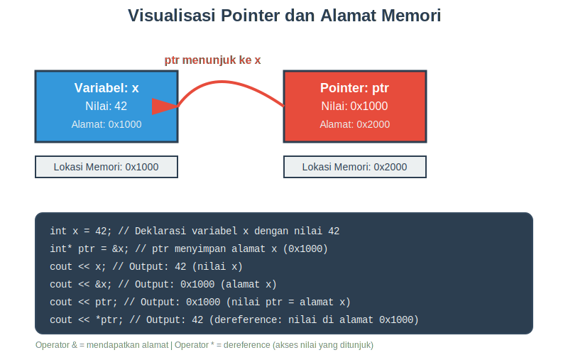
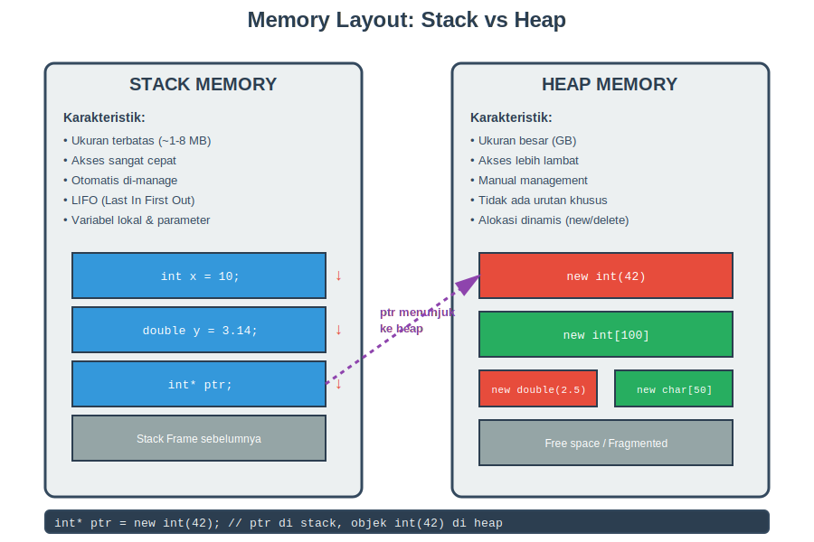

# Pertemuan 11: Pointer dan Memori Dinamis

## 📝 Deskripsi

Materi pertemuan ke-11 dari mata kuliah **Dasar-Dasar Pemrograman** yang membahas konsep pointer dan manajemen memori dinamis dalam C++. Pertemuan ini mencakup pemahaman mendalam tentang alamat memori, operator pointer, hubungan pointer dengan array, serta teknik alokasi dan dealokasi memori dinamis.

## 🎯 Sub-CPMK

**Sub-CPMK 3.3:** Mahasiswa mampu menerapkan konsep pointer dan penggunaannya dalam program C++

## 📚 Pokok Bahasan

### 1. Konsep Dasar Pointer
- Pengertian pointer dan alamat memori
- Visualisasi memori komputer
- Deklarasi dan inisialisasi pointer
- Pointer sebagai "alamat"

### 2. Operator Pointer
- Operator address-of (&)
- Operator dereference (*)
- Modifikasi nilai melalui pointer
- Notasi dan sintaks pointer

### 3. Pointer dan Array
- Hubungan erat pointer dengan array
- Pointer arithmetic
- Traversal array menggunakan pointer
- Array sebagai parameter fungsi
- Passing array dengan pointer

### 4. Memori Dinamis
- Stack memory vs heap memory
- Operator new dan delete
- Alokasi single variable
- Alokasi array dinamis
- Delete vs delete[]

### 5. Memory Management
- Memory leak dan bahayanya
- Dangling pointer
- Double delete problem
- nullptr best practices
- Common memory errors

### 6. Advanced Topics
- Pointer ke pointer (double pointer)
- Matrix dinamis dengan pointer
- Const pointer dan pointer to const
- Pointer sebagai parameter fungsi
- Fungsi yang mengembalikan pointer

### 7. Aplikasi Praktis
- Dynamic array resizing
- Linked list sederhana
- String manipulation dengan pointer
- Matrix operations

### 8. Best Practices dan Debugging
- Pedoman penggunaan pointer yang aman
- Common pointer errors
- Debugging tools (Valgrind, AddressSanitizer)
- Memory leak detection

## 📦 Struktur Materi

```
pertemuan-11/
├── Bahan_Ajar_Pertemuan_11.md    # Materi lengkap (40+ halaman)
├── index.html                     # Presentasi Reveal.js
├── images/
│   ├── pointer_visualization.svg  # Diagram pointer dan alamat
│   └── memory_layout.svg          # Diagram stack vs heap
├── README.md                      # Dokumentasi ini
└── .nojekyll                      # Config GitHub Pages
```

## 🎯 Tujuan Pembelajaran

Setelah mempelajari materi ini, mahasiswa diharapkan dapat:

1. **Memahami** konsep pointer dan alamat memori dalam C++
2. **Mendeklarasikan** dan menginisialisasi pointer dengan benar
3. **Menggunakan** operator address-of (&) dan dereference (*)
4. **Menjelaskan** hubungan antara pointer dan array
5. **Mengimplementasikan** pointer arithmetic untuk navigasi memori
6. **Mengalokasikan** memori dinamis menggunakan operator new
7. **Mendealokasikan** memori dengan benar menggunakan delete
8. **Menghindari** memory leak dan dangling pointer
9. **Membuat** fungsi dengan parameter pointer
10. **Mengimplementasikan** struktur data sederhana dengan pointer

## 🌐 Presentasi Online

Presentasi HTML dapat diakses di GitHub Pages:

```
https://[username].github.io/pertemuan-11/
```

Atau buka file `index.html` secara lokal di browser.

### Navigasi Presentasi

- **→** atau **Space**: Slide berikutnya
- **←**: Slide sebelumnya
- **ESC** atau **O**: Overview semua slide
- **F**: Fullscreen
- **S**: Speaker notes
- **?**: Help keyboard shortcuts

## 📖 Cara Menggunakan

### Untuk Dosen

1. **Persiapan Mengajar:**
   - Baca `Bahan_Ajar_Pertemuan_11.md` untuk materi lengkap
   - Review contoh-contoh kode yang akan dijelaskan
   - Siapkan environment untuk live coding

2. **Saat Mengajar:**
   - Gunakan `index.html` untuk presentasi di kelas
   - Demonstrasikan konsep dengan live coding
   - Tunjukkan diagram SVG untuk penjelasan visual
   - Diskusikan common errors dan cara menghindarinya

3. **Latihan:**
   - Gunakan soal latihan di bahan ajar
   - Berikan coding challenge tentang pointer
   - Review memory management dengan tools debugging

### Untuk Mahasiswa

1. **Sebelum Perkuliahan:**
   - Baca overview materi dari presentasi HTML
   - Persiapkan environment C++ (compiler, IDE)

2. **Saat Perkuliahan:**
   - Fokus pada demonstrasi live coding
   - Catat poin-poin penting tentang memory management
   - Tanyakan jika ada konsep yang belum jelas

3. **Setelah Perkuliahan:**
   - Baca materi lengkap dari `Bahan_Ajar_Pertemuan_11.md`
   - **Ketik ulang** semua contoh kode (jangan copy-paste!)
   - Jalankan dan eksperimen dengan kode
   - Kerjakan soal latihan secara bertahap
   - Diskusikan soal diskusi dengan teman

4. **Praktek Tambahan:**
   - Implementasi linked list sederhana
   - Buat program dengan dynamic array
   - Praktek debugging memory leak
   - Eksperimen dengan pointer arithmetic

## 🔍 Topik Penting

### ⚠️ CRITICAL: Memory Management

Pointer adalah fitur powerful namun berbahaya jika tidak digunakan dengan benar:

```cpp
// SELALU lakukan ini:
int* ptr = new int(42);    // 1. Alokasi
// ... gunakan ptr ...
delete ptr;                 // 2. Dealokasi
ptr = nullptr;             // 3. Reset ke null

// CEK sebelum gunakan:
if (ptr != nullptr) {
    cout << *ptr;
}
```

### 🚨 Common Pitfalls

1. **Uninitialized Pointer** ❌
   ```cpp
   int* ptr;           // Bahaya!
   cout << *ptr;       // Crash!
   ```

2. **Memory Leak** ❌
   ```cpp
   int* ptr = new int[1000];
   // Lupa delete[]     // Memory leak!
   ```

3. **Dangling Pointer** ❌
   ```cpp
   int* ptr = new int(10);
   delete ptr;
   cout << *ptr;       // Undefined behavior!
   ```

4. **Wrong Delete** ❌
   ```cpp
   int* arr = new int[10];
   delete arr;         // WRONG!
   delete[] arr;       // CORRECT!
   ```

## 🖼️ Diagram dan Visualisasi

### Pointer Visualization


Diagram ini menunjukkan:
- Variabel dan alamat memorinya
- Pointer yang menyimpan alamat
- Operator & dan * dalam aksi
- Hubungan antara pointer dan variabel

### Memory Layout


Diagram ini menunjukkan:
- Perbedaan stack dan heap memory
- Karakteristik masing-masing region
- Alokasi statik vs dinamis
- Pointer yang menghubungkan keduanya

## 💻 Contoh Kode Penting

### Basic Pointer Usage
```cpp
int x = 42;
int* ptr = &x;

cout << x;       // 42
cout << &x;      // 0x...
cout << ptr;     // 0x... (sama dengan &x)
cout << *ptr;    // 42
```

### Dynamic Memory
```cpp
// Alokasi
int* arr = new int[100];

// Gunakan
for (int i = 0; i < 100; i++) {
    arr[i] = i;
}

// Dealokasi
delete[] arr;
arr = nullptr;
```

### Function with Pointer
```cpp
void swap(int* a, int* b) {
    int temp = *a;
    *a = *b;
    *b = temp;
}

int main() {
    int x = 5, y = 10;
    swap(&x, &y);
    // x = 10, y = 5
}
```


## 🔧 Debugging Tools

### Valgrind (Linux/Mac)
```bash
# Compile dengan debug info
g++ -g program.cpp -o program

# Jalankan dengan Valgrind
valgrind --leak-check=full ./program
```

### AddressSanitizer (GCC/Clang)
```bash
# Compile dengan ASan
g++ -fsanitize=address -g program.cpp -o program

# Jalankan normal
./program
```

### GDB Commands
```bash
# Start GDB
gdb ./program

# Useful commands
(gdb) print ptr       # Print pointer value
(gdb) print *ptr      # Print value at pointer
(gdb) x/10x ptr       # Examine 10 hex values at ptr
(gdb) info locals     # Show local variables
```

## 📚 Referensi Utama

1. **Deitel, P. J., & Deitel, H. M.** (2020). *C++ How to Program* (10th ed.). Pearson. Chapter 8: Pointers.

2. **Savitch, W.** (2017). *Problem Solving with C++* (10th ed.). Pearson. Chapter 9: Pointers and Dynamic Arrays.

3. **Stroustrup, B.** (2014). *Programming: Principles and Practice Using C++* (2nd ed.). Addison-Wesley. Chapter 17: Vector and Free Store.

4. **Lippman, S. B., Lajoie, J., & Moo, B. E.** (2012). *C++ Primer* (5th ed.). Addison-Wesley. Chapter 12: Dynamic Memory.

5. **Meyers, S.** (2014). *Effective Modern C++*. O'Reilly Media. Items 18-22: Smart Pointers.

## 🔗 Materi Terkait

- **Pertemuan 9:** Array 1D dan Operasinya
- **Pertemuan 10:** Array Multidimensi
- **Pertemuan 12:** Struct, Union, dan Typedef
- **Pertemuan 13:** C++ di Platform Lain

## 📝 Catatan Tambahan

### Modern C++ Alternatives

Dalam C++ modern (C++11 dan seterusnya), sebaiknya gunakan **smart pointers** untuk automatic memory management:

```cpp
#include <memory>

// Unique pointer (exclusive ownership)
unique_ptr<int> ptr = make_unique<int>(42);
// Otomatis di-delete, tidak perlu manual delete!

// Shared pointer (shared ownership)
shared_ptr<int> ptr = make_shared<int>(42);
// Reference counted, otomatis delete when count = 0
```

Namun, pemahaman tentang raw pointer tetap penting untuk:
- Memahami bagaimana smart pointers bekerja
- Interfacing dengan C libraries
- Low-level programming
- Legacy code maintenance
- Performance-critical code

### Best Practice Summary

1. ✅ Selalu inisialisasi pointer
2. ✅ Cek nullptr sebelum dereference
3. ✅ Pasangkan new dengan delete
4. ✅ Gunakan delete[] untuk array
5. ✅ Set nullptr setelah delete
6. ✅ Gunakan const untuk pointer read-only
7. ✅ Prefer smart pointers dalam kode modern
8. ✅ Use debugging tools untuk detect leaks

## 🤝 Kontribusi

Jika menemukan kesalahan atau ingin memberikan saran:
1. Buat issue di repository
2. Atau submit pull request dengan perbaikan

## 📄 Lisensi

Materi ini dibuat untuk keperluan pendidikan dan dapat digunakan secara bebas dengan tetap mencantumkan sumber.

---

**Terakhir diperbarui:** November 2025  
**Versi:** 1.0  
**Mata Kuliah:** Dasar-Dasar Pemrograman  
**Pertemuan:** 11 - Pointer dan Memori Dinamis

---

**"With great power comes great responsibility."**  
— Pointer programming wisdom
