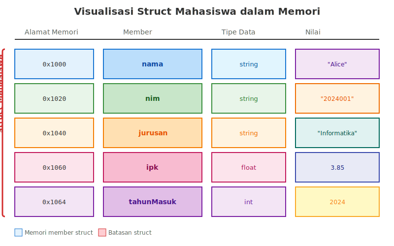

# BAB 12: STRUCT, UNION, DAN TYPEDEF

## 12.1 Pendahuluan

Selamat datang di pertemuan kedua belas mata kuliah Dasar-Dasar Pemrograman. Setelah mempelajari array dan pointer sebagai struktur data fundamental, kita akan memasuki topik yang sangat penting dalam pengorganisasian data: tipe data bentukan (user-defined types). Kemampuan untuk membuat tipe data sendiri adalah salah satu fitur powerful yang membedakan bahasa pemrograman tingkat tinggi dari bahasa assembly.

Bayangkan Anda diminta untuk membuat program yang mengelola data mahasiswa. Setiap mahasiswa memiliki berbagai atribut: nama, NIM, jurusan, IPK, tahun masuk, dan alamat. Tanpa struct, Anda harus membuat array terpisah untuk setiap atribut, dan menjaga agar indeks setiap array tetap konsisten. Ini bukan hanya merepotkan, tetapi juga rawan error. Dengan struct, kita dapat mengelompokkan semua atribut ini menjadi satu kesatuan yang logis dan mudah dikelola.

Struct memungkinkan kita untuk membuat tipe data baru yang merupakan kumpulan dari berbagai tipe data yang sudah ada. Ini sangat berguna ketika kita perlu merepresentasikan entitas dunia nyata yang memiliki banyak properti. Pada bab ini, kita akan mempelajari cara mendefinisikan dan menggunakan struct, perbedaan antara struct dan union, penggunaan typedef untuk membuat alias tipe data, serta enum untuk membuat tipe enumerasi. Pemahaman mendalam tentang konsep-konsep ini akan membuka jalan ke pemrograman berorientasi objek (OOP) yang akan dipelajari di pertemuan selanjutnya.

## 12.2 Konsep Dasar Struct

### 12.2.1 Pengertian Struct

Struct (singkatan dari structure) adalah tipe data yang dapat menggabungkan beberapa variabel dengan tipe data yang berbeda menjadi satu kesatuan logis. Setiap variabel dalam struct disebut sebagai member atau field. Berbeda dengan array yang hanya dapat menyimpan elemen-elemen dengan tipe data yang sama, struct memungkinkan kita mengelompokkan data dengan tipe yang berbeda-beda.

Konsep struct sangat penting dalam pemrograman karena memungkinkan kita untuk merepresentasikan objek atau entitas dunia nyata dengan lebih akurat. Misalnya, sebuah buku memiliki judul (string), pengarang (string), tahun terbit (integer), dan harga (float). Dengan struct, kita dapat mengelompokkan semua informasi ini dalam satu struktur data bernama "Buku".

Dalam C++, struct sebenarnya adalah versi sederhana dari class. Perbedaan utamanya adalah pada default access specifier: member struct secara default bersifat public, sementara member class secara default bersifat private. Namun untuk saat ini, kita akan fokus menggunakan struct sebagai cara untuk mengelompokkan data.

### 12.2.2 Sintaks Definisi Struct

Untuk mendefinisikan struct dalam C++, kita menggunakan kata kunci `struct` diikuti dengan nama struct dan daftar member-nya. Berikut adalah sintaks umum untuk mendefinisikan struct:

```cpp
struct NamaStruct {
    tipe_data1 member1;
    tipe_data2 member2;
    tipe_data3 member3;
    // ... member lainnya
};
```

Perhatikan bahwa definisi struct diakhiri dengan titik koma (semicolon). Ini adalah aturan penting yang sering terlupakan oleh programmer pemula. Tanpa titik koma di akhir definisi struct, compiler akan menghasilkan error.

Berikut adalah contoh sederhana definisi struct untuk merepresentasikan data mahasiswa:

```cpp
#include <iostream>
#include <string>
using namespace std;

struct Mahasiswa {
    string nama;
    string nim;
    string jurusan;
    float ipk;
    int tahunMasuk;
};

int main() {
    // Definisi struct sudah selesai
    // Kita akan belajar cara menggunakannya di bagian berikutnya
    cout << "Struct Mahasiswa berhasil didefinisikan" << endl;
    return 0;
}
```

**Kode 12.1:** Contoh definisi struct Mahasiswa dengan lima member berbeda.

### 12.2.3 Visualisasi Struktur Data Struct

Untuk memahami struct dengan lebih baik, mari kita visualisasikan bagaimana struct menyimpan data dalam memori:



**Gambar 12.1:** Visualisasi struct Mahasiswa dalam memori. Setiap member struct menempati ruang memori yang berurutan dengan ukuran sesuai tipe datanya.

## 12.3 Deklarasi dan Inisialisasi Struct

### 12.3.1 Deklarasi Variabel Struct

Setelah mendefinisikan struct, kita dapat mendeklarasikan variabel dengan tipe struct tersebut. Ada beberapa cara untuk mendeklarasikan variabel struct:

```cpp
#include <iostream>
#include <string>
using namespace std;

struct Mahasiswa {
    string nama;
    string nim;
    float ipk;
};

int main() {
    // Cara 1: Deklarasi sederhana
    Mahasiswa mhs1;
    
    // Cara 2: Deklarasi multiple variabel
    Mahasiswa mhs2, mhs3, mhs4;
    
    // Cara 3: Deklarasi dengan inisialisasi
    Mahasiswa mhs5 = {"Budi Santoso", "12345", 3.75};
    
    cout << "Variabel struct berhasil dideklarasikan" << endl;
    return 0;
}
```

**Kode 12.2:** Berbagai cara mendeklarasikan variabel bertipe struct.

### 12.3.2 Inisialisasi Struct

Ada beberapa cara untuk menginisialisasi struct di C++. Cara yang paling umum adalah menggunakan aggregate initialization dengan kurung kurawal:

```cpp
#include <iostream>
#include <string>
using namespace std;

struct Mahasiswa {
    string nama;
    string nim;
    float ipk;
    int semester;
};

int main() {
    // Inisialisasi dengan semua member
    Mahasiswa mhs1 = {"Alice Johnson", "2024001", 3.85, 3};
    
    // Inisialisasi sebagian (sisanya akan di-default)
    Mahasiswa mhs2 = {"Bob Smith", "2024002"};  // ipk = 0.0, semester = 0
    
    // Inisialisasi kosong (semua member di-default)
    Mahasiswa mhs3 = {};
    
    // Designated initializers (C++20)
    Mahasiswa mhs4 = {
        .nama = "Charlie Brown",
        .nim = "2024003",
        .ipk = 3.90,
        .semester = 5
    };
    
    cout << "Mahasiswa 1: " << mhs1.nama << ", IPK: " << mhs1.ipk << endl;
    cout << "Mahasiswa 4: " << mhs4.nama << ", Semester: " << mhs4.semester << endl;
    
    return 0;
}
```

**Kode 12.3:** Berbagai cara menginisialisasi struct dengan nilai awal.

### 12.3.3 Akses Member Struct

Untuk mengakses atau memodifikasi member dari variabel struct, kita menggunakan operator titik (dot operator atau member access operator):

```cpp
#include <iostream>
#include <string>
using namespace std;

struct Buku {
    string judul;
    string penulis;
    int tahun;
    float harga;
};

int main() {
    Buku b1;
    
    // Mengisi nilai member menggunakan dot operator
    b1.judul = "Pemrograman C++";
    b1.penulis = "John Doe";
    b1.tahun = 2024;
    b1.harga = 150000.0;
    
    // Mengakses dan menampilkan nilai member
    cout << "=== INFORMASI BUKU ===" << endl;
    cout << "Judul   : " << b1.judul << endl;
    cout << "Penulis : " << b1.penulis << endl;
    cout << "Tahun   : " << b1.tahun << endl;
    cout << "Harga   : Rp " << b1.harga << endl;
    
    // Modifikasi member
    b1.harga = b1.harga * 0.9;  // Diskon 10%
    cout << "\nSetelah diskon 10%: Rp " << b1.harga << endl;
    
    return 0;
}
```

**Kode 12.4:** Mengakses dan memodifikasi member struct menggunakan dot operator.

## 12.4 Array of Struct

### 12.4.1 Deklarasi dan Inisialisasi Array of Struct

Salah satu kegunaan penting struct adalah ketika dikombinasikan dengan array. Kita dapat membuat array yang berisi elemen-elemen bertipe struct, yang sangat berguna untuk mengelola kumpulan data dengan struktur yang sama.

```cpp
#include <iostream>
#include <string>
using namespace std;

struct Siswa {
    string nama;
    int umur;
    float nilai;
};

int main() {
    // Deklarasi array of struct dengan 3 elemen
    Siswa kelas[3];
    
    // Mengisi data untuk setiap siswa
    kelas[0].nama = "Ahmad";
    kelas[0].umur = 16;
    kelas[0].nilai = 85.5;
    
    kelas[1].nama = "Budi";
    kelas[1].umur = 17;
    kelas[1].nilai = 90.0;
    
    kelas[2].nama = "Citra";
    kelas[2].umur = 16;
    kelas[2].nilai = 88.75;
    
    // Menampilkan data semua siswa
    cout << "=== DATA SISWA ===" << endl;
    for (int i = 0; i < 3; i++) {
        cout << "Siswa " << (i+1) << ":" << endl;
        cout << "  Nama : " << kelas[i].nama << endl;
        cout << "  Umur : " << kelas[i].umur << " tahun" << endl;
        cout << "  Nilai: " << kelas[i].nilai << endl;
        cout << endl;
    }
    
    return 0;
}
```

**Kode 12.5:** Array of struct untuk menyimpan data beberapa siswa.

### 12.4.2 Inisialisasi Array of Struct dengan Nilai Awal

Kita juga dapat menginisialisasi array of struct langsung saat deklarasi:

```cpp
#include <iostream>
#include <string>
using namespace std;

struct Produk {
    string nama;
    int stok;
    float harga;
};

int main() {
    // Inisialisasi array of struct dengan nilai awal
    Produk inventory[4] = {
        {"Laptop", 15, 8500000.0},
        {"Mouse", 50, 125000.0},
        {"Keyboard", 30, 450000.0},
        {"Monitor", 20, 2500000.0}
    };
    
    cout << "=== INVENTORY TOKO ELEKTRONIK ===" << endl;
    cout << "No | Nama Produk      | Stok | Harga" << endl;
    cout << "---|------------------|------|-------------" << endl;
    
    for (int i = 0; i < 4; i++) {
        cout << (i+1) << "  | ";
        cout << inventory[i].nama << string(16 - inventory[i].nama.length(), ' ') << " | ";
        cout << inventory[i].stok << string(4 - to_string(inventory[i].stok).length(), ' ') << " | ";
        cout << "Rp " << inventory[i].harga << endl;
    }
    
    return 0;
}
```

**Kode 12.6:** Inisialisasi dan tampilan array of struct untuk data produk.

### 12.4.3 Operasi pada Array of Struct

Kita dapat melakukan berbagai operasi pada array of struct, seperti pencarian, pengurutan, dan agregasi data:

```cpp
#include <iostream>
#include <string>
#include <algorithm>
using namespace std;

struct Karyawan {
    string nama;
    int usia;
    float gaji;
};

// Fungsi untuk mencari karyawan dengan gaji tertinggi
int cariGajiTertinggi(Karyawan data[], int n) {
    int indexMax = 0;
    for (int i = 1; i < n; i++) {
        if (data[i].gaji > data[indexMax].gaji) {
            indexMax = i;
        }
    }
    return indexMax;
}

// Fungsi untuk menghitung rata-rata gaji
float hitungRataRataGaji(Karyawan data[], int n) {
    float total = 0;
    for (int i = 0; i < n; i++) {
        total += data[i].gaji;
    }
    return total / n;
}

int main() {
    Karyawan perusahaan[5] = {
        {"Andi", 28, 7500000},
        {"Budi", 35, 12000000},
        {"Citra", 26, 6500000},
        {"Doni", 42, 15000000},
        {"Eka", 31, 9000000}
    };
    
    int n = 5;
    
    // Mencari karyawan dengan gaji tertinggi
    int indexTertinggi = cariGajiTertinggi(perusahaan, n);
    cout << "Karyawan dengan gaji tertinggi:" << endl;
    cout << "Nama: " << perusahaan[indexTertinggi].nama << endl;
    cout << "Gaji: Rp " << perusahaan[indexTertinggi].gaji << endl;
    
    // Menghitung rata-rata gaji
    float rataRata = hitungRataRataGaji(perusahaan, n);
    cout << "\nRata-rata gaji: Rp " << rataRata << endl;
    
    return 0;
}
```

**Kode 12.7:** Operasi pencarian dan agregasi pada array of struct.

## 12.5 Struct sebagai Parameter Fungsi

### 12.5.1 Pass by Value

Ketika struct dilewatkan ke fungsi secara pass by value, seluruh isi struct akan disalin ke parameter fungsi. Ini berarti modifikasi yang dilakukan di dalam fungsi tidak akan mempengaruhi struct asli:

```cpp
#include <iostream>
#include <string>
using namespace std;

struct Point {
    int x;
    int y;
};

// Fungsi yang menerima struct by value
void tampilkanPoint(Point p) {
    cout << "Point (" << p.x << ", " << p.y << ")" << endl;
}

// Fungsi yang mencoba memodifikasi struct (tidak akan berpengaruh)
void geserPoint(Point p, int dx, int dy) {
    p.x += dx;
    p.y += dy;
    cout << "Di dalam fungsi - Point: (" << p.x << ", " << p.y << ")" << endl;
}

int main() {
    Point p1 = {10, 20};
    
    cout << "Sebelum pemanggilan fungsi:" << endl;
    tampilkanPoint(p1);
    
    geserPoint(p1, 5, 5);
    
    cout << "\nSetelah pemanggilan fungsi:" << endl;
    tampilkanPoint(p1);  // Nilai tidak berubah
    
    return 0;
}
```

**Kode 12.8:** Struct sebagai parameter fungsi dengan pass by value.

### 12.5.2 Pass by Reference

Untuk menghindari overhead penyalinan dan memungkinkan fungsi memodifikasi struct asli, kita dapat menggunakan pass by reference:

```cpp
#include <iostream>
#include <string>
using namespace std;

struct Mahasiswa {
    string nama;
    float ipk;
};

// Pass by reference untuk memodifikasi struct asli
void updateIPK(Mahasiswa &mhs, float ipkBaru) {
    mhs.ipk = ipkBaru;
    cout << "IPK " << mhs.nama << " berhasil diupdate!" << endl;
}

// Pass by const reference untuk efisiensi tanpa modifikasi
void tampilkanMahasiswa(const Mahasiswa &mhs) {
    cout << "Nama: " << mhs.nama << endl;
    cout << "IPK : " << mhs.ipk << endl;
}

int main() {
    Mahasiswa mhs1 = {"Alice", 3.50};
    
    cout << "=== DATA AWAL ===" << endl;
    tampilkanMahasiswa(mhs1);
    
    cout << "\n=== UPDATE IPK ===" << endl;
    updateIPK(mhs1, 3.75);
    
    cout << "\n=== DATA SETELAH UPDATE ===" << endl;
    tampilkanMahasiswa(mhs1);
    
    return 0;
}
```

**Kode 12.9:** Struct sebagai parameter fungsi dengan pass by reference dan const reference.

### 12.5.3 Mengembalikan Struct dari Fungsi

Fungsi dapat mengembalikan struct sebagai return value:

```cpp
#include <iostream>
#include <string>
#include <cmath>
using namespace std;

struct Point {
    double x;
    double y;
};

// Fungsi yang mengembalikan struct
Point buatPoint(double x, double y) {
    Point p;
    p.x = x;
    p.y = y;
    return p;
}

// Fungsi untuk menghitung jarak antara dua point
double hitungJarak(Point p1, Point p2) {
    double dx = p2.x - p1.x;
    double dy = p2.y - p1.y;
    return sqrt(dx * dx + dy * dy);
}

// Fungsi untuk menghitung titik tengah
Point titikTengah(Point p1, Point p2) {
    Point tengah;
    tengah.x = (p1.x + p2.x) / 2.0;
    tengah.y = (p1.y + p2.y) / 2.0;
    return tengah;
}

int main() {
    Point p1 = buatPoint(0, 0);
    Point p2 = buatPoint(3, 4);
    
    cout << "Point 1: (" << p1.x << ", " << p1.y << ")" << endl;
    cout << "Point 2: (" << p2.x << ", " << p2.y << ")" << endl;
    
    double jarak = hitungJarak(p1, p2);
    cout << "\nJarak antara kedua point: " << jarak << endl;
    
    Point tengah = titikTengah(p1, p2);
    cout << "Titik tengah: (" << tengah.x << ", " << tengah.y << ")" << endl;
    
    return 0;
}
```

**Kode 12.10:** Fungsi yang mengembalikan struct dan operasi matematika pada point.

## 12.6 Nested Struct

### 12.6.1 Konsep Nested Struct

Nested struct adalah struct yang memiliki member berupa struct lain. Ini berguna ketika kita perlu merepresentasikan hubungan hierarkis atau komposisi objek:

```cpp
#include <iostream>
#include <string>
using namespace std;

struct Tanggal {
    int hari;
    int bulan;
    int tahun;
};

struct Alamat {
    string jalan;
    string kota;
    string provinsi;
    string kodePos;
};

struct Pegawai {
    string nama;
    string nip;
    Tanggal tanggalLahir;  // Nested struct
    Alamat alamat;         // Nested struct
    float gaji;
};

int main() {
    Pegawai p1;
    
    // Mengisi data pegawai
    p1.nama = "John Doe";
    p1.nip = "PEG2024001";
    
    // Mengisi tanggal lahir (nested struct)
    p1.tanggalLahir.hari = 15;
    p1.tanggalLahir.bulan = 8;
    p1.tanggalLahir.tahun = 1990;
    
    // Mengisi alamat (nested struct)
    p1.alamat.jalan = "Jl. Merdeka No. 123";
    p1.alamat.kota = "Jakarta";
    p1.alamat.provinsi = "DKI Jakarta";
    p1.alamat.kodePos = "12345";
    
    p1.gaji = 8500000;
    
    // Menampilkan data pegawai
    cout << "=== DATA PEGAWAI ===" << endl;
    cout << "Nama         : " << p1.nama << endl;
    cout << "NIP          : " << p1.nip << endl;
    cout << "Tanggal Lahir: " << p1.tanggalLahir.hari << "/"
         << p1.tanggalLahir.bulan << "/" << p1.tanggalLahir.tahun << endl;
    cout << "\nAlamat:" << endl;
    cout << "  " << p1.alamat.jalan << endl;
    cout << "  " << p1.alamat.kota << ", " << p1.alamat.provinsi << endl;
    cout << "  " << p1.alamat.kodePos << endl;
    cout << "\nGaji: Rp " << p1.gaji << endl;
    
    return 0;
}
```

**Kode 12.11:** Contoh nested struct untuk merepresentasikan data pegawai dengan tanggal dan alamat.

### 12.6.2 Inisialisasi Nested Struct

Kita dapat menginisialisasi nested struct menggunakan nested braces:

```cpp
#include <iostream>
#include <string>
using namespace std;

struct Dimensi {
    float panjang;
    float lebar;
    float tinggi;
};

struct Produk {
    string nama;
    Dimensi ukuran;
    float berat;
};

int main() {
    // Inisialisasi dengan nested braces
    Produk barang1 = {
        "Lemari Kayu",
        {180.0, 90.0, 200.0},  // ukuran
        75.5               // berat
    };
    
    // Inisialisasi designated initializers (C++20)
    Produk barang2 = {
        .nama = "Meja Belajar",
        .ukuran = {120.0, 60.0, 75.0},
        .berat = 25.0
    };
    
    cout << "=== INFORMASI PRODUK 1 ===" << endl;
    cout << "Nama  : " << barang1.nama << endl;
    cout << "Ukuran: " << barang1.ukuran.panjang << " x " 
         << barang1.ukuran.lebar << " x " 
         << barang1.ukuran.tinggi << " cm" << endl;
    cout << "Berat : " << barang1.berat << " kg" << endl;
    
    // Menghitung volume
    float volume = barang1.ukuran.panjang * barang1.ukuran.lebar * barang1.ukuran.tinggi;
    cout << "Volume: " << volume << " cm³" << endl;
    
    return 0;
}
```

**Kode 12.12:** Inisialisasi nested struct dengan nested braces.

## 12.7 Union

### 12.7.1 Pengertian Union

Union adalah tipe data yang mirip dengan struct, tetapi dengan perbedaan fundamental: semua member union berbagi lokasi memori yang sama. Ini berarti pada satu waktu, hanya satu member yang dapat menyimpan nilai yang valid. Ukuran union ditentukan oleh member yang memiliki ukuran terbesar.

Union berguna ketika kita perlu menghemat memori dan tahu bahwa hanya satu member yang akan digunakan pada satu waktu. Misalnya, dalam sistem yang mengolah berbagai tipe data tetapi hanya satu tipe pada satu waktu.

```cpp
#include <iostream>
#include <string>
using namespace std;

union Data {
    int intValue;
    float floatValue;
    char charValue;
};

int main() {
    Data d;
    
    // Menyimpan integer
    d.intValue = 42;
    cout << "Integer value: " << d.intValue << endl;
    
    // Menyimpan float (menimpa nilai int)
    d.floatValue = 3.14;
    cout << "Float value: " << d.floatValue << endl;
    cout << "Integer value setelah diubah: " << d.intValue << " (nilai tidak valid!)" << endl;
    
    // Menyimpan char (menimpa nilai float)
    d.charValue = 'A';
    cout << "Char value: " << d.charValue << endl;
    
    cout << "\nUkuran union Data: " << sizeof(Data) << " bytes" << endl;
    cout << "Ukuran int: " << sizeof(int) << " bytes" << endl;
    cout << "Ukuran float: " << sizeof(float) << " bytes" << endl;
    cout << "Ukuran char: " << sizeof(char) << " bytes" << endl;
    
    return 0;
}
```

**Kode 12.13:** Demonstrasi union dan berbagi memori antar member.

### 12.7.2 Perbedaan Struct dan Union

Untuk memahami perbedaan antara struct dan union dengan lebih jelas, mari kita bandingkan keduanya:

```cpp
#include <iostream>
using namespace std;

struct StructExample {
    int a;
    float b;
    char c;
};

union UnionExample {
    int a;
    float b;
    char c;
};

int main() {
    StructExample s;
    UnionExample u;
    
    // Struct: semua member memiliki memori terpisah
    s.a = 10;
    s.b = 3.14;
    s.c = 'X';
    
    cout << "=== STRUCT ===" << endl;
    cout << "s.a = " << s.a << endl;
    cout << "s.b = " << s.b << endl;
    cout << "s.c = " << s.c << endl;
    cout << "Ukuran struct: " << sizeof(StructExample) << " bytes" << endl;
    
    // Union: semua member berbagi memori yang sama
    u.a = 10;
    cout << "\n=== UNION ===" << endl;
    cout << "Setelah u.a = 10:" << endl;
    cout << "u.a = " << u.a << endl;
    
    u.b = 3.14;
    cout << "\nSetelah u.b = 3.14:" << endl;
    cout << "u.b = " << u.b << endl;
    cout << "u.a = " << u.a << " (tidak valid lagi!)" << endl;
    
    u.c = 'X';
    cout << "\nSetelah u.c = 'X':" << endl;
    cout << "u.c = " << u.c << endl;
    cout << "u.a = " << u.a << " (tidak valid lagi!)" << endl;
    cout << "u.b = " << u.b << " (tidak valid lagi!)" << endl;
    
    cout << "\nUkuran union: " << sizeof(UnionExample) << " bytes" << endl;
    
    return 0;
}
```

**Kode 12.14:** Perbandingan antara struct dan union dalam penggunaan memori.

### 12.7.3 Tagged Union

Untuk mengatasi masalah bahwa kita tidak tahu member mana yang sedang aktif dalam union, kita dapat menggunakan konsep tagged union dengan menggabungkan union dengan struct:

```cpp
#include <iostream>
#include <string>
using namespace std;

enum TipeData {
    TIPE_INT,
    TIPE_FLOAT,
    TIPE_STRING
};

struct TaggedUnion {
    TipeData tipe;  // Tag untuk mengetahui tipe data yang aktif
    union {
        int intValue;
        float floatValue;
        char stringValue[50];
    } data;
};

void tampilkanData(const TaggedUnion &tu) {
    switch(tu.tipe) {
        case TIPE_INT:
            cout << "Integer: " << tu.data.intValue << endl;
            break;
        case TIPE_FLOAT:
            cout << "Float: " << tu.data.floatValue << endl;
            break;
        case TIPE_STRING:
            cout << "String: " << tu.data.stringValue << endl;
            break;
    }
}

int main() {
    TaggedUnion var1, var2, var3;
    
    // Menyimpan integer
    var1.tipe = TIPE_INT;
    var1.data.intValue = 42;
    
    // Menyimpan float
    var2.tipe = TIPE_FLOAT;
    var2.data.floatValue = 3.14159;
    
    // Menyimpan string
    var3.tipe = TIPE_STRING;
    string temp = "Hello Union!";
    for (int i = 0; i < temp.length(); i++) {
        var3.data.stringValue[i] = temp[i];
    }
    var3.data.stringValue[temp.length()] = '\0';
    
    cout << "=== DATA TERSIMPAN ===" << endl;
    tampilkanData(var1);
    tampilkanData(var2);
    tampilkanData(var3);
    
    return 0;
}
```

**Kode 12.15:** Tagged union untuk melacak tipe data yang sedang aktif.

## 12.8 Typedef dan Type Aliases

### 12.8.1 Typedef

Typedef adalah cara untuk membuat alias atau nama alternatif untuk tipe data yang sudah ada. Ini sangat berguna untuk membuat kode lebih mudah dibaca dan dipelihara, terutama ketika bekerja dengan tipe data yang kompleks:

```cpp
#include <iostream>
#include <string>
using namespace std;

// Typedef untuk tipe data primitif
typedef unsigned long long ull;
typedef long double ldouble;

// Typedef untuk struct
struct Mahasiswa {
    string nama;
    float ipk;
};
typedef struct Mahasiswa Mhs;

int main() {
    // Menggunakan typedef untuk tipe primitif
    ull angkaBesar = 18446744073709551615ULL;
    ldouble pi = 3.14159265358979323846L;
    
    cout << "Angka besar: " << angkaBesar << endl;
    cout << "Pi dengan presisi tinggi: " << pi << endl;
    
    // Menggunakan typedef untuk struct
    Mhs m1 = {"Alice", 3.85};
    cout << "\nMahasiswa: " << m1.nama << ", IPK: " << m1.ipk << endl;
    
    return 0;
}
```

**Kode 12.16:** Penggunaan typedef untuk membuat alias tipe data.

### 12.8.2 Using Declaration (C++11)

C++11 memperkenalkan cara yang lebih modern untuk membuat alias tipe menggunakan kata kunci `using`. Sintaksnya lebih konsisten dan mudah dibaca dibandingkan typedef:

```cpp
#include <iostream>
#include <vector>
#include <string>
using namespace std;

// Using untuk tipe primitif
using Integer = int;
using Real = double;

// Using untuk tipe kompleks
using StringVector = vector<string>;

// Using untuk pointer
using IntPtr = int*;

// Using untuk struct
struct Point {
    double x;
    double y;
};
using Point2D = Point;

int main() {
    Integer angka = 42;
    Real desimal = 3.14159;
    
    StringVector daftarNama = {"Alice", "Bob", "Charlie"};
    
    Point2D p = {10.5, 20.3};
    
    cout << "Integer: " << angka << endl;
    cout << "Real: " << desimal << endl;
    cout << "\nDaftar nama:" << endl;
    for (const auto &nama : daftarNama) {
        cout << "- " << nama << endl;
    }
    cout << "\nPoint: (" << p.x << ", " << p.y << ")" << endl;
    
    return 0;
}
```

**Kode 12.17:** Penggunaan using declaration sebagai alternatif modern untuk typedef.

### 12.8.3 Kegunaan Typedef dalam Proyek Besar

Typedef sangat berguna dalam proyek besar untuk meningkatkan maintainability dan portabilitas kode:

```cpp
#include <iostream>
#include <string>
using namespace std;

// Mendefinisikan tipe data yang mungkin berbeda di platform berbeda
#ifdef _WIN64
    typedef long long int64_t;
#else
    typedef long int64_t;
#endif

// Typedef untuk readability
typedef int StudentID;
typedef float GPA;
typedef string CourseName;

struct Student {
    StudentID id;
    string nama;
    GPA ipk;
};

// Typedef untuk array
typedef Student StudentArray[100];

void displayStudent(const Student &s) {
    cout << "ID: " << s.id << ", Nama: " << s.nama << ", IPK: " << s.ipk << endl;
}

int main() {
    Student s1 = {2024001, "Alice Johnson", 3.85};
    Student s2 = {2024002, "Bob Smith", 3.70};
    
    displayStudent(s1);
    displayStudent(s2);
    
    // Menggunakan int64_t yang compatible di berbagai platform
    int64_t bigNumber = 9223372036854775807LL;
    cout << "\nBig number: " << bigNumber << endl;
    
    return 0;
}
```

**Kode 12.18:** Typedef untuk meningkatkan portabilitas dan readability kode.

## 12.9 Enum dan Enum Class

### 12.9.1 Enum (Enumeration)

Enum adalah tipe data yang terdiri dari sekumpulan konstanta bernama (named constants). Enum sangat berguna untuk merepresentasikan sekumpulan nilai yang terbatas dan terdefinisi dengan baik:

```cpp
#include <iostream>
#include <string>
using namespace std;

// Definisi enum untuk hari dalam seminggu
enum Hari {
    SENIN,
    SELASA,
    RABU,
    KAMIS,
    JUMAT,
    SABTU,
    MINGGU
};

// Definisi enum dengan nilai eksplisit
enum Status {
    PENDING = 1,
    PROCESSING = 2,
    COMPLETED = 3,
    CANCELLED = 0
};

string getNamaHari(Hari h) {
    switch(h) {
        case SENIN: return "Senin";
        case SELASA: return "Selasa";
        case RABU: return "Rabu";
        case KAMIS: return "Kamis";
        case JUMAT: return "Jumat";
        case SABTU: return "Sabtu";
        case MINGGU: return "Minggu";
        default: return "Unknown";
    }
}

int main() {
    Hari hariIni = RABU;
    Hari hariLibur = MINGGU;
    
    cout << "Hari ini: " << getNamaHari(hariIni) << endl;
    cout << "Hari libur: " << getNamaHari(hariLibur) << endl;
    
    // Enum secara internal adalah integer
    cout << "\nNilai numerik RABU: " << hariIni << endl;
    cout << "Nilai numerik MINGGU: " << hariLibur << endl;
    
    Status statusOrder = PROCESSING;
    cout << "\nStatus order: " << statusOrder << endl;
    
    return 0;
}
```

**Kode 12.19:** Penggunaan enum untuk merepresentasikan hari dan status.

### 12.9.2 Enum Class (Scoped Enumeration - C++11)

C++11 memperkenalkan enum class yang lebih type-safe dan tidak menyebabkan name pollution:

```cpp
#include <iostream>
#include <string>
using namespace std;

// Enum class dengan type safety
enum class Warna {
    MERAH,
    HIJAU,
    BIRU,
    KUNING
};

enum class Priority {
    LOW = 1,
    MEDIUM = 5,
    HIGH = 10,
    CRITICAL = 20
};

string getWarna(Warna w) {
    switch(w) {
        case Warna::MERAH: return "Merah";
        case Warna::HIJAU: return "Hijau";
        case Warna::BIRU: return "Biru";
        case Warna::KUNING: return "Kuning";
        default: return "Unknown";
    }
}

int main() {
    Warna warnaFavorit = Warna::BIRU;
    Priority prioritasTask = Priority::HIGH;
    
    cout << "Warna favorit: " << getWarna(warnaFavorit) << endl;
    
    // Enum class tidak otomatis convert ke int
    // cout << warnaFavorit << endl;  // ERROR!
    cout << "Prioritas task: " << static_cast<int>(prioritasTask) << endl;
    
    // Enum class mencegah name collision
    // Misalnya kita bisa punya dua enum dengan member sama
    enum class TrafficLight { RED, YELLOW, GREEN };
    enum class Signal { RED, YELLOW, GREEN };
    
    TrafficLight lampu = TrafficLight::RED;
    Signal sinyal = Signal::GREEN;
    
    // Tidak ada konflik karena scoped
    cout << "\nEnum class mencegah name collision!" << endl;
    
    return 0;
}
```

**Kode 12.20:** Penggunaan enum class untuk type safety yang lebih baik.

### 12.9.3 Enum dalam Struct

Kombinasi enum dengan struct sangat berguna untuk membuat model data yang lebih ekspresif:

```cpp
#include <iostream>
#include <string>
using namespace std;

enum class Gender {
    MALE,
    FEMALE
};

enum class StudentStatus {
    ACTIVE,
    GRADUATED,
    DROPPED,
    ON_LEAVE
};

struct Student {
    string nama;
    Gender jenisKelamin;
    StudentStatus status;
    float ipk;
};

string getGenderString(Gender g) {
    return (g == Gender::MALE) ? "Laki-laki" : "Perempuan";
}

string getStatusString(StudentStatus s) {
    switch(s) {
        case StudentStatus::ACTIVE: return "Aktif";
        case StudentStatus::GRADUATED: return "Lulus";
        case StudentStatus::DROPPED: return "Drop Out";
        case StudentStatus::ON_LEAVE: return "Cuti";
        default: return "Unknown";
    }
}

void displayStudent(const Student &s) {
    cout << "Nama          : " << s.nama << endl;
    cout << "Jenis Kelamin : " << getGenderString(s.jenisKelamin) << endl;
    cout << "Status        : " << getStatusString(s.status) << endl;
    cout << "IPK           : " << s.ipk << endl;
}

int main() {
    Student mhs1 = {
        "Alice Johnson",
        Gender::FEMALE,
        StudentStatus::ACTIVE,
        3.85
    };
    
    Student mhs2 = {
        "Bob Smith",
        Gender::MALE,
        StudentStatus::GRADUATED,
        3.70
    };
    
    cout << "=== MAHASISWA 1 ===" << endl;
    displayStudent(mhs1);
    
    cout << "\n=== MAHASISWA 2 ===" << endl;
    displayStudent(mhs2);
    
    return 0;
}
```

**Kode 12.21:** Kombinasi enum class dengan struct untuk model data yang lebih baik.

## 12.10 Aplikasi Praktis Struct

### 12.10.1 Sistem Manajemen Perpustakaan

Mari kita lihat contoh aplikasi praktis yang lebih kompleks menggunakan struct:

```cpp
#include <iostream>
#include <string>
#include <iomanip>
using namespace std;

struct Tanggal {
    int hari;
    int bulan;
    int tahun;
};

struct Buku {
    string judul;
    string penulis;
    string isbn;
    int tahunTerbit;
    bool tersedia;
};

struct Peminjam {
    string nama;
    string id;
    Tanggal tanggalPinjam;
    Tanggal tanggalKembali;
};

struct TransaksiPinjam {
    Buku buku;
    Peminjam peminjam;
};

void tampilkanTanggal(const Tanggal &t) {
    cout << setfill('0') << setw(2) << t.hari << "/"
         << setw(2) << t.bulan << "/"
         << t.tahun;
}

void tampilkanBuku(const Buku &b) {
    cout << "Judul      : " << b.judul << endl;
    cout << "Penulis    : " << b.penulis << endl;
    cout << "ISBN       : " << b.isbn << endl;
    cout << "Tahun      : " << b.tahunTerbit << endl;
    cout << "Status     : " << (b.tersedia ? "Tersedia" : "Dipinjam") << endl;
}

void prosesP peminjaman(TransaksiPinjam &transaksi) {
    transaksi.buku.tersedia = false;
    cout << "\n=== PEMINJAMAN BERHASIL ===" << endl;
    cout << "Peminjam   : " << transaksi.peminjam.nama << endl;
    cout << "ID         : " << transaksi.peminjam.id << endl;
    cout << "Buku       : " << transaksi.buku.judul << endl;
    cout << "Tgl Pinjam : ";
    tampilkanTanggal(transaksi.peminjam.tanggalPinjam);
    cout << endl;
    cout << "Tgl Kembali: ";
    tampilkanTanggal(transaksi.peminjam.tanggalKembali);
    cout << endl;
}

int main() {
    // Inisialisasi buku
    Buku buku1 = {
        "Pemrograman C++",
        "John Doe",
        "978-0-123-45678-9",
        2024,
        true
    };
    
    // Inisialisasi peminjam
    Peminjam peminjam1 = {
        "Alice Johnson",
        "MHS2024001",
        {15, 11, 2024},  // tanggal pinjam
        {22, 11, 2024}   // tanggal kembali
    };
    
    // Membuat transaksi
    TransaksiPinjam transaksi = {buku1, peminjam1};
    
    cout << "=== INFORMASI BUKU ===" << endl;
    tampilkanBuku(transaksi.buku);
    
    // Proses peminjaman
    prosesPeminjaman(transaksi);
    
    cout << "\n=== STATUS BUKU SETELAH DIPINJAM ===" << endl;
    tampilkanBuku(transaksi.buku);
    
    return 0;
}
```

**Kode 12.22:** Sistem manajemen perpustakaan menggunakan nested struct dan multiple struct.

### 12.10.2 Sistem Nilai Mahasiswa

Contoh lain aplikasi praktis untuk mengelola nilai mahasiswa:

```cpp
#include <iostream>
#include <string>
#include <iomanip>
using namespace std;

struct MataKuliah {
    string kode;
    string nama;
    int sks;
    float nilai;
};

struct Mahasiswa {
    string nama;
    string nim;
    MataKuliah matkul[5];
    int jumlahMatkul;
};

float hitungIPK(const Mahasiswa &mhs) {
    float totalNilaiXSKS = 0;
    int totalSKS = 0;
    
    for (int i = 0; i < mhs.jumlahMatkul; i++) {
        totalNilaiXSKS += mhs.matkul[i].nilai * mhs.matkul[i].sks;
        totalSKS += mhs.matkul[i].sks;
    }
    
    return totalSKS > 0 ? totalNilaiXSKS / totalSKS : 0.0;
}

string getGrade(float nilai) {
    if (nilai >= 3.75) return "A";
    else if (nilai >= 3.25) return "A-";
    else if (nilai >= 2.75) return "B+";
    else if (nilai >= 2.25) return "B";
    else if (nilai >= 1.75) return "B-";
    else if (nilai >= 1.25) return "C+";
    else if (nilai >= 0.75) return "C";
    else return "D";
}

void tampilkanTranskrip(const Mahasiswa &mhs) {
    cout << "=== TRANSKRIP NILAI ===" << endl;
    cout << "Nama: " << mhs.nama << endl;
    cout << "NIM : " << mhs.nim << endl;
    cout << "\n" << left << setw(12) << "Kode"
         << setw(30) << "Mata Kuliah"
         << setw(6) << "SKS"
         << setw(8) << "Nilai"
         << "Grade" << endl;
    cout << string(66, '-') << endl;
    
    for (int i = 0; i < mhs.jumlahMatkul; i++) {
        cout << left << setw(12) << mhs.matkul[i].kode
             << setw(30) << mhs.matkul[i].nama
             << setw(6) << mhs.matkul[i].sks
             << setw(8) << fixed << setprecision(2) << mhs.matkul[i].nilai
             << getGrade(mhs.matkul[i].nilai) << endl;
    }
    
    float ipk = hitungIPK(mhs);
    cout << string(66, '-') << endl;
    cout << "IPK: " << fixed << setprecision(2) << ipk
         << " (" << getGrade(ipk) << ")" << endl;
}

int main() {
    Mahasiswa mhs1 = {
        "Alice Johnson",
        "2024001",
        {
            {"CS101", "Pengantar Pemrograman", 3, 3.75},
            {"MTK201", "Kalkulus I", 4, 3.50},
            {"FIS101", "Fisika Dasar", 3, 3.25},
            {"ENG101", "Bahasa Inggris", 2, 4.00},
            {"CS102", "Struktur Data", 3, 3.75}
        },
        5
    };
    
    tampilkanTranskrip(mhs1);
    
    return 0;
}
```

**Kode 12.23:** Sistem pengelolaan nilai mahasiswa dengan perhitungan IPK.

### 12.10.3 Sistem Inventory Barang

Contoh sistem inventory sederhana:

```cpp
#include <iostream>
#include <string>
#include <iomanip>
using namespace std;

enum class KategoriBarang {
    ELEKTRONIK,
    MAKANAN,
    PAKAIAN,
    PERALATAN
};

struct Barang {
    string kode;
    string nama;
    KategoriBarang kategori;
    int stok;
    float harga;
};

string getKategoriString(KategoriBarang k) {
    switch(k) {
        case KategoriBarang::ELEKTRONIK: return "Elektronik";
        case KategoriBarang::MAKANAN: return "Makanan";
        case KategoriBarang::PAKAIAN: return "Pakaian";
        case KategoriBarang::PERALATAN: return "Peralatan";
        default: return "Unknown";
    }
}

void tampilkanBarang(const Barang &b) {
    cout << left << setw(10) << b.kode
         << setw(25) << b.nama
         << setw(15) << getKategoriString(b.kategori)
         << setw(8) << b.stok
         << "Rp " << right << setw(10) << fixed << setprecision(0) << b.harga << endl;
}

void tambahStok(Barang &b, int jumlah) {
    b.stok += jumlah;
    cout << "Stok " << b.nama << " bertambah " << jumlah << " unit" << endl;
}

bool kurangiStok(Barang &b, int jumlah) {
    if (b.stok >= jumlah) {
        b.stok -= jumlah;
        cout << "Stok " << b.nama << " berkurang " << jumlah << " unit" << endl;
        return true;
    } else {
        cout << "Stok " << b.nama << " tidak mencukupi!" << endl;
        return false;
    }
}

void laporanInventory(Barang inventory[], int n) {
    cout << "\n=== LAPORAN INVENTORY ===" << endl;
    cout << left << setw(10) << "Kode"
         << setw(25) << "Nama Barang"
         << setw(15) << "Kategori"
         << setw(8) << "Stok"
         << "Harga" << endl;
    cout << string(75, '-') << endl;
    
    float totalNilai = 0;
    for (int i = 0; i < n; i++) {
        tampilkanBarang(inventory[i]);
        totalNilai += inventory[i].stok * inventory[i].harga;
    }
    
    cout << string(75, '-') << endl;
    cout << "Total Nilai Inventory: Rp " << fixed << setprecision(0) << totalNilai << endl;
}

int main() {
    Barang inventory[5] = {
        {"E001", "Laptop Gaming", KategoriBarang::ELEKTRONIK, 15, 12500000},
        {"E002", "Mouse Wireless", KategoriBarang::ELEKTRONIK, 50, 250000},
        {"M001", "Snack Cokelat", KategoriBarang::MAKANAN, 100, 15000},
        {"P001", "Kaos Polo", KategoriBarang::PAKAIAN, 30, 125000},
        {"R001", "Gunting", KategoriBarang::PERALATAN, 25, 35000}
    };
    
    int n = 5;
    
    laporanInventory(inventory, n);
    
    cout << "\n=== TRANSAKSI ===" << endl;
    tambahStok(inventory[1], 20);  // Tambah mouse
    kurangiStok(inventory[0], 3);   // Jual 3 laptop
    kurangiStok(inventory[2], 150); // Coba jual snack (stok tidak cukup)
    
    laporanInventory(inventory, n);
    
    return 0;
}
```

**Kode 12.24:** Sistem inventory barang dengan kategori dan manajemen stok.

## 12.11 Ringkasan Bab

Pada bab ini, kita telah mempelajari konsep tipe data bentukan (user-defined types) dalam C++, yang merupakan fondasi penting untuk pengorganisasian data yang lebih kompleks. Struct memungkinkan kita mengelompokkan berbagai tipe data menjadi satu kesatuan logis, sangat berguna untuk merepresentasikan entitas dunia nyata dengan berbagai atribut. Kita belajar cara mendeklarasikan, menginisialisasi, dan mengakses member struct menggunakan dot operator.

Array of struct memungkinkan kita mengelola kumpulan data dengan struktur yang sama secara efisien. Struct dapat dilewatkan ke fungsi baik secara pass by value maupun pass by reference, dengan masing-masing memiliki kelebihan dan kasus penggunaan yang berbeda. Nested struct memungkinkan kita membuat struktur data hierarkis yang lebih kompleks.

Union memberikan cara untuk menghemat memori dengan membiarkan beberapa member berbagi lokasi memori yang sama, meskipun harus digunakan dengan hati-hati karena hanya satu member yang valid pada satu waktu. Tagged union mengatasi masalah ini dengan menambahkan tag untuk melacak member mana yang sedang aktif.

Typedef dan using declaration memberikan cara untuk membuat alias tipe data, meningkatkan readability dan maintainability kode. Enum dan enum class memungkinkan kita mendefinisikan sekumpulan konstanta bernama yang terbatas dan terdefinisi dengan baik, dengan enum class memberikan type safety yang lebih baik.

Konsep-konsep ini sangat penting karena merupakan jembatan menuju pemrograman berorientasi objek. Struct dalam C++ sebenarnya adalah class dengan default public access, dan pemahaman mendalam tentang struct akan memudahkan transisi ke OOP.

## 12.12 Soal Latihan

1. Buatlah program yang mendefinisikan struct `Rectangle` dengan member `panjang` dan `lebar` (keduanya float). Implementasikan fungsi untuk menghitung luas dan keliling rectangle. Buatlah array berisi 3 rectangle dan tampilkan informasi lengkap termasuk luas dan keliling masing-masing.

2. Definisikan struct `Time` dengan member `jam`, `menit`, dan `detik` (keduanya int). Buatlah fungsi yang menerima dua struct Time dan mengembalikan selisih waktu dalam detik. Gunakan fungsi ini untuk menghitung durasi antara dua waktu yang berbeda.

3. Buatlah struct `Student` yang berisi nama, NIM, dan array nilai untuk 5 mata kuliah. Implementasikan fungsi untuk menghitung nilai rata-rata dan menentukan predikat (A, B, C, D, atau E). Buatlah program untuk menginput data 3 mahasiswa dan menampilkan mahasiswa dengan nilai tertinggi.

4. Definisikan struct `BankAccount` dengan member nomor rekening, nama pemilik, dan saldo. Implementasikan fungsi untuk deposit, withdraw, dan transfer antar rekening. Pastikan program memeriksa saldo sebelum melakukan withdraw atau transfer.

5. Buatlah struct `Date` dengan member hari, bulan, dan tahun. Implementasikan fungsi untuk:
   - Mengecek apakah suatu tanggal valid
   - Menghitung selisih hari antara dua tanggal
   - Menentukan apakah suatu tahun kabisat
   - Mendapatkan tanggal besok dari tanggal tertentu

6. Definisikan enum class `DayOfWeek` untuk hari dalam seminggu dan struct `Schedule` yang berisi hari, waktu mulai, waktu selesai, dan nama aktivitas. Buatlah array of schedule untuk jadwal mingguan dan implementasikan fungsi untuk mencari aktivitas pada hari tertentu.

7. Buatlah program sistem pemesanan tiket bioskop menggunakan struct `Movie` (judul, durasi, genre), struct `Seat` (baris, nomor, tersedia), dan struct `Booking` (movie, seat, nama pemesan). Implementasikan fungsi untuk booking dan membatalkan booking.

8. Definisikan union yang dapat menyimpan integer, float, atau karakter. Buatlah tagged union dengan enum untuk melacak tipe data yang sedang aktif. Implementasikan fungsi untuk menampilkan nilai sesuai tipe yang aktif dan fungsi untuk mengkonversi antara tipe-tipe data tersebut.

## 12.13 Soal Diskusi

1. Jelaskan mengapa struct lebih berguna daripada menggunakan beberapa array terpisah ketika mengelola data yang kompleks. Berikan contoh kasus di mana penggunaan struct sangat menguntungkan dibandingkan pendekatan lain.

2. Dalam konteks manajemen memori dan performa, kapan sebaiknya menggunakan pass by value dan kapan menggunakan pass by reference ketika struct menjadi parameter fungsi? Apa pertimbangan yang harus diperhatikan?

3. Bandingkan struct dan union dari segi penggunaan memori dan kasus penggunaan yang tepat. Dalam situasi apa union lebih menguntungkan daripada struct? Apa risiko menggunakan union tanpa tagged union?

4. Typedef dan using declaration memiliki fungsi yang mirip untuk membuat alias tipe. Mengapa C++11 memperkenalkan using declaration jika typedef sudah ada? Apa kelebihan using declaration dibandingkan typedef?

5. Mengapa enum class diperkenalkan di C++11 padahal enum biasa sudah ada sejak C? Apa masalah yang dipecahkan oleh enum class? Berikan contoh kasus di mana enum biasa dapat menyebabkan bug yang bisa dihindari dengan enum class.

6. Jelaskan hubungan antara struct dalam C++ dengan class dalam OOP. Apa perbedaan utama antara keduanya? Mengapa struct masih berguna meskipun ada class?

7. Nested struct memungkinkan pembuatan struktur data yang hierarkis. Diskusikan kapan nested struct lebih baik daripada membuat beberapa struct terpisah. Apa trade-off yang harus dipertimbangkan?

8. Dalam pengembangan perangkat lunak berskala besar, bagaimana penggunaan struct, typedef, dan enum dapat meningkatkan maintainability dan readability kode? Berikan contoh konkret dari pengalaman atau skenario hipotetis.

## 12.14 Referensi

1. Deitel, P. & Deitel, H. (2020). *C++ How to Program* (10th ed.). Pearson. Chapter 10: Classes: A Deeper Look.

2. Savitch, W. (2017). *Problem Solving with C++* (10th ed.). Pearson. Chapter 10: Structures and Classes.

3. Stroustrup, B. (2014). *Programming: Principles and Practice Using C++* (2nd ed.). Addison-Wesley. Chapter 9: Technicalities: Classes, etc.

4. Lippman, S. B., Lajoie, J., & Moo, B. E. (2012). *C++ Primer* (5th ed.). Addison-Wesley. Chapter 7: Classes.

5. Meyers, S. (2014). *Effective Modern C++*. O'Reilly Media. Item 10: Prefer scoped enums to unscoped enums.

6. cppreference.com. (2024). *Structures*. Retrieved from https://en.cppreference.com/w/cpp/language/class

7. ISO/IEC 14882:2020. *Programming Languages — C++* (C++20 Standard). International Organization for Standardization.
