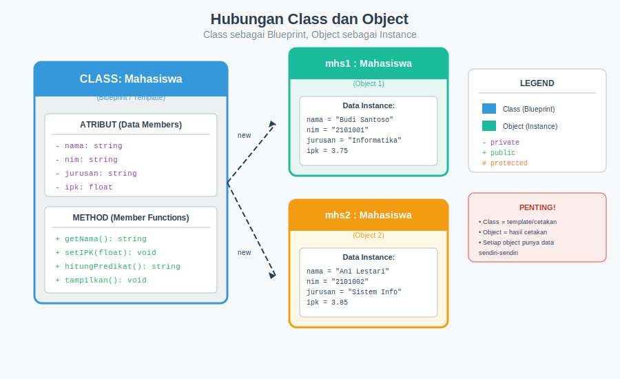
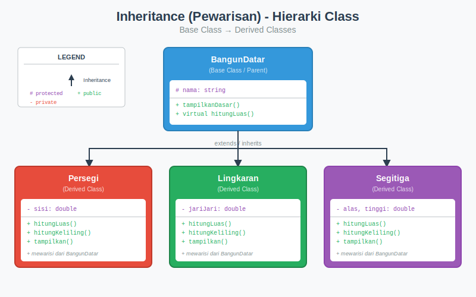

# BAB 13: PENGENALAN PEMROGRAMAN BERORIENTASI OBJEK

## 13.1 Pendahuluan

Selamat datang di pertemuan ketiga belas mata kuliah Dasar-Dasar Pemrograman. Hingga saat ini, kita telah mempelajari pemrograman dengan pendekatan prosedural, dimana program kita terdiri dari fungsi-fungsi yang memanipulasi data secara terpisah. Pada pertemuan ini, kita akan berkenalan dengan paradigma pemrograman yang berbeda namun sangat powerful: Pemrograman Berorientasi Objek (Object-Oriented Programming atau OOP).

Bayangkan Anda sedang merancang sebuah game. Dalam game tersebut, ada berbagai karakter seperti pahlawan, musuh, dan NPC (Non-Player Character). Setiap karakter memiliki atribut seperti nama, health point, level, dan kemampuan khusus. Mereka juga memiliki perilaku seperti bergerak, menyerang, dan bertahan. Dengan pemrograman prosedural, kita harus membuat banyak variabel dan fungsi terpisah untuk mengelola setiap karakter, dan menjaga konsistensi data menjadi tantangan tersendiri. Dengan OOP, kita dapat membuat "template" atau "blueprint" bernama class yang mendefinisikan apa yang dimiliki dan bisa dilakukan oleh sebuah karakter, lalu menciptakan objek-objek individual dari template tersebut.

Pemrograman Berorientasi Objek adalah paradigma pemrograman yang mengorganisir kode dalam bentuk objek-objek yang memiliki data (atribut) dan fungsi (method) yang bekerja pada data tersebut. OOP memungkinkan kita untuk menulis kode yang lebih terorganisir, mudah dipelihara, dan dapat digunakan kembali. Konsep OOP sangat penting karena hampir semua bahasa pemrograman modern seperti Java, Python, C#, dan tentu saja C++, mendukung paradigma ini. Pada bab ini, kita akan mempelajari konsep fundamental OOP termasuk class dan object, constructor dan destructor, enkapsulasi (encapsulation), pewarisan (inheritance), dan polimorfisme (polymorphism).

## 13.2 Paradigma OOP vs Prosedural

### 13.2.1 Pemrograman Prosedural

Pemrograman prosedural adalah paradigma pemrograman yang kita gunakan selama ini. Dalam pendekatan ini, program diorganisir sebagai serangkaian prosedur atau fungsi yang memanipulasi data. Data dan fungsi dipisahkan secara tegas. Kita mendeklarasikan variabel untuk menyimpan data, kemudian membuat fungsi-fungsi untuk memanipulasi data tersebut.

```cpp
#include <iostream>
#include <string>
using namespace std;

// Data terpisah dari fungsi
struct DataMahasiswa {
    string nama;
    string nim;
    float ipk;
};

// Fungsi-fungsi untuk memanipulasi data
void tampilkanMahasiswa(DataMahasiswa mhs) {
    cout << "Nama : " << mhs.nama << endl;
    cout << "NIM  : " << mhs.nim << endl;
    cout << "IPK  : " << mhs.ipk << endl;
}

void ubahIPK(DataMahasiswa &mhs, float ipkBaru) {
    if (ipkBaru >= 0.0 && ipkBaru <= 4.0) {
        mhs.ipk = ipkBaru;
    }
}

int main() {
    DataMahasiswa mhs1;
    mhs1.nama = "Budi Santoso";
    mhs1.nim = "2101001";
    mhs1.ipk = 3.75;
    
    tampilkanMahasiswa(mhs1);
    ubahIPK(mhs1, 3.85);
    
    return 0;
}
```

**Kode 13.1:** Pendekatan prosedural untuk mengelola data mahasiswa.

Pendekatan prosedural memiliki beberapa kelemahan ketika program menjadi lebih kompleks. Data dapat diakses dan dimodifikasi oleh siapa saja, sehingga sulit untuk menjamin integritas data. Ketika ada perubahan pada struktur data, semua fungsi yang menggunakan data tersebut perlu dimodifikasi. Selain itu, sulit untuk membuat komponen yang dapat digunakan kembali (reusable).

### 13.2.2 Pemrograman Berorientasi Objek

Pemrograman Berorientasi Objek mengambil pendekatan yang berbeda. Data dan fungsi yang bekerja pada data tersebut digabungkan menjadi satu kesatuan yang disebut objek. Objek dibuat berdasarkan template yang disebut class. Class mendefinisikan atribut (data) dan method (fungsi) yang dimiliki oleh objek.

```cpp
#include <iostream>
#include <string>
using namespace std;

// Class menggabungkan data dan fungsi
class Mahasiswa {
private:
    string nama;
    string nim;
    float ipk;

public:
    // Constructor
    Mahasiswa(string n, string ni, float i) {
        nama = n;
        nim = ni;
        setIPK(i);  // Validasi melalui setter
    }
    
    // Getter methods
    string getNama() { return nama; }
    string getNIM() { return nim; }
    float getIPK() { return ipk; }
    
    // Setter dengan validasi
    void setIPK(float ipkBaru) {
        if (ipkBaru >= 0.0 && ipkBaru <= 4.0) {
            ipk = ipkBaru;
        }
    }
    
    // Method untuk menampilkan data
    void tampilkan() {
        cout << "Nama : " << nama << endl;
        cout << "NIM  : " << nim << endl;
        cout << "IPK  : " << ipk << endl;
    }
};

int main() {
    Mahasiswa mhs1("Budi Santoso", "2101001", 3.75);
    mhs1.tampilkan();
    mhs1.setIPK(3.85);
    
    return 0;
}
```

**Kode 13.2:** Pendekatan OOP untuk mengelola data mahasiswa.

Dalam pendekatan OOP, data mahasiswa (nama, nim, ipk) dan fungsi yang bekerja pada data tersebut (tampilkan, setIPK) digabungkan dalam satu class. Data bersifat private sehingga tidak dapat diakses langsung dari luar, melindungi integritas data. Perubahan internal pada class tidak mempengaruhi kode yang menggunakan class tersebut selama interface (method public) tetap sama.

### 13.2.3 Empat Pilar OOP

Pemrograman Berorientasi Objek dibangun di atas empat pilar fundamental yang akan kita pelajari di pertemuan ini:

**Encapsulation (Enkapsulasi)** adalah konsep menggabungkan data dan method yang bekerja pada data tersebut dalam satu kesatuan, serta menyembunyikan detail implementasi dari pengguna. Enkapsulasi melindungi data dari akses yang tidak sah dan memastikan integritas data.

**Abstraction (Abstraksi)** adalah konsep menyembunyikan kompleksitas dan hanya menampilkan fitur-fitur penting kepada pengguna. Pengguna tidak perlu mengetahui detail implementasi internal, cukup mengetahui cara menggunakan interface yang disediakan.

**Inheritance (Pewarisan)** adalah mekanisme dimana sebuah class dapat mewarisi atribut dan method dari class lain. Ini memungkinkan penggunaan kembali kode (code reuse) dan pembentukan hierarki class.

**Polymorphism (Polimorfisme)** adalah kemampuan objek untuk mengambil banyak bentuk. Method dengan nama yang sama dapat memiliki perilaku yang berbeda tergantung pada objek yang memanggilnya.


*Gambar 13.1: Empat pilar fundamental Pemrograman Berorientasi Objek*

## 13.3 Class dan Object

### 13.3.1 Pengertian Class

Class adalah blueprint atau template yang mendefinisikan struktur dan perilaku objek. Class menentukan atribut (data members) apa yang dimiliki objek dan method (member functions) apa yang dapat dilakukan objek. Class sendiri bukanlah objek, melainkan cetakan untuk membuat objek.

Bayangkan class sebagai resep kue. Resep menjelaskan bahan-bahan yang dibutuhkan (atribut) dan langkah-langkah pembuatan (method). Resep sendiri bukanlah kue, tetapi dengan mengikuti resep tersebut, kita dapat membuat banyak kue (objek) yang memiliki karakteristik serupa.

```cpp
class NamaClass {
    // Access specifier
private:
    // Data members (atribut) - biasanya private
    tipe_data atribut1;
    tipe_data atribut2;

public:
    // Member functions (method) - biasanya public
    void method1() {
        // implementasi
    }
    
    tipe_return method2(parameter) {
        // implementasi
        return nilai;
    }
};  // Jangan lupa titik koma!
```

**Kode 13.3:** Struktur dasar sebuah class dalam C++.

### 13.3.2 Pengertian Object

Object adalah instance atau perwujudan nyata dari sebuah class. Jika class adalah blueprint, maka object adalah produk yang dibuat berdasarkan blueprint tersebut. Setiap object memiliki salinan sendiri dari data members yang didefinisikan dalam class, tetapi semua object berbagi definisi method yang sama.

```cpp
#include <iostream>
#include <string>
using namespace std;

class Mobil {
private:
    string merk;
    string model;
    int tahun;
    int kecepatan;

public:
    // Constructor
    Mobil(string m, string mo, int t) {
        merk = m;
        model = mo;
        tahun = t;
        kecepatan = 0;
    }
    
    // Method untuk akselerasi
    void akselerasi(int tambah) {
        kecepatan += tambah;
        cout << merk << " " << model << " berakselerasi" << endl;
        cout << "Kecepatan sekarang: " << kecepatan << " km/jam" << endl;
    }
    
    // Method untuk rem
    void rem(int kurang) {
        kecepatan -= kurang;
        if (kecepatan < 0) kecepatan = 0;
        cout << merk << " " << model << " mengerem" << endl;
        cout << "Kecepatan sekarang: " << kecepatan << " km/jam" << endl;
    }
    
    // Method untuk menampilkan info
    void tampilkanInfo() {
        cout << "=== Info Mobil ===" << endl;
        cout << "Merk   : " << merk << endl;
        cout << "Model  : " << model << endl;
        cout << "Tahun  : " << tahun << endl;
        cout << "Kecepatan: " << kecepatan << " km/jam" << endl;
    }
};

int main() {
    // Membuat object dari class Mobil
    Mobil mobil1("Toyota", "Avanza", 2023);
    Mobil mobil2("Honda", "Jazz", 2022);
    
    // Menggunakan method pada object
    mobil1.tampilkanInfo();
    cout << endl;
    
    mobil1.akselerasi(40);
    mobil1.akselerasi(20);
    mobil1.rem(10);
    
    cout << endl;
    mobil2.tampilkanInfo();
    
    return 0;
}
```

**Kode 13.4:** Membuat dan menggunakan object dari class Mobil.

**Output:**
```
=== Info Mobil ===
Merk   : Toyota
Model  : Avanza
Tahun  : 2023
Kecepatan: 0 km/jam

Toyota Avanza berakselerasi
Kecepatan sekarang: 40 km/jam
Toyota Avanza berakselerasi
Kecepatan sekarang: 60 km/jam
Toyota Avanza mengerem
Kecepatan sekarang: 50 km/jam

=== Info Mobil ===
Merk   : Honda
Model  : Jazz
Tahun  : 2022
Kecepatan: 0 km/jam
```

Pada contoh di atas, `mobil1` dan `mobil2` adalah dua object berbeda yang dibuat dari class `Mobil`. Masing-masing memiliki data sendiri (merk, model, tahun, kecepatan yang berbeda), tetapi menggunakan method yang sama (akselerasi, rem, tampilkanInfo).

### 13.3.3 Access Specifiers

Access specifiers menentukan tingkat akses terhadap members (atribut dan method) dari sebuah class. C++ menyediakan tiga access specifiers:

**public**: Members dapat diakses dari mana saja, baik dari dalam class maupun dari luar class. Method yang merupakan interface untuk pengguna biasanya dideklarasikan public.

**private**: Members hanya dapat diakses dari dalam class itu sendiri. Data members biasanya dideklarasikan private untuk melindungi data dari akses yang tidak sah. Ini adalah default access specifier untuk class.

**protected**: Members dapat diakses dari dalam class itu sendiri dan dari class turunan (derived class). Kita akan membahas ini lebih lanjut di bagian inheritance.

```cpp
#include <iostream>
#include <string>
using namespace std;

class Rekening {
private:
    string nomorRekening;
    string namaPemilik;
    double saldo;

protected:
    string jenisRekening;

public:
    // Constructor
    Rekening(string no, string nama, double s, string jenis) {
        nomorRekening = no;
        namaPemilik = nama;
        saldo = s;
        jenisRekening = jenis;
    }
    
    // Getter untuk saldo (read-only access)
    double getSaldo() {
        return saldo;
    }
    
    // Method untuk setor
    void setor(double jumlah) {
        if (jumlah > 0) {
            saldo += jumlah;
            cout << "Setor berhasil. Saldo: Rp " << saldo << endl;
        }
    }
    
    // Method untuk tarik
    bool tarik(double jumlah) {
        if (jumlah > 0 && jumlah <= saldo) {
            saldo -= jumlah;
            cout << "Penarikan berhasil. Saldo: Rp " << saldo << endl;
            return true;
        }
        cout << "Penarikan gagal. Saldo tidak mencukupi." << endl;
        return false;
    }
};

int main() {
    Rekening rek("1234567890", "Ani Lestari", 1000000, "Tabungan");
    
    // Mengakses public method
    cout << "Saldo awal: Rp " << rek.getSaldo() << endl;
    rek.setor(500000);
    rek.tarik(200000);
    rek.tarik(2000000);  // Akan gagal
    
    // Ini akan ERROR - tidak bisa akses private member
    // cout << rek.saldo;  // ERROR!
    // rek.saldo = 9999999;  // ERROR!
    
    return 0;
}
```

**Kode 13.5:** Penggunaan access specifiers dalam class Rekening.

**Output:**
```
Saldo awal: Rp 1000000
Setor berhasil. Saldo: Rp 1500000
Penarikan berhasil. Saldo: Rp 1300000
Penarikan gagal. Saldo tidak mencukupi.
```



*Gambar 13.2: Hubungan antara class sebagai blueprint dan object sebagai instance*

## 13.4 Constructor dan Destructor

### 13.4.1 Pengertian Constructor

Constructor adalah member function khusus yang dipanggil secara otomatis ketika sebuah object dibuat. Constructor digunakan untuk menginisialisasi object, seperti mengatur nilai awal untuk data members. Constructor memiliki beberapa karakteristik khusus: namanya harus sama dengan nama class, tidak memiliki return type (bahkan void sekalipun), dan dapat memiliki parameter atau tidak.

Ada beberapa jenis constructor yang perlu kita ketahui. **Default constructor** adalah constructor yang tidak memiliki parameter atau semua parameternya memiliki nilai default. Jika kita tidak mendefinisikan constructor apapun, compiler akan secara otomatis menyediakan default constructor. **Parameterized constructor** adalah constructor yang menerima parameter untuk menginisialisasi object dengan nilai tertentu.

```cpp
#include <iostream>
#include <string>
using namespace std;

class Buku {
private:
    string judul;
    string pengarang;
    int tahunTerbit;
    double harga;

public:
    // Default constructor
    Buku() {
        judul = "Tidak Diketahui";
        pengarang = "Anonim";
        tahunTerbit = 0;
        harga = 0.0;
        cout << "[Default Constructor dipanggil]" << endl;
    }
    
    // Parameterized constructor
    Buku(string j, string p, int t, double h) {
        judul = j;
        pengarang = p;
        tahunTerbit = t;
        harga = h;
        cout << "[Parameterized Constructor dipanggil untuk: " << judul << "]" << endl;
    }
    
    // Constructor dengan sebagian parameter
    Buku(string j, string p) {
        judul = j;
        pengarang = p;
        tahunTerbit = 2024;  // Default tahun
        harga = 50000;       // Default harga
        cout << "[Constructor 2-param dipanggil untuk: " << judul << "]" << endl;
    }
    
    void tampilkan() {
        cout << "Judul     : " << judul << endl;
        cout << "Pengarang : " << pengarang << endl;
        cout << "Tahun     : " << tahunTerbit << endl;
        cout << "Harga     : Rp " << harga << endl;
    }
};

int main() {
    cout << "=== Membuat Object ===" << endl;
    
    Buku buku1;  // Memanggil default constructor
    Buku buku2("Laskar Pelangi", "Andrea Hirata", 2005, 75000);
    Buku buku3("Filosofi Teras", "Henry Manampiring");
    
    cout << "\n=== Info Buku 1 ===" << endl;
    buku1.tampilkan();
    
    cout << "\n=== Info Buku 2 ===" << endl;
    buku2.tampilkan();
    
    cout << "\n=== Info Buku 3 ===" << endl;
    buku3.tampilkan();
    
    return 0;
}
```

**Kode 13.6:** Berbagai jenis constructor dalam class Buku.

**Output:**
```
=== Membuat Object ===
[Default Constructor dipanggil]
[Parameterized Constructor dipanggil untuk: Laskar Pelangi]
[Constructor 2-param dipanggil untuk: Filosofi Teras]

=== Info Buku 1 ===
Judul     : Tidak Diketahui
Pengarang : Anonim
Tahun     : 0
Harga     : Rp 0

=== Info Buku 2 ===
Judul     : Laskar Pelangi
Pengarang : Andrea Hirata
Tahun     : 2005
Harga     : Rp 75000

=== Info Buku 3 ===
Judul     : Filosofi Teras
Pengarang : Henry Manampiring
Tahun     : 2024
Harga     : Rp 50000
```

### 13.4.2 Initializer List

C++ menyediakan cara yang lebih efisien untuk menginisialisasi data members menggunakan initializer list. Initializer list ditulis setelah parameter constructor, diawali dengan tanda titik dua (:), dan berisi daftar inisialisasi untuk data members.

```cpp
#include <iostream>
#include <string>
using namespace std;

class Mahasiswa {
private:
    string nama;
    string nim;
    float ipk;

public:
    // Constructor dengan initializer list
    Mahasiswa(string n, string ni, float i) 
        : nama(n), nim(ni), ipk(i) {
        cout << "Mahasiswa " << nama << " dibuat" << endl;
    }
    
    void tampilkan() {
        cout << "Nama : " << nama << endl;
        cout << "NIM  : " << nim << endl;
        cout << "IPK  : " << ipk << endl;
    }
};

int main() {
    Mahasiswa mhs1("Doni Pratama", "2101001", 3.75);
    mhs1.tampilkan();
    
    return 0;
}
```

**Kode 13.7:** Constructor dengan initializer list.

Initializer list lebih efisien karena data members diinisialisasi langsung, bukan di-assign setelah diinisialisasi dengan nilai default. Untuk tipe data sederhana seperti int atau float, perbedaannya mungkin tidak signifikan, tetapi untuk object yang lebih kompleks, initializer list dapat meningkatkan performa.

### 13.4.3 Destructor

Destructor adalah member function khusus yang dipanggil secara otomatis ketika sebuah object dihancurkan atau keluar dari scope. Destructor digunakan untuk membersihkan resource yang digunakan oleh object, seperti memori dinamis atau file handle. Destructor memiliki karakteristik: namanya sama dengan nama class tetapi diawali dengan tilde (~), tidak memiliki return type dan parameter, dan setiap class hanya boleh memiliki satu destructor.

```cpp
#include <iostream>
#include <string>
using namespace std;

class Koneksi {
private:
    string server;
    bool terhubung;

public:
    // Constructor
    Koneksi(string s) : server(s), terhubung(false) {
        cout << "[CONSTRUCTOR] Membuat koneksi ke " << server << endl;
        terhubung = true;
        cout << "[CONSTRUCTOR] Koneksi berhasil!" << endl;
    }
    
    // Destructor
    ~Koneksi() {
        cout << "[DESTRUCTOR] Menutup koneksi ke " << server << endl;
        terhubung = false;
        cout << "[DESTRUCTOR] Koneksi ditutup!" << endl;
    }
    
    void kirimData(string data) {
        if (terhubung) {
            cout << "Mengirim data ke " << server << ": " << data << endl;
        }
    }
};

int main() {
    cout << "=== Program dimulai ===" << endl;
    
    {
        cout << "\n--- Masuk ke blok ---" << endl;
        Koneksi kon1("database.server.com");
        kon1.kirimData("SELECT * FROM users");
        cout << "--- Keluar dari blok ---" << endl;
    }  // kon1 keluar dari scope, destructor dipanggil
    
    cout << "\n--- Setelah blok ---" << endl;
    
    Koneksi kon2("api.server.com");
    kon2.kirimData("GET /data");
    
    cout << "\n=== Program akan berakhir ===" << endl;
    return 0;
}  // kon2 keluar dari scope, destructor dipanggil
```

**Kode 13.8:** Penggunaan destructor untuk membersihkan resource.

**Output:**
```
=== Program dimulai ===

--- Masuk ke blok ---
[CONSTRUCTOR] Membuat koneksi ke database.server.com
[CONSTRUCTOR] Koneksi berhasil!
Mengirim data ke database.server.com: SELECT * FROM users
--- Keluar dari blok ---
[DESTRUCTOR] Menutup koneksi ke database.server.com
[DESTRUCTOR] Koneksi ditutup!

--- Setelah blok ---
[CONSTRUCTOR] Membuat koneksi ke api.server.com
[CONSTRUCTOR] Koneksi berhasil!
Mengirim data ke api.server.com: GET /data

=== Program akan berakhir ===
[DESTRUCTOR] Menutup koneksi ke api.server.com
[DESTRUCTOR] Koneksi ditutup!
```

Destructor sangat penting ketika class mengalokasikan resource dinamis. Meskipun pada contoh sederhana di atas destructor hanya mencetak pesan dan mengubah flag, dalam aplikasi nyata destructor akan melakukan tugas-tugas seperti dealokasi memori dengan `delete`, menutup file, atau memutuskan koneksi database.

## 13.5 Encapsulation (Enkapsulasi)

### 13.5.1 Konsep Data Hiding

Enkapsulasi adalah salah satu pilar fundamental OOP yang mengacu pada penggabungan data dan method yang bekerja pada data tersebut dalam satu kesatuan, serta menyembunyikan detail internal dari pengguna. Konsep utama dari enkapsulasi adalah data hiding, yaitu membuat data members bersifat private sehingga tidak dapat diakses langsung dari luar class.

Data hiding melindungi integritas data dengan memastikan bahwa data hanya dapat diubah melalui method-method yang telah ditentukan. Ini mencegah manipulasi data yang tidak diinginkan atau tidak valid. Misalnya, kita dapat memastikan bahwa nilai tidak pernah negatif, atau format data selalu benar.

```cpp
#include <iostream>
#include <string>
using namespace std;

class AkunBank {
private:
    string nomorRekening;
    string namaNasabah;
    double saldo;
    string pin;  // Data sensitif

public:
    AkunBank(string no, string nama, double s, string p) 
        : nomorRekening(no), namaNasabah(nama), saldo(s), pin(p) {}
    
    // Getter - hanya data yang boleh diakses
    string getNomorRekening() { return nomorRekening; }
    string getNamaNasabah() { return namaNasabah; }
    double getSaldo() { return saldo; }
    // Tidak ada getter untuk PIN!
    
    // Method dengan validasi
    bool setor(double jumlah) {
        if (jumlah <= 0) {
            cout << "Jumlah setoran harus positif!" << endl;
            return false;
        }
        saldo += jumlah;
        cout << "Setor Rp " << jumlah << " berhasil" << endl;
        return true;
    }
    
    bool tarik(double jumlah, string pinInput) {
        // Validasi PIN
        if (pinInput != pin) {
            cout << "PIN salah!" << endl;
            return false;
        }
        // Validasi jumlah
        if (jumlah <= 0) {
            cout << "Jumlah penarikan harus positif!" << endl;
            return false;
        }
        if (jumlah > saldo) {
            cout << "Saldo tidak mencukupi!" << endl;
            return false;
        }
        saldo -= jumlah;
        cout << "Tarik Rp " << jumlah << " berhasil" << endl;
        return true;
    }
    
    bool ubahPIN(string pinLama, string pinBaru) {
        if (pinLama != pin) {
            cout << "PIN lama salah!" << endl;
            return false;
        }
        if (pinBaru.length() != 6) {
            cout << "PIN harus 6 digit!" << endl;
            return false;
        }
        pin = pinBaru;
        cout << "PIN berhasil diubah" << endl;
        return true;
    }
    
    void tampilkanInfo() {
        cout << "No. Rekening : " << nomorRekening << endl;
        cout << "Nama Nasabah : " << namaNasabah << endl;
        cout << "Saldo        : Rp " << saldo << endl;
    }
};

int main() {
    AkunBank akun("1234567890", "Dewi Lestari", 5000000, "123456");
    
    cout << "=== Info Akun ===" << endl;
    akun.tampilkanInfo();
    
    cout << "\n=== Transaksi ===" << endl;
    akun.setor(1000000);
    akun.tarik(500000, "123456");  // PIN benar
    akun.tarik(500000, "000000");  // PIN salah
    akun.tarik(10000000, "123456"); // Saldo tidak cukup
    
    cout << "\n=== Ubah PIN ===" << endl;
    akun.ubahPIN("123456", "654321");
    
    cout << "\n=== Saldo Akhir ===" << endl;
    cout << "Saldo: Rp " << akun.getSaldo() << endl;
    
    // Ini tidak bisa dilakukan:
    // akun.saldo = 999999999;  // ERROR! private
    // cout << akun.pin;         // ERROR! private
    
    return 0;
}
```

**Kode 13.9:** Enkapsulasi dalam class AkunBank untuk melindungi data sensitif.

**Output:**
```
=== Info Akun ===
No. Rekening : 1234567890
Nama Nasabah : Dewi Lestari
Saldo        : Rp 5000000

=== Transaksi ===
Setor Rp 1000000 berhasil
Tarik Rp 500000 berhasil
PIN salah!
Saldo tidak mencukupi!

=== Ubah PIN ===
PIN berhasil diubah

=== Saldo Akhir ===
Saldo: Rp 5500000
```

### 13.5.2 Getter dan Setter

Getter dan setter adalah method yang digunakan untuk mengakses (get) dan mengubah (set) nilai dari private data members. Dengan menggunakan getter dan setter, kita dapat mengontrol bagaimana data diakses dan dimodifikasi, serta menambahkan validasi jika diperlukan.

```cpp
#include <iostream>
#include <string>
using namespace std;

class Produk {
private:
    string kode;
    string nama;
    double harga;
    int stok;

public:
    // Constructor
    Produk(string k, string n, double h, int s) 
        : kode(k), nama(n) {
        setHarga(h);  // Menggunakan setter untuk validasi
        setStok(s);
    }
    
    // Getter methods
    string getKode() const { return kode; }
    string getNama() const { return nama; }
    double getHarga() const { return harga; }
    int getStok() const { return stok; }
    
    // Setter methods dengan validasi
    void setNama(string n) {
        if (!n.empty()) {
            nama = n;
        }
    }
    
    void setHarga(double h) {
        if (h >= 0) {
            harga = h;
        } else {
            cout << "Error: Harga tidak boleh negatif!" << endl;
            harga = 0;
        }
    }
    
    void setStok(int s) {
        if (s >= 0) {
            stok = s;
        } else {
            cout << "Error: Stok tidak boleh negatif!" << endl;
            stok = 0;
        }
    }
    
    // Method bisnis
    void kurangiStok(int jumlah) {
        if (jumlah > stok) {
            cout << "Error: Stok tidak mencukupi!" << endl;
            return;
        }
        stok -= jumlah;
        cout << "Stok " << nama << " dikurangi " << jumlah << endl;
    }
    
    void tambahStok(int jumlah) {
        if (jumlah <= 0) {
            cout << "Error: Jumlah harus positif!" << endl;
            return;
        }
        stok += jumlah;
        cout << "Stok " << nama << " ditambah " << jumlah << endl;
    }
    
    void tampilkan() const {
        cout << "Kode  : " << kode << endl;
        cout << "Nama  : " << nama << endl;
        cout << "Harga : Rp " << harga << endl;
        cout << "Stok  : " << stok << " unit" << endl;
    }
};

int main() {
    Produk p1("PRD001", "Laptop Gaming", 15000000, 10);
    
    cout << "=== Info Produk Awal ===" << endl;
    p1.tampilkan();
    
    cout << "\n=== Operasi Stok ===" << endl;
    p1.kurangiStok(3);
    p1.tambahStok(5);
    p1.kurangiStok(20);  // Akan error
    
    cout << "\n=== Ubah Harga ===" << endl;
    p1.setHarga(14500000);
    cout << "Harga baru: Rp " << p1.getHarga() << endl;
    
    p1.setHarga(-1000);  // Akan error
    
    cout << "\n=== Info Produk Akhir ===" << endl;
    p1.tampilkan();
    
    return 0;
}
```

**Kode 13.10:** Penggunaan getter dan setter dengan validasi.

**Output:**
```
=== Info Produk Awal ===
Kode  : PRD001
Nama  : Laptop Gaming
Harga : Rp 15000000
Stok  : 10 unit

=== Operasi Stok ===
Stok Laptop Gaming dikurangi 3
Stok Laptop Gaming ditambah 5
Error: Stok tidak mencukupi!

=== Ubah Harga ===
Harga baru: Rp 14500000
Error: Harga tidak boleh negatif!

=== Info Produk Akhir ===
Kode  : PRD001
Nama  : Laptop Gaming
Harga : Rp 14500000
Stok  : 12 unit
```

## 13.6 Inheritance (Pewarisan)

### 13.6.1 Konsep Inheritance

Inheritance atau pewarisan adalah mekanisme dimana sebuah class (derived class atau child class) dapat mewarisi atribut dan method dari class lain (base class atau parent class). Inheritance memungkinkan kita untuk membuat hierarki class dan menggunakan kembali kode yang sudah ada.

Bayangkan hierarki dalam dunia nyata: semua kucing adalah hewan, semua kucing persia adalah kucing, dan semua hewan memiliki karakteristik umum seperti makan dan bergerak. Dengan inheritance, kita dapat mendefinisikan karakteristik umum di base class dan karakteristik khusus di derived class.

```cpp
#include <iostream>
#include <string>
using namespace std;

// Base class (Parent class)
class Hewan {
protected:
    string nama;
    int umur;

public:
    Hewan(string n, int u) : nama(n), umur(u) {
        cout << "[Hewan Constructor] " << nama << " dibuat" << endl;
    }
    
    ~Hewan() {
        cout << "[Hewan Destructor] " << nama << " dihancurkan" << endl;
    }
    
    void makan() {
        cout << nama << " sedang makan" << endl;
    }
    
    void tidur() {
        cout << nama << " sedang tidur" << endl;
    }
    
    void tampilkan() {
        cout << "Nama : " << nama << endl;
        cout << "Umur : " << umur << " tahun" << endl;
    }
};

// Derived class (Child class)
class Kucing : public Hewan {
private:
    string warnaBulu;

public:
    // Constructor derived class memanggil constructor base class
    Kucing(string n, int u, string w) : Hewan(n, u), warnaBulu(w) {
        cout << "[Kucing Constructor] " << nama << " adalah kucing" << endl;
    }
    
    ~Kucing() {
        cout << "[Kucing Destructor] " << nama << " kucing dihancurkan" << endl;
    }
    
    // Method khusus kucing
    void mengeong() {
        cout << nama << " bersuara: Meong!" << endl;
    }
    
    void bermain() {
        cout << nama << " bermain dengan bola wol" << endl;
    }
    
    // Override method tampilkan
    void tampilkan() {
        Hewan::tampilkan();  // Panggil method parent
        cout << "Warna Bulu: " << warnaBulu << endl;
        cout << "Jenis: Kucing" << endl;
    }
};

// Derived class lainnya
class Anjing : public Hewan {
private:
    string ras;

public:
    Anjing(string n, int u, string r) : Hewan(n, u), ras(r) {
        cout << "[Anjing Constructor] " << nama << " adalah anjing" << endl;
    }
    
    ~Anjing() {
        cout << "[Anjing Destructor] " << nama << " anjing dihancurkan" << endl;
    }
    
    void menggonggong() {
        cout << nama << " bersuara: Guk guk!" << endl;
    }
    
    void jaga() {
        cout << nama << " sedang menjaga rumah" << endl;
    }
    
    void tampilkan() {
        Hewan::tampilkan();
        cout << "Ras: " << ras << endl;
        cout << "Jenis: Anjing" << endl;
    }
};

int main() {
    cout << "=== Membuat Hewan ===" << endl;
    Kucing kucing1("Miki", 2, "Orange");
    cout << endl;
    Anjing anjing1("Buddy", 3, "Golden Retriever");
    
    cout << "\n=== Info Kucing ===" << endl;
    kucing1.tampilkan();
    
    cout << "\n=== Aktivitas Kucing ===" << endl;
    kucing1.makan();      // Method dari Hewan
    kucing1.tidur();      // Method dari Hewan
    kucing1.mengeong();   // Method khusus Kucing
    kucing1.bermain();    // Method khusus Kucing
    
    cout << "\n=== Info Anjing ===" << endl;
    anjing1.tampilkan();
    
    cout << "\n=== Aktivitas Anjing ===" << endl;
    anjing1.makan();          // Method dari Hewan
    anjing1.menggonggong();   // Method khusus Anjing
    anjing1.jaga();           // Method khusus Anjing
    
    cout << "\n=== Program Berakhir ===" << endl;
    return 0;
}
```

**Kode 13.11:** Inheritance dengan class Hewan sebagai base class.

**Output:**
```
=== Membuat Hewan ===
[Hewan Constructor] Miki dibuat
[Kucing Constructor] Miki adalah kucing

[Hewan Constructor] Buddy dibuat
[Anjing Constructor] Buddy adalah anjing

=== Info Kucing ===
Nama : Miki
Umur : 2 tahun
Warna Bulu: Orange
Jenis: Kucing

=== Aktivitas Kucing ===
Miki sedang makan
Miki sedang tidur
Miki bersuara: Meong!
Miki bermain dengan bola wol

=== Info Anjing ===
Nama : Buddy
Umur : 3 tahun
Ras: Golden Retriever
Jenis: Anjing

=== Aktivitas Anjing ===
Buddy sedang makan
Buddy bersuara: Guk guk!
Buddy sedang menjaga rumah

=== Program Berakhir ===
[Anjing Destructor] Buddy anjing dihancurkan
[Hewan Destructor] Buddy dihancurkan
[Kucing Destructor] Miki kucing dihancurkan
[Hewan Destructor] Miki dihancurkan
```

### 13.6.2 Access Control dalam Inheritance

Ketika melakukan inheritance, kita perlu memahami bagaimana access specifier mempengaruhi visibilitas members:

| Base Class Member | public inheritance | protected inheritance | private inheritance |
|-------------------|-------------------|----------------------|---------------------|
| public            | public            | protected            | private             |
| protected         | protected         | protected            | private             |
| private           | tidak diwariskan  | tidak diwariskan     | tidak diwariskan    |

Yang paling umum digunakan adalah public inheritance (`class Derived : public Base`), yang mempertahankan access level dari base class.

```cpp
#include <iostream>
using namespace std;

class BangunDatar {
protected:
    string nama;
    string warna;

public:
    BangunDatar(string n, string w) : nama(n), warna(w) {}
    
    void tampilkanDasar() {
        cout << "Nama   : " << nama << endl;
        cout << "Warna  : " << warna << endl;
    }
};

class Persegi : public BangunDatar {
private:
    double sisi;

public:
    Persegi(double s, string w) : BangunDatar("Persegi", w), sisi(s) {}
    
    double hitungLuas() {
        return sisi * sisi;
    }
    
    double hitungKeliling() {
        return 4 * sisi;
    }
    
    void tampilkan() {
        tampilkanDasar();  // Akses method public parent
        cout << "Sisi   : " << sisi << endl;
        cout << "Luas   : " << hitungLuas() << endl;
        cout << "Keliling: " << hitungKeliling() << endl;
    }
};

class Lingkaran : public BangunDatar {
private:
    double jariJari;
    const double PI = 3.14159;

public:
    Lingkaran(double r, string w) : BangunDatar("Lingkaran", w), jariJari(r) {}
    
    double hitungLuas() {
        return PI * jariJari * jariJari;
    }
    
    double hitungKeliling() {
        return 2 * PI * jariJari;
    }
    
    void tampilkan() {
        tampilkanDasar();
        cout << "Jari-jari: " << jariJari << endl;
        cout << "Luas     : " << hitungLuas() << endl;
        cout << "Keliling : " << hitungKeliling() << endl;
    }
};

class Segitiga : public BangunDatar {
private:
    double alas, tinggi;
    double sisiA, sisiB, sisiC;

public:
    Segitiga(double a, double t, double s1, double s2, double s3, string w) 
        : BangunDatar("Segitiga", w), alas(a), tinggi(t), 
          sisiA(s1), sisiB(s2), sisiC(s3) {}
    
    double hitungLuas() {
        return 0.5 * alas * tinggi;
    }
    
    double hitungKeliling() {
        return sisiA + sisiB + sisiC;
    }
    
    void tampilkan() {
        tampilkanDasar();
        cout << "Alas   : " << alas << endl;
        cout << "Tinggi : " << tinggi << endl;
        cout << "Luas   : " << hitungLuas() << endl;
        cout << "Keliling: " << hitungKeliling() << endl;
    }
};

int main() {
    Persegi p(5, "Merah");
    Lingkaran l(7, "Biru");
    Segitiga s(6, 4, 5, 5, 6, "Hijau");
    
    cout << "=== PERSEGI ===" << endl;
    p.tampilkan();
    
    cout << "\n=== LINGKARAN ===" << endl;
    l.tampilkan();
    
    cout << "\n=== SEGITIGA ===" << endl;
    s.tampilkan();
    
    return 0;
}
```

**Kode 13.12:** Inheritance dengan class BangunDatar dan turunannya.

**Output:**
```
=== PERSEGI ===
Nama   : Persegi
Warna  : Merah
Sisi   : 5
Luas   : 25
Keliling: 20

=== LINGKARAN ===
Nama   : Lingkaran
Warna  : Biru
Jari-jari: 7
Luas     : 153.938
Keliling : 43.9823

=== SEGITIGA ===
Nama   : Segitiga
Warna  : Hijau
Alas   : 6
Tinggi : 4
Luas   : 12
Keliling: 16
```



*Gambar 13.3: Diagram inheritance class BangunDatar dan turunannya*

## 13.7 Polymorphism (Polimorfisme)

### 13.7.1 Konsep Polymorphism

Polymorphism berasal dari bahasa Yunani yang berarti "banyak bentuk". Dalam OOP, polymorphism memungkinkan objek dari class yang berbeda untuk merespons method yang sama dengan cara yang berbeda. Ini adalah salah satu fitur paling powerful dalam OOP yang memungkinkan kode yang lebih fleksibel dan extensible.

Ada dua jenis polymorphism dalam C++:

**Compile-time Polymorphism** (Static Binding) terjadi pada saat kompilasi. Contohnya adalah function overloading dan operator overloading. Compiler menentukan fungsi mana yang akan dipanggil berdasarkan tipe dan jumlah argumen.

**Runtime Polymorphism** (Dynamic Binding) terjadi pada saat program berjalan. Ini dicapai melalui virtual functions dan inheritance. Keputusan tentang method mana yang akan dipanggil dibuat saat runtime berdasarkan tipe objek yang sebenarnya.

### 13.7.2 Virtual Functions

Virtual function adalah member function yang dideklarasikan dengan keyword `virtual` di base class dan dapat di-override di derived class. Ketika virtual function dipanggil melalui pointer atau reference ke base class, versi yang dipanggil ditentukan oleh tipe objek yang sebenarnya (bukan tipe pointer/reference).

```cpp
#include <iostream>
#include <string>
using namespace std;

class Kendaraan {
protected:
    string nama;
    
public:
    Kendaraan(string n) : nama(n) {}
    
    // Virtual function
    virtual void suara() {
        cout << nama << " mengeluarkan suara" << endl;
    }
    
    virtual void bergerak() {
        cout << nama << " bergerak" << endl;
    }
    
    void tampilkan() {
        cout << "Kendaraan: " << nama << endl;
    }
    
    // Virtual destructor penting untuk inheritance
    virtual ~Kendaraan() {
        cout << "[Destructor] " << nama << endl;
    }
};

class Mobil : public Kendaraan {
public:
    Mobil(string n) : Kendaraan(n) {}
    
    // Override virtual function
    void suara() override {
        cout << nama << " bersuara: Brum brum!" << endl;
    }
    
    void bergerak() override {
        cout << nama << " melaju di jalan raya" << endl;
    }
};

class Motor : public Kendaraan {
public:
    Motor(string n) : Kendaraan(n) {}
    
    void suara() override {
        cout << nama << " bersuara: Ngeng ngeng!" << endl;
    }
    
    void bergerak() override {
        cout << nama << " melaju lincah di jalanan" << endl;
    }
};

class Sepeda : public Kendaraan {
public:
    Sepeda(string n) : Kendaraan(n) {}
    
    void suara() override {
        cout << nama << " bersuara: Kring kring!" << endl;
    }
    
    void bergerak() override {
        cout << nama << " dikayuh pelan-pelan" << endl;
    }
};

// Function yang menerima pointer base class
void demonstrasiPolymorphism(Kendaraan* k) {
    cout << "--- Demonstrasi ---" << endl;
    k->tampilkan();
    k->suara();     // Virtual function - dipanggil sesuai tipe objek
    k->bergerak();  // Virtual function - dipanggil sesuai tipe objek
    cout << endl;
}

int main() {
    cout << "=== POLYMORPHISM DEMO ===" << endl << endl;
    
    // Membuat objek berbagai jenis kendaraan
    Mobil mobil("Toyota Avanza");
    Motor motor("Honda Beat");
    Sepeda sepeda("Polygon");
    
    // Polymorphism melalui pointer base class
    Kendaraan* kendaraan1 = &mobil;
    Kendaraan* kendaraan2 = &motor;
    Kendaraan* kendaraan3 = &sepeda;
    
    // Memanggil virtual function melalui pointer base class
    // Method yang dipanggil sesuai dengan tipe objek yang sebenarnya
    demonstrasiPolymorphism(kendaraan1);
    demonstrasiPolymorphism(kendaraan2);
    demonstrasiPolymorphism(kendaraan3);
    
    // Array of pointers
    cout << "=== ARRAY OF POINTERS ===" << endl;
    Kendaraan* armada[3] = {&mobil, &motor, &sepeda};
    
    for (int i = 0; i < 3; i++) {
        armada[i]->suara();
    }
    
    cout << "\n=== PROGRAM SELESAI ===" << endl;
    return 0;
}
```

**Kode 13.13:** Demonstrasi polymorphism dengan virtual functions.

**Output:**
```
=== POLYMORPHISM DEMO ===

--- Demonstrasi ---
Kendaraan: Toyota Avanza
Toyota Avanza bersuara: Brum brum!
Toyota Avanza melaju di jalan raya

--- Demonstrasi ---
Kendaraan: Honda Beat
Honda Beat bersuara: Ngeng ngeng!
Honda Beat melaju lincah di jalanan

--- Demonstrasi ---
Kendaraan: Polygon
Polygon bersuara: Kring kring!
Polygon dikayuh pelan-pelan

=== ARRAY OF POINTERS ===
Toyota Avanza bersuara: Brum brum!
Honda Beat bersuara: Ngeng ngeng!
Polygon bersuara: Kring kring!

=== PROGRAM SELESAI ===
[Destructor] Polygon
[Destructor] Honda Beat
[Destructor] Toyota Avanza
```

### 13.7.3 Keyword override

Keyword `override` (C++11) digunakan untuk secara eksplisit menandakan bahwa sebuah method dimaksudkan untuk meng-override virtual function dari base class. Ini membantu mendeteksi kesalahan pada saat kompilasi jika method tidak benar-benar meng-override function yang ada.

```cpp
class Base {
public:
    virtual void foo() { }
    virtual void bar(int x) { }
};

class Derived : public Base {
public:
    void foo() override { }        // OK: override foo()
    void bar(int x) override { }   // OK: override bar(int)
    
    // void baz() override { }     // ERROR: tidak ada baz() di Base
    // void bar(double x) override { } // ERROR: parameter berbeda
};
```

**Kode 13.14:** Penggunaan keyword override untuk keamanan.

## 13.8 Contoh Aplikasi OOP: Sistem Perpustakaan

Berikut adalah contoh aplikasi sederhana yang menggabungkan semua konsep OOP yang telah kita pelajari:

```cpp
#include <iostream>
#include <string>
#include <vector>
using namespace std;

// Base class
class ItemPerpustakaan {
protected:
    string kode;
    string judul;
    bool tersedia;

public:
    ItemPerpustakaan(string k, string j) 
        : kode(k), judul(j), tersedia(true) {}
    
    virtual ~ItemPerpustakaan() {}
    
    // Getter
    string getKode() const { return kode; }
    string getJudul() const { return judul; }
    bool isTersedia() const { return tersedia; }
    
    // Virtual functions
    virtual void tampilkanInfo() {
        cout << "Kode    : " << kode << endl;
        cout << "Judul   : " << judul << endl;
        cout << "Status  : " << (tersedia ? "Tersedia" : "Dipinjam") << endl;
    }
    
    virtual string getTipe() = 0;  // Pure virtual function
    
    bool pinjam() {
        if (tersedia) {
            tersedia = false;
            cout << judul << " berhasil dipinjam" << endl;
            return true;
        }
        cout << judul << " sedang tidak tersedia" << endl;
        return false;
    }
    
    void kembalikan() {
        tersedia = true;
        cout << judul << " berhasil dikembalikan" << endl;
    }
};

// Derived class: Buku
class Buku : public ItemPerpustakaan {
private:
    string pengarang;
    int tahunTerbit;
    int jumlahHalaman;

public:
    Buku(string k, string j, string p, int t, int h)
        : ItemPerpustakaan(k, j), pengarang(p), tahunTerbit(t), jumlahHalaman(h) {}
    
    string getTipe() override { return "Buku"; }
    
    void tampilkanInfo() override {
        cout << "=== BUKU ===" << endl;
        ItemPerpustakaan::tampilkanInfo();
        cout << "Pengarang: " << pengarang << endl;
        cout << "Tahun    : " << tahunTerbit << endl;
        cout << "Halaman  : " << jumlahHalaman << endl;
    }
};

// Derived class: Majalah
class Majalah : public ItemPerpustakaan {
private:
    string penerbit;
    int edisi;
    string bulanTerbit;

public:
    Majalah(string k, string j, string p, int e, string b)
        : ItemPerpustakaan(k, j), penerbit(p), edisi(e), bulanTerbit(b) {}
    
    string getTipe() override { return "Majalah"; }
    
    void tampilkanInfo() override {
        cout << "=== MAJALAH ===" << endl;
        ItemPerpustakaan::tampilkanInfo();
        cout << "Penerbit : " << penerbit << endl;
        cout << "Edisi    : " << edisi << endl;
        cout << "Bulan    : " << bulanTerbit << endl;
    }
};

// Derived class: DVD
class DVD : public ItemPerpustakaan {
private:
    string sutradara;
    int durasi;  // dalam menit
    string genre;

public:
    DVD(string k, string j, string s, int d, string g)
        : ItemPerpustakaan(k, j), sutradara(s), durasi(d), genre(g) {}
    
    string getTipe() override { return "DVD"; }
    
    void tampilkanInfo() override {
        cout << "=== DVD ===" << endl;
        ItemPerpustakaan::tampilkanInfo();
        cout << "Sutradara: " << sutradara << endl;
        cout << "Durasi   : " << durasi << " menit" << endl;
        cout << "Genre    : " << genre << endl;
    }
};

// Class Perpustakaan untuk mengelola koleksi
class Perpustakaan {
private:
    string nama;
    vector<ItemPerpustakaan*> koleksi;

public:
    Perpustakaan(string n) : nama(n) {}
    
    void tambahItem(ItemPerpustakaan* item) {
        koleksi.push_back(item);
        cout << "Item " << item->getJudul() << " ditambahkan" << endl;
    }
    
    void tampilkanKoleksi() {
        cout << "\n==============================" << endl;
        cout << "Koleksi " << nama << endl;
        cout << "==============================" << endl;
        
        for (int i = 0; i < koleksi.size(); i++) {
            cout << "\n[Item " << (i + 1) << "]" << endl;
            koleksi[i]->tampilkanInfo();
        }
    }
    
    ItemPerpustakaan* cariItem(string kode) {
        for (auto item : koleksi) {
            if (item->getKode() == kode) {
                return item;
            }
        }
        return nullptr;
    }
    
    void tampilkanStatistik() {
        int totalItem = koleksi.size();
        int tersedia = 0;
        int buku = 0, majalah = 0, dvd = 0;
        
        for (auto item : koleksi) {
            if (item->isTersedia()) tersedia++;
            if (item->getTipe() == "Buku") buku++;
            else if (item->getTipe() == "Majalah") majalah++;
            else if (item->getTipe() == "DVD") dvd++;
        }
        
        cout << "\n=== STATISTIK PERPUSTAKAAN ===" << endl;
        cout << "Total Item  : " << totalItem << endl;
        cout << "Tersedia    : " << tersedia << endl;
        cout << "Dipinjam    : " << (totalItem - tersedia) << endl;
        cout << "Jumlah Buku : " << buku << endl;
        cout << "Jumlah Majalah: " << majalah << endl;
        cout << "Jumlah DVD  : " << dvd << endl;
    }
};

int main() {
    // Membuat perpustakaan
    Perpustakaan perpus("Perpustakaan Kampus");
    
    // Menambahkan berbagai item
    cout << "=== MENAMBAHKAN KOLEKSI ===" << endl;
    
    Buku* buku1 = new Buku("B001", "Laskar Pelangi", "Andrea Hirata", 2005, 534);
    Buku* buku2 = new Buku("B002", "Bumi Manusia", "Pramoedya A. Toer", 1980, 535);
    Majalah* maj1 = new Majalah("M001", "National Geographic", "NG Society", 156, "Desember");
    DVD* dvd1 = new DVD("D001", "Pengabdi Setan", "Joko Anwar", 107, "Horror");
    
    perpus.tambahItem(buku1);
    perpus.tambahItem(buku2);
    perpus.tambahItem(maj1);
    perpus.tambahItem(dvd1);
    
    // Menampilkan koleksi
    perpus.tampilkanKoleksi();
    
    // Simulasi peminjaman
    cout << "\n=== SIMULASI PEMINJAMAN ===" << endl;
    
    ItemPerpustakaan* item = perpus.cariItem("B001");
    if (item) {
        item->pinjam();
    }
    
    item = perpus.cariItem("D001");
    if (item) {
        item->pinjam();
        item->pinjam();  // Coba pinjam lagi
    }
    
    // Statistik
    perpus.tampilkanStatistik();
    
    // Pengembalian
    cout << "\n=== PENGEMBALIAN ===" << endl;
    item = perpus.cariItem("B001");
    if (item) {
        item->kembalikan();
    }
    
    // Statistik akhir
    perpus.tampilkanStatistik();
    
    // Cleanup
    delete buku1;
    delete buku2;
    delete maj1;
    delete dvd1;
    
    return 0;
}
```

**Kode 13.15:** Sistem Perpustakaan sederhana menggunakan OOP.

**Output:**
```
=== MENAMBAHKAN KOLEKSI ===
Item Laskar Pelangi ditambahkan
Item Bumi Manusia ditambahkan
Item National Geographic ditambahkan
Item Pengabdi Setan ditambahkan

==============================
Koleksi Perpustakaan Kampus
==============================

[Item 1]
=== BUKU ===
Kode    : B001
Judul   : Laskar Pelangi
Status  : Tersedia
Pengarang: Andrea Hirata
Tahun    : 2005
Halaman  : 534

[Item 2]
=== BUKU ===
Kode    : B002
Judul   : Bumi Manusia
Status  : Tersedia
Pengarang: Pramoedya A. Toer
Tahun    : 1980
Halaman  : 535

[Item 3]
=== MAJALAH ===
Kode    : M001
Judul   : National Geographic
Status  : Tersedia
Penerbit : NG Society
Edisi    : 156
Bulan    : Desember

[Item 4]
=== DVD ===
Kode    : D001
Judul   : Pengabdi Setan
Status  : Tersedia
Sutradara: Joko Anwar
Durasi   : 107 menit
Genre    : Horror

=== SIMULASI PEMINJAMAN ===
Laskar Pelangi berhasil dipinjam
Pengabdi Setan berhasil dipinjam
Pengabdi Setan sedang tidak tersedia

=== STATISTIK PERPUSTAKAAN ===
Total Item  : 4
Tersedia    : 2
Dipinjam    : 2
Jumlah Buku : 2
Jumlah Majalah: 1
Jumlah DVD  : 1

=== PENGEMBALIAN ===
Laskar Pelangi berhasil dikembalikan

=== STATISTIK PERPUSTAKAAN ===
Total Item  : 4
Tersedia    : 3
Dipinjam    : 1
Jumlah Buku : 2
Jumlah Majalah: 1
Jumlah DVD  : 1
```

## 13.9 Best Practices dalam OOP

### 13.9.1 Prinsip-Prinsip Desain

Berikut adalah beberapa prinsip penting dalam mendesain class yang baik:

**Single Responsibility Principle**: Setiap class harus memiliki satu tanggung jawab utama. Class yang melakukan terlalu banyak hal sulit dipelihara dan diuji.

**Encapsulation**: Selalu jadikan data members private dan sediakan getter/setter jika diperlukan. Ini melindungi data dan memungkinkan validasi.

**Favor Composition over Inheritance**: Jangan terlalu sering menggunakan inheritance. Kadang lebih baik memiliki object dari class lain sebagai member daripada mewarisinya.

### 13.9.2 Kesalahan Umum yang Harus Dihindari

**Lupa titik koma setelah definisi class**:
```cpp
class MyClass {
    // ...
}    // ERROR! Kurang titik koma

class MyClass {
    // ...
};   // Benar
```

**Tidak menyediakan virtual destructor pada base class dengan virtual functions**:
```cpp
class Base {
public:
    virtual void foo() { }
    // Harus ada virtual destructor!
    virtual ~Base() { }
};
```

**Mengakses private member dari luar class**:
```cpp
class MyClass {
private:
    int data;
};

MyClass obj;
obj.data = 5;  // ERROR! data adalah private
```

## 13.10 Ringkasan

Pada pertemuan ini, kita telah mempelajari konsep-konsep fundamental Pemrograman Berorientasi Objek (OOP):

**Class dan Object**: Class adalah blueprint yang mendefinisikan atribut dan method, sedangkan object adalah instance dari class. Access specifiers (public, private, protected) mengontrol visibilitas members.

**Constructor dan Destructor**: Constructor menginisialisasi object saat dibuat, destructor membersihkan resource saat object dihancurkan. Initializer list menyediakan cara efisien untuk inisialisasi.

**Encapsulation**: Menggabungkan data dan method dalam satu unit serta menyembunyikan detail internal. Getter dan setter menyediakan akses terkontrol ke data.

**Inheritance**: Memungkinkan class mewarisi atribut dan method dari class lain, mendukung code reuse dan hierarki class.

**Polymorphism**: Memungkinkan objek berbeda merespons method yang sama dengan cara berbeda. Virtual functions memungkinkan runtime polymorphism.

Pemahaman tentang OOP sangat penting karena hampir semua bahasa pemrograman modern mendukung paradigma ini. Dengan OOP, kita dapat menulis kode yang lebih terorganisir, mudah dipelihara, dan dapat digunakan kembali.

## 13.11 Latihan

### Latihan 1: Class Mahasiswa
Buat class `Mahasiswa` dengan atribut nama, NIM, dan array nilai (maksimal 5 mata kuliah). Implementasikan method untuk menambah nilai, menghitung IPK, dan menampilkan data mahasiswa.

### Latihan 2: Hierarki Bangun Ruang
Buat hierarki class untuk bangun ruang 3D dengan base class `BangunRuang` dan derived classes `Kubus`, `Balok`, dan `Tabung`. Setiap class harus dapat menghitung volume dan luas permukaan.

### Latihan 3: Sistem Nilai
Buat program untuk mengelola nilai siswa dengan class `Siswa` dan class `Kelas`. Class `Kelas` berisi array siswa dan dapat menghitung rata-rata nilai kelas.

### Latihan 4: Inheritance Kendaraan
Buat hierarki class kendaraan dengan base class `Kendaraan` dan derived classes `Mobil`, `Motor`, dan `Truk`. Setiap kendaraan memiliki method untuk menghitung biaya tol berdasarkan jenisnya.

### Latihan 5: Polymorphism Bentuk
Buat program yang menggunakan polymorphism untuk menampilkan informasi berbagai bentuk geometri. Gunakan array pointer ke base class dan virtual functions.

## 13.12 Pertanyaan Diskusi

1. Apa perbedaan utama antara pemrograman prosedural dan pemrograman berorientasi objek? Berikan contoh situasi dimana masing-masing pendekatan lebih tepat digunakan.

2. Mengapa enkapsulasi penting dalam OOP? Jelaskan bagaimana enkapsulasi dapat meningkatkan keamanan dan maintainability kode.

3. Kapan sebaiknya menggunakan inheritance dan kapan sebaiknya menggunakan composition? Berikan contoh konkret.

4. Jelaskan perbedaan antara compile-time polymorphism dan runtime polymorphism. Berikan contoh masing-masing.

5. Mengapa penting untuk mendeklarasikan destructor sebagai virtual pada base class yang memiliki virtual functions?

6. Apa keuntungan menggunakan access specifier `protected` dibandingkan `private` dalam konteks inheritance?

7. Bagaimana OOP dapat membantu dalam pengembangan software berskala besar? Jelaskan dengan contoh.

8. Apa yang dimaksud dengan "programming to interface, not implementation"? Bagaimana konsep ini terkait dengan polymorphism?

## 13.13 Referensi

1. Deitel, P., & Deitel, H. (2017). *C++ How to Program* (10th ed.). Pearson. Chapter 9-12.

2. Savitch, W. (2018). *Problem Solving with C++* (10th ed.). Pearson. Chapter 10-11.

3. Stroustrup, B. (2014). *Programming: Principles and Practice Using C++* (2nd ed.). Addison-Wesley. Chapter 9.

4. Lippman, S. B., Lajoie, J., & Moo, B. E. (2012). *C++ Primer* (5th ed.). Addison-Wesley. Chapter 13-15.

5. cppreference.com - C++ Reference Documentation. https://en.cppreference.com/
