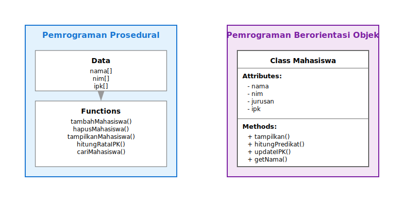
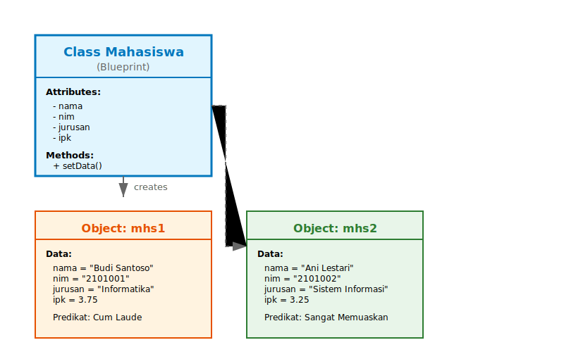
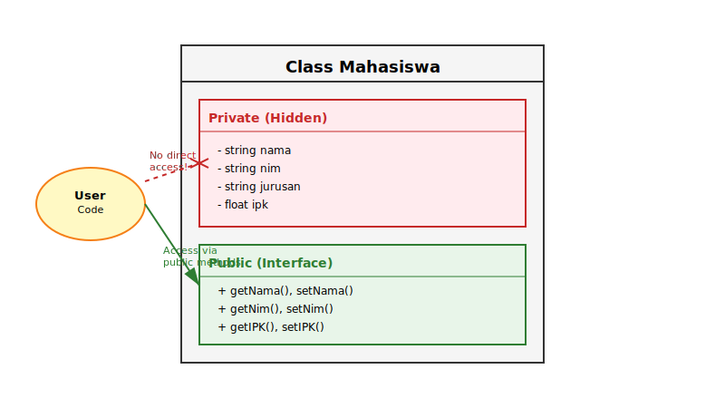
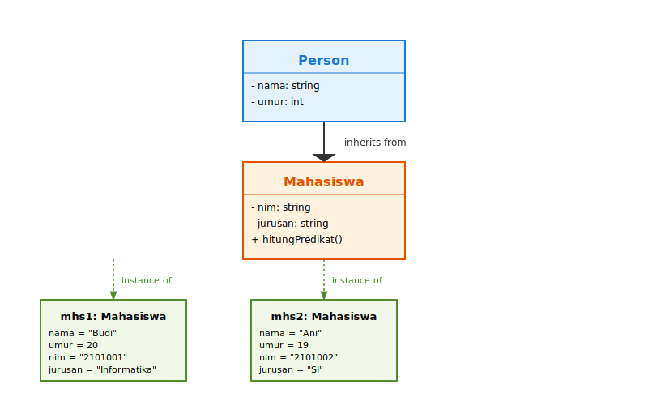
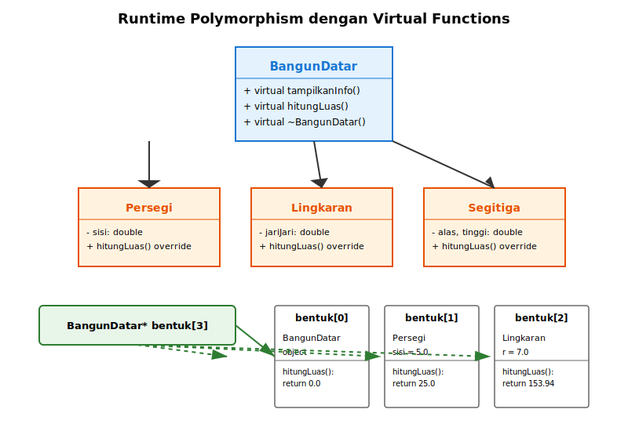

# BAB 14: PENGENALAN PEMROGRAMAN BERORIENTASI OBJEK

## 14.1 Pendahuluan

Selamat datang di pertemuan keempat belas mata kuliah Dasar-Dasar Pemrograman. Hingga saat ini, kita telah mempelajari pemrograman dengan pendekatan prosedural, dimana program kita terdiri dari fungsi-fungsi yang memanipulasi data. Pada pertemuan ini, kita akan berkenalan dengan paradigma pemrograman yang berbeda namun sangat powerful: Pemrograman Berorientasi Objek (Object-Oriented Programming atau OOP).

Bayangkan Anda sedang merancang sebuah game. Dalam game tersebut, ada berbagai karakter seperti pahlawan, musuh, dan NPC (Non-Player Character). Setiap karakter memiliki atribut seperti nama, health point, level, dan kemampuan khusus. Mereka juga memiliki perilaku seperti bergerak, menyerang, dan bertahan. Dengan pemrograman prosedural, kita harus membuat banyak variabel dan fungsi terpisah untuk mengelola setiap karakter. Dengan OOP, kita dapat membuat "template" atau "blueprint" bernama class yang mendefinisikan apa yang dimiliki dan bisa dilakukan oleh sebuah karakter, lalu menciptakan objek-objek individual dari template tersebut.

Pemrograman Berorientasi Objek adalah paradigma pemrograman yang mengorganisir kode dalam bentuk objek-objek yang memiliki data (atribut) dan fungsi (method) yang bekerja pada data tersebut. OOP memungkinkan kita untuk menulis kode yang lebih terorganisir, mudah dipelihara, dan dapat digunakan kembali. Konsep OOP sangat penting karena hampir semua bahasa pemrograman modern seperti Java, Python, C#, dan tentu saja C++, mendukung paradigma ini.

Pada bab ini, kita akan mempelajari konsep fundamental OOP termasuk class dan object, constructor dan destructor, enkapsulasi (encapsulation), pewarisan (inheritance), dan polimorfisme (polymorphism). Pertemuan ini akan memberikan fondasi yang kokoh untuk mempelajari OOP lebih mendalam di mata kuliah yang akan datang.

## 14.2 Paradigma Pemrograman: Prosedural vs OOP

### 14.2.1 Pemrograman Prosedural

Selama ini kita telah belajar pemrograman dengan pendekatan prosedural. Dalam pemrograman prosedural, program dipandang sebagai serangkaian instruksi yang dijalankan secara berurutan. Program dibagi menjadi fungsi-fungsi yang melakukan tugas tertentu, dan data dipisahkan dari fungsi-fungsi tersebut. Data biasanya disimpan dalam variabel global atau dikirim sebagai parameter ke fungsi.

Pendekatan prosedural sangat baik untuk program-program sederhana dan algoritma yang linear. Namun, ketika program menjadi besar dan kompleks, pendekatan ini memiliki beberapa keterbatasan. Data dan fungsi yang terpisah dapat menyebabkan kesulitan dalam memelihara kode, terutama ketika banyak fungsi yang memanipulasi data yang sama. Perubahan pada struktur data dapat mempengaruhi banyak fungsi yang berbeda, membuat modifikasi program menjadi berisiko dan memakan waktu.

Sebagai contoh, jika kita membuat program untuk mengelola data mahasiswa dengan pendekatan prosedural, kita mungkin memiliki beberapa array terpisah untuk menyimpan nama, NIM, jurusan, dan IPK mahasiswa. Kita juga memiliki berbagai fungsi seperti `tambahMahasiswa()`, `hapusMahasiswa()`, `tampilkanMahasiswa()`, dan `hitungRataIPK()`. Jika kita ingin menambahkan atribut baru seperti alamat email, kita harus mengubah banyak fungsi yang ada.

### 14.2.2 Pemrograman Berorientasi Objek

Pemrograman Berorientasi Objek (OOP) mengambil pendekatan yang berbeda. Dalam OOP, program dipandang sebagai kumpulan objek-objek yang saling berinteraksi. Setiap objek memiliki data (disebut atribut atau properties) dan fungsi (disebut method) yang bekerja pada data tersebut. Data dan method yang terkait dikelompokkan bersama dalam satu kesatuan yang disebut class.

OOP memiliki beberapa keunggulan dibandingkan pemrograman prosedural. Pertama, kode menjadi lebih terorganisir karena data dan fungsi yang terkait dikemas dalam satu tempat. Kedua, konsep enkapsulasi memungkinkan kita menyembunyikan detail implementasi dan hanya mengekspos interface yang diperlukan. Ketiga, pewarisan memungkinkan kita untuk membuat class baru berdasarkan class yang sudah ada, mengurangi duplikasi kode. Keempat, polimorfisme memungkinkan kita untuk menulis kode yang lebih fleksibel dan dapat bekerja dengan berbagai tipe objek.

Kembali ke contoh program mahasiswa, dengan OOP kita dapat membuat sebuah class `Mahasiswa` yang memiliki semua atribut (nama, NIM, jurusan, IPK) dan method (tampilkan, hitungPredikat, dll) dalam satu tempat. Jika kita ingin menambahkan atribut baru, kita cukup mengubah class `Mahasiswa` tanpa harus mengubah kode di tempat lain.



*Gambar 14.1: Perbandingan antara paradigma pemrograman prosedural dan berorientasi objek*

### 14.2.3 Empat Pilar OOP

Pemrograman Berorientasi Objek dibangun atas empat konsep fundamental yang sering disebut sebagai empat pilar OOP. Pemahaman yang baik tentang keempat pilar ini sangat penting untuk dapat menulis program OOP yang efektif.

Pilar pertama adalah **Encapsulation** (enkapsulasi), yaitu konsep penggabungan data dan method yang bekerja pada data tersebut dalam satu kesatuan (class), serta menyembunyikan detail internal objek dari dunia luar. Dengan enkapsulasi, kita dapat mengontrol bagaimana data diakses dan dimodifikasi, melindungi data dari manipulasi yang tidak diinginkan.

Pilar kedua adalah **Inheritance** (pewarisan), yaitu mekanisme dimana sebuah class dapat mewarisi atribut dan method dari class lain. Ini memungkinkan kita untuk membuat hierarki class dan mengurangi duplikasi kode. Class yang mewarisi disebut derived class atau child class, sedangkan class yang diwarisi disebut base class atau parent class.

Pilar ketiga adalah **Polymorphism** (polimorfisme), yang berarti "banyak bentuk". Polimorfisme memungkinkan kita untuk menggunakan satu interface untuk berbagai tipe data atau objek yang berbeda. Dengan polimorfisme, kita dapat menulis kode yang lebih fleksibel dan dapat bekerja dengan berbagai jenis objek.

Pilar keempat adalah **Abstraction** (abstraksi), yaitu proses menyembunyikan detail implementasi yang kompleks dan hanya menampilkan fungsionalitas yang penting kepada pengguna. Abstraksi memungkinkan kita untuk fokus pada apa yang dilakukan objek daripada bagaimana ia melakukannya.

## 14.3 Class dan Object

### 14.3.1 Pengertian Class

Class adalah blueprint atau template untuk membuat objek. Class mendefinisikan atribut (data) dan method (fungsi) yang akan dimiliki oleh objek-objek yang dibuat dari class tersebut. Analogi yang sering digunakan adalah class seperti cetakan kue, sedangkan objek adalah kue-kue yang dihasilkan dari cetakan tersebut. Satu cetakan dapat menghasilkan banyak kue dengan bentuk yang sama, meskipun setiap kue adalah entitas yang terpisah.

Dalam C++, class didefinisikan menggunakan kata kunci `class` diikuti dengan nama class dan body class yang diapit oleh kurung kurawal. Di dalam class, kita dapat mendeklarasikan data member (variabel) dan member function (method). Class juga memiliki access specifier yang mengontrol visibilitas member-member tersebut.

Berikut adalah sintaks umum untuk mendefinisikan class:

```cpp
class NamaClass {
private:
    // Data members private
    // Hanya dapat diakses dari dalam class
    
public:
    // Data members public
    // Dapat diakses dari luar class
    
    // Member functions
    // Method-method yang bekerja pada data
};
```

*Kode 14.1: Sintaks umum definisi class dalam C++*

### 14.3.2 Access Specifier

Access specifier menentukan bagaimana member-member dari sebuah class dapat diakses. C++ memiliki tiga access specifier utama: `private`, `public`, dan `protected`. Pada pertemuan ini, kita akan fokus pada `private` dan `public`, karena `protected` lebih relevan dalam konteks inheritance yang lebih kompleks.

Member yang dideklarasikan sebagai `private` hanya dapat diakses dari dalam class itu sendiri. Ini adalah inti dari enkapsulasi, dimana kita menyembunyikan detail internal dari pengguna class. Biasanya, data members (atribut) dideklarasikan sebagai private untuk melindungi integritas data. Untuk mengakses atau memodifikasi data private, kita menyediakan public method yang disebut getter dan setter.

Member yang dideklarasikan sebagai `public` dapat diakses dari mana saja, baik dari dalam class maupun dari luar class. Biasanya, member functions (method) yang merupakan interface class dideklarasikan sebagai public. Ini memungkinkan pengguna class untuk berinteraksi dengan objek melalui method-method yang telah disediakan.

Jika tidak ada access specifier yang disebutkan, default access specifier untuk class adalah private. Ini berbeda dengan struct, dimana default access specifiernya adalah public. Hal ini membuat class lebih cocok untuk enkapsulasi dibandingkan struct.

### 14.3.3 Membuat Class Sederhana

Mari kita buat contoh class sederhana untuk merepresentasikan sebuah mahasiswa. Class ini akan memiliki beberapa atribut dan method dasar.

```cpp
#include <iostream>
#include <string>
using namespace std;

class Mahasiswa {
private:
    // Data members (atribut)
    string nama;
    string nim;
    string jurusan;
    float ipk;

public:
    // Method untuk mengatur nilai atribut
    void setData(string n, string ni, string j, float i) {
        nama = n;
        nim = ni;
        jurusan = j;
        ipk = i;
    }
    
    // Method untuk menampilkan data
    void tampilkan() {
        cout << "=== Data Mahasiswa ===" << endl;
        cout << "Nama    : " << nama << endl;
        cout << "NIM     : " << nim << endl;
        cout << "Jurusan : " << jurusan << endl;
        cout << "IPK     : " << ipk << endl;
    }
    
    // Method untuk menghitung predikat
    string hitungPredikat() {
        if (ipk >= 3.5) return "Cum Laude";
        else if (ipk >= 3.0) return "Sangat Memuaskan";
        else if (ipk >= 2.75) return "Memuaskan";
        else return "Cukup";
    }
};
```

*Kode 14.2: Definisi class Mahasiswa dengan atribut dan method*

Pada contoh di atas, class `Mahasiswa` memiliki empat data member private: `nama`, `nim`, `jurusan`, dan `ipk`. Karena data member ini private, mereka tidak dapat diakses langsung dari luar class. Kita menyediakan tiga public method: `setData()` untuk mengatur nilai atribut, `tampilkan()` untuk menampilkan data mahasiswa, dan `hitungPredikat()` untuk menghitung predikat kelulusan berdasarkan IPK.

### 14.3.4 Pengertian Object

Object adalah instance atau perwujudan konkret dari sebuah class. Jika class adalah blueprint, maka object adalah produk yang dibuat berdasarkan blueprint tersebut. Satu class dapat memiliki banyak object, dan setiap object memiliki nilai atribut yang independen.

Untuk membuat object dari sebuah class, kita menggunakan sintaks yang mirip dengan deklarasi variabel biasa:

```cpp
NamaClass namaObject;
```

Setelah object dibuat, kita dapat mengakses member-member public dari object tersebut menggunakan operator dot (`.`). Mari kita lihat contoh penggunaan class `Mahasiswa` yang telah kita definisikan sebelumnya.

```cpp
int main() {
    // Membuat object dari class Mahasiswa
    Mahasiswa mhs1;
    Mahasiswa mhs2;
    
    // Mengatur data untuk mhs1
    mhs1.setData("Budi Santoso", "2101001", "Informatika", 3.75);
    
    // Mengatur data untuk mhs2
    mhs2.setData("Ani Lestari", "2101002", "Sistem Informasi", 3.25);
    
    // Menampilkan data mahasiswa
    mhs1.tampilkan();
    cout << "Predikat: " << mhs1.hitungPredikat() << endl;
    cout << endl;
    
    mhs2.tampilkan();
    cout << "Predikat: " << mhs2.hitungPredikat() << endl;
    
    return 0;
}
```

*Kode 14.3: Membuat dan menggunakan object dari class Mahasiswa*

Pada contoh di atas, kita membuat dua object `mhs1` dan `mhs2` dari class `Mahasiswa`. Setiap object memiliki set atribut yang independen. Kita mengatur data untuk setiap object menggunakan method `setData()`, kemudian menampilkan data dan menghitung predikat untuk masing-masing mahasiswa. Perhatikan bahwa meskipun `mhs1` dan `mhs2` dibuat dari class yang sama, mereka adalah entitas yang terpisah dengan data yang berbeda.



*Gambar 14.2: Hubungan antara class sebagai blueprint dan object sebagai instance*

## 14.4 Constructor dan Destructor

### 14.4.1 Pengertian Constructor

Constructor adalah member function khusus yang dipanggil secara otomatis ketika sebuah object dibuat. Constructor digunakan untuk menginisialisasi object, seperti mengatur nilai awal untuk data members. Constructor memiliki beberapa karakteristik khusus: namanya harus sama dengan nama class, tidak memiliki return type (bahkan void sekalipun), dan dapat memiliki parameter atau tidak.

Ada beberapa jenis constructor yang perlu kita ketahui. **Default constructor** adalah constructor yang tidak memiliki parameter atau semua parameternya memiliki nilai default. Jika kita tidak mendefinisikan constructor apapun, compiler akan secara otomatis menyediakan default constructor. **Parameterized constructor** adalah constructor yang menerima parameter untuk menginisialisasi object dengan nilai tertentu.

Mari kita modifikasi class `Mahasiswa` untuk menambahkan constructor:

```cpp
class Mahasiswa {
private:
    string nama;
    string nim;
    string jurusan;
    float ipk;

public:
    // Default constructor
    Mahasiswa() {
        nama = "Belum diisi";
        nim = "0000000";
        jurusan = "Belum ditentukan";
        ipk = 0.0;
        cout << "Object mahasiswa dibuat dengan default constructor" << endl;
    }
    
    // Parameterized constructor
    Mahasiswa(string n, string ni, string j, float i) {
        nama = n;
        nim = ni;
        jurusan = j;
        ipk = i;
        cout << "Object mahasiswa " << nama << " dibuat" << endl;
    }
    
    // Method lainnya tetap sama...
    void tampilkan() {
        cout << "=== Data Mahasiswa ===" << endl;
        cout << "Nama    : " << nama << endl;
        cout << "NIM     : " << nim << endl;
        cout << "Jurusan : " << jurusan << endl;
        cout << "IPK     : " << ipk << endl;
    }
};
```

*Kode 14.4: Class Mahasiswa dengan default constructor dan parameterized constructor*

Dengan constructor, kita dapat membuat object dengan cara yang lebih elegan:

```cpp
int main() {
    // Menggunakan default constructor
    Mahasiswa mhs1;
    
    // Menggunakan parameterized constructor
    Mahasiswa mhs2("Citra Dewi", "2101003", "Teknik Komputer", 3.45);
    
    mhs1.tampilkan();
    cout << endl;
    mhs2.tampilkan();
    
    return 0;
}
```

*Kode 14.5: Membuat object menggunakan constructor*

### 14.4.2 Constructor Initializer List

C++ menyediakan cara yang lebih efisien untuk menginisialisasi data members dalam constructor, yaitu menggunakan initializer list. Initializer list ditulis setelah parameter constructor dan sebelum body constructor, diawali dengan tanda titik dua (`:`).

```cpp
class Mahasiswa {
private:
    string nama;
    string nim;
    string jurusan;
    float ipk;

public:
    // Constructor dengan initializer list
    Mahasiswa(string n, string ni, string j, float i) 
        : nama(n), nim(ni), jurusan(j), ipk(i) {
        cout << "Object mahasiswa " << nama << " dibuat" << endl;
    }
    
    // ... method lainnya
};
```

*Kode 14.6: Penggunaan constructor initializer list*

Initializer list lebih efisien karena data members langsung diinisialisasi dengan nilai yang diberikan, bukan diinisialisasi terlebih dahulu dengan nilai default lalu diubah. Untuk tipe data sederhana seperti int atau float, perbedaannya mungkin tidak signifikan, tetapi untuk object yang lebih kompleks, initializer list dapat meningkatkan performa.

### 14.4.3 Destructor

Destructor adalah member function khusus yang dipanggil secara otomatis ketika sebuah object dihancurkan atau keluar dari scope. Destructor digunakan untuk membersihkan resource yang digunakan oleh object, seperti memori dinamis atau file handle. Destructor memiliki karakteristik: namanya sama dengan nama class tetapi diawali dengan tilde (`~`), tidak memiliki return type dan parameter, dan setiap class hanya boleh memiliki satu destructor.

```cpp
class Mahasiswa {
private:
    string nama;
    string nim;
    string jurusan;
    float ipk;

public:
    // Constructor
    Mahasiswa(string n, string ni, string j, float i) 
        : nama(n), nim(ni), jurusan(j), ipk(i) {
        cout << "Object mahasiswa " << nama << " dibuat" << endl;
    }
    
    // Destructor
    ~Mahasiswa() {
        cout << "Object mahasiswa " << nama << " dihancurkan" << endl;
    }
    
    // ... method lainnya
};

int main() {
    cout << "=== Program dimulai ===" << endl;
    
    {
        Mahasiswa mhs1("Doni Pratama", "2101004", "Informatika", 3.60);
        mhs1.tampilkan();
    } // mhs1 keluar dari scope, destructor dipanggil
    
    cout << "=== mhs1 sudah dihancurkan ===" << endl;
    
    Mahasiswa mhs2("Eva Susanti", "2101005", "Sistem Informasi", 3.80);
    
    cout << "=== Program akan berakhir ===" << endl;
    return 0;
    // mhs2 keluar dari scope, destructor dipanggil
}
```

*Kode 14.7: Penggunaan destructor dalam class*

Destructor sangat penting ketika class mengalokasikan resource dinamis. Meskipun pada contoh sederhana di atas destructor hanya mencetak pesan, dalam aplikasi nyata destructor akan melakukan tugas-tugas seperti dealokasi memori dengan `delete`, menutup file, atau memutuskan koneksi database.

## 14.5 Encapsulation (Enkapsulasi)

### 14.5.1 Konsep Data Hiding

Enkapsulasi adalah salah satu pilar fundamental OOP yang mengacu pada penggabungan data dan method yang bekerja pada data tersebut dalam satu kesatuan, serta menyembunyikan detail internal dari pengguna. Konsep utama dari enkapsulasi adalah data hiding, yaitu membuat data members bersifat private sehingga tidak dapat diakses langsung dari luar class.

Data hiding melindungi integritas data dengan memastikan bahwa data hanya dapat diubah melalui method-method yang telah ditentukan. Ini mencegah manipulasi data yang tidak diinginkan atau tidak valid. Misalnya, kita dapat memastikan bahwa IPK mahasiswa selalu dalam rentang 0.0 sampai 4.0, atau NIM selalu dalam format yang benar.

Manfaat utama dari enkapsulasi adalah peningkatan maintainability (kemudahan pemeliharaan). Ketika detail implementasi disembunyikan, kita dapat mengubah implementasi internal tanpa mempengaruhi kode yang menggunakan class tersebut, selama interface public tetap sama. Ini juga meningkatkan modularitas dan mengurangi coupling antara berbagai bagian program.

### 14.5.2 Getter dan Setter Methods

Untuk mengakses dan memodifikasi data private, kita menyediakan public method yang disebut getter dan setter. **Getter method** (accessor) digunakan untuk mendapatkan nilai dari data member private. **Setter method** (mutator) digunakan untuk mengubah nilai data member private, seringkali dengan validasi terlebih dahulu.

Convention penamaan untuk getter dan setter biasanya menggunakan prefix "get" dan "set" diikuti dengan nama atribut. Mari kita tambahkan getter dan setter ke class `Mahasiswa`:

```cpp
class Mahasiswa {
private:
    string nama;
    string nim;
    string jurusan;
    float ipk;

public:
    // Constructor
    Mahasiswa(string n, string ni, string j, float i) 
        : nama(n), nim(ni), jurusan(j), ipk(i) {}
    
    // Getter methods
    string getNama() {
        return nama;
    }
    
    string getNim() {
        return nim;
    }
    
    string getJurusan() {
        return jurusan;
    }
    
    float getIPK() {
        return ipk;
    }
    
    // Setter methods dengan validasi
    void setNama(string n) {
        if (n.length() > 0) {
            nama = n;
        } else {
            cout << "Error: Nama tidak boleh kosong!" << endl;
        }
    }
    
    void setNim(string ni) {
        if (ni.length() == 7) {
            nim = ni;
        } else {
            cout << "Error: NIM harus 7 digit!" << endl;
        }
    }
    
    void setJurusan(string j) {
        jurusan = j;
    }
    
    void setIPK(float i) {
        if (i >= 0.0 && i <= 4.0) {
            ipk = i;
        } else {
            cout << "Error: IPK harus antara 0.0 - 4.0!" << endl;
        }
    }
    
    void tampilkan() {
        cout << "=== Data Mahasiswa ===" << endl;
        cout << "Nama    : " << nama << endl;
        cout << "NIM     : " << nim << endl;
        cout << "Jurusan : " << jurusan << endl;
        cout << "IPK     : " << ipk << endl;
    }
};
```

*Kode 14.8: Class Mahasiswa dengan getter dan setter methods*

Contoh penggunaan getter dan setter:

```cpp
int main() {
    Mahasiswa mhs("Fajar Nugroho", "2101006", "Informatika", 3.50);
    
    // Menggunakan getter
    cout << "Nama: " << mhs.getNama() << endl;
    cout << "IPK: " << mhs.getIPK() << endl;
    cout << endl;
    
    // Menggunakan setter dengan validasi
    mhs.setIPK(3.75); // Valid
    mhs.setIPK(5.0);  // Invalid - akan muncul pesan error
    
    mhs.setNim("123");    // Invalid - akan muncul pesan error
    mhs.setNim("2101007"); // Valid
    
    cout << endl;
    mhs.tampilkan();
    
    return 0;
}
```

*Kode 14.9: Penggunaan getter dan setter methods*



*Gambar 14.3: Konsep enkapsulasi dengan data hiding dan interface public*

## 14.6 Inheritance (Pewarisan)

### 14.6.1 Konsep Dasar Inheritance

Inheritance atau pewarisan adalah mekanisme dimana sebuah class dapat mewarisi atribut dan method dari class lain. Class yang mewarisi disebut **derived class**, **child class**, atau **subclass**. Class yang diwarisi disebut **base class**, **parent class**, atau **superclass**. Inheritance memungkinkan kita untuk membuat hierarki class dan menggunakan kembali kode yang sudah ada.

Konsep inheritance sangat berguna ketika kita memiliki beberapa class yang memiliki kesamaan. Alih-alih menduplikasi kode yang sama di setiap class, kita dapat membuat base class yang berisi atribut dan method yang umum, lalu membuat derived class yang mewarisi dari base class dan menambahkan atribut atau method yang spesifik.

Manfaat utama dari inheritance adalah code reusability (penggunaan kembali kode). Kita tidak perlu menulis ulang kode yang sama untuk class-class yang memiliki kesamaan. Inheritance juga memfasilitasi extensibility, dimana kita dapat dengan mudah menambahkan class baru yang mewarisi dari class yang sudah ada tanpa mengubah kode yang ada.

Sintaks untuk inheritance dalam C++ adalah:

```cpp
class DerivedClass : access-specifier BaseClass {
    // Additional members
};
```

Access specifier dalam inheritance (public, protected, private) menentukan bagaimana member dari base class dapat diakses dalam derived class. Untuk pembelajaran dasar ini, kita akan fokus pada public inheritance yang paling umum digunakan.

### 14.6.2 Membuat Base Class dan Derived Class

Mari kita buat contoh inheritance dengan hierarki class untuk representasi person dan mahasiswa. Kita akan membuat base class `Person` yang memiliki atribut umum seperti nama dan umur, lalu derived class `Mahasiswa` yang mewarisi dari `Person` dan menambahkan atribut spesifik seperti NIM dan jurusan.

```cpp
#include <iostream>
#include <string>
using namespace std;

// Base class
class Person {
protected: // Bisa diakses oleh derived class
    string nama;
    int umur;

public:
    Person(string n, int u) : nama(n), umur(u) {
        cout << "Constructor Person dipanggil" << endl;
    }
    
    void tampilkanInfo() {
        cout << "Nama: " << nama << endl;
        cout << "Umur: " << umur << " tahun" << endl;
    }
    
    // Getter
    string getNama() { return nama; }
    int getUmur() { return umur; }
};

// Derived class
class Mahasiswa : public Person {
private:
    string nim;
    string jurusan;
    float ipk;

public:
    // Constructor derived class
    Mahasiswa(string n, int u, string ni, string j, float i) 
        : Person(n, u) { // Memanggil constructor base class
        nim = ni;
        jurusan = j;
        ipk = i;
        cout << "Constructor Mahasiswa dipanggil" << endl;
    }
    
    // Method khusus untuk Mahasiswa
    void tampilkanMahasiswa() {
        tampilkanInfo(); // Memanggil method dari base class
        cout << "NIM: " << nim << endl;
        cout << "Jurusan: " << jurusan << endl;
        cout << "IPK: " << ipk << endl;
    }
    
    string hitungPredikat() {
        if (ipk >= 3.5) return "Cum Laude";
        else if (ipk >= 3.0) return "Sangat Memuaskan";
        else if (ipk >= 2.75) return "Memuaskan";
        else return "Cukup";
    }
};
```

*Kode 14.10: Base class Person dan derived class Mahasiswa*

Pada contoh di atas, class `Mahasiswa` mewarisi dari class `Person` menggunakan public inheritance. Perhatikan bahwa data members `nama` dan `umur` dideklarasikan sebagai `protected` di base class, sehingga dapat diakses oleh derived class. Constructor derived class memanggil constructor base class menggunakan initializer list untuk menginisialisasi atribut yang diwarisi.

Contoh penggunaan:

```cpp
int main() {
    // Membuat object dari base class
    Person person1("Andi Wijaya", 25);
    cout << "\n=== Data Person ===" << endl;
    person1.tampilkanInfo();
    
    cout << "\n=================================\n" << endl;
    
    // Membuat object dari derived class
    Mahasiswa mhs1("Budi Santoso", 20, "2101001", "Informatika", 3.75);
    cout << "\n=== Data Mahasiswa ===" << endl;
    mhs1.tampilkanMahasiswa();
    cout << "Predikat: " << mhs1.hitungPredikat() << endl;
    
    return 0;
}
```

*Kode 14.11: Penggunaan base class dan derived class*

### 14.6.3 Constructor dalam Inheritance

Ketika object dari derived class dibuat, constructor base class dipanggil terlebih dahulu, baru kemudian constructor derived class. Urutan pemanggilan constructor adalah dari base class paling atas dalam hierarki hingga derived class paling bawah. Sebaliknya, ketika object dihancurkan, destructor dipanggil dalam urutan terbalik: destructor derived class dipanggil terlebih dahulu, baru destructor base class.

Jika base class memiliki parameterized constructor, derived class harus secara eksplisit memanggil constructor base class dalam initializer list. Jika tidak ada pemanggilan eksplisit, compiler akan mencoba memanggil default constructor base class, dan akan terjadi error jika default constructor tidak tersedia.

Mari kita lihat contoh dengan multiple inheritance level:

```cpp
class Person {
protected:
    string nama;
    int umur;

public:
    Person(string n, int u) : nama(n), umur(u) {
        cout << "1. Constructor Person" << endl;
    }
    
    ~Person() {
        cout << "4. Destructor Person" << endl;
    }
};

class Mahasiswa : public Person {
protected:
    string nim;
    string jurusan;

public:
    Mahasiswa(string n, int u, string ni, string j) 
        : Person(n, u), nim(ni), jurusan(j) {
        cout << "2. Constructor Mahasiswa" << endl;
    }
    
    ~Mahasiswa() {
        cout << "3. Destructor Mahasiswa" << endl;
    }
};

class MahasiswaAktif : public Mahasiswa {
private:
    int semester;

public:
    MahasiswaAktif(string n, int u, string ni, string j, int s) 
        : Mahasiswa(n, u, ni, j), semester(s) {
        cout << "3. Constructor MahasiswaAktif" << endl;
    }
    
    ~MahasiswaAktif() {
        cout << "2. Destructor MahasiswaAktif" << endl;
    }
};

int main() {
    cout << "=== Membuat Object ===" << endl;
    MahasiswaAktif mhs("Citra Dewi", 19, "2101002", "Informatika", 3);
    
    cout << "\n=== Object akan dihancurkan ===" << endl;
    return 0;
}
```

*Kode 14.12: Urutan pemanggilan constructor dan destructor dalam inheritance*



*Gambar 14.4: Hierarki inheritance dengan base class Person dan derived class Mahasiswa*

## 14.7 Polymorphism (Polimorfisme)

### 14.7.1 Konsep Dasar Polymorphism

Polymorphism berasal dari bahasa Yunani yang berarti "banyak bentuk". Dalam OOP, polymorphism adalah kemampuan untuk menggunakan satu interface untuk berbagai tipe data atau objek. Polymorphism memungkinkan kita untuk menulis kode yang lebih fleksibel dan dapat bekerja dengan berbagai jenis objek tanpa perlu mengetahui tipe spesifik dari objek tersebut.

Ada dua jenis polymorphism utama dalam C++: **compile-time polymorphism** (juga disebut static polymorphism) dan **runtime polymorphism** (juga disebut dynamic polymorphism). Compile-time polymorphism dicapai melalui function overloading dan operator overloading, dimana compiler menentukan function mana yang akan dipanggil pada saat kompilasi. Runtime polymorphism dicapai melalui inheritance dan virtual functions, dimana function yang akan dipanggil ditentukan pada saat program dijalankan.

Pada pertemuan pengenalan ini, kita akan fokus pada runtime polymorphism dengan virtual functions, karena ini adalah bentuk polymorphism yang paling characteristic untuk OOP.

### 14.7.2 Function Overriding

Function overriding terjadi ketika derived class mendefinisikan ulang method yang sudah ada di base class dengan signature yang sama. Derived class dapat memberikan implementasi yang berbeda untuk method yang diwarisi dari base class. Ini berbeda dengan function overloading, dimana kita memiliki multiple functions dengan nama yang sama tetapi signature yang berbeda di class yang sama.

Mari kita lihat contoh function overriding:

```cpp
class BangunDatar {
protected:
    string nama;

public:
    BangunDatar(string n) : nama(n) {}
    
    // Method yang akan di-override
    void tampilkanInfo() {
        cout << "Ini adalah bangun datar: " << nama << endl;
    }
    
    // Method yang akan di-override
    double hitungLuas() {
        cout << "Luas belum didefinisikan untuk bangun datar umum" << endl;
        return 0.0;
    }
};

class Persegi : public BangunDatar {
private:
    double sisi;

public:
    Persegi(double s) : BangunDatar("Persegi"), sisi(s) {}
    
    // Override method tampilkanInfo
    void tampilkanInfo() {
        cout << "Ini adalah persegi dengan sisi " << sisi << " cm" << endl;
    }
    
    // Override method hitungLuas
    double hitungLuas() {
        return sisi * sisi;
    }
};

class Lingkaran : public BangunDatar {
private:
    double jariJari;

public:
    Lingkaran(double r) : BangunDatar("Lingkaran"), jariJari(r) {}
    
    // Override method tampilkanInfo
    void tampilkanInfo() {
        cout << "Ini adalah lingkaran dengan jari-jari " << jariJari << " cm" << endl;
    }
    
    // Override method hitungLuas
    double hitungLuas() {
        return 3.14159 * jariJari * jariJari;
    }
};
```

*Kode 14.13: Function overriding dalam inheritance*

```cpp
int main() {
    BangunDatar bangun("Umum");
    Persegi persegi(5.0);
    Lingkaran lingkaran(7.0);
    
    bangun.tampilkanInfo();
    cout << "Luas: " << bangun.hitungLuas() << " cm²" << endl;
    cout << endl;
    
    persegi.tampilkanInfo();
    cout << "Luas: " << persegi.hitungLuas() << " cm²" << endl;
    cout << endl;
    
    lingkaran.tampilkanInfo();
    cout << "Luas: " << lingkaran.hitungLuas() << " cm²" << endl;
    
    return 0;
}
```

*Kode 14.14: Penggunaan function overriding*

### 14.7.3 Virtual Functions (Konsep Dasar)

Virtual function adalah fitur kunci untuk mencapai runtime polymorphism dalam C++. Ketika kita mendeklarasikan method sebagai `virtual` di base class, kita memberitahu compiler bahwa method ini mungkin akan di-override di derived class, dan pemanggilan method harus ditentukan pada runtime berdasarkan tipe objek yang sebenarnya, bukan tipe pointer atau reference.

Untuk mendeklarasikan virtual function, kita menambahkan keyword `virtual` sebelum return type di base class:

```cpp
class BangunDatar {
protected:
    string nama;

public:
    BangunDatar(string n) : nama(n) {}
    
    // Virtual function
    virtual void tampilkanInfo() {
        cout << "Ini adalah bangun datar: " << nama << endl;
    }
    
    virtual double hitungLuas() {
        cout << "Luas belum didefinisikan untuk bangun datar umum" << endl;
        return 0.0;
    }
    
    // Virtual destructor penting untuk inheritance
    virtual ~BangunDatar() {
        cout << "Destructor BangunDatar" << endl;
    }
};

class Persegi : public BangunDatar {
private:
    double sisi;

public:
    Persegi(double s) : BangunDatar("Persegi"), sisi(s) {}
    
    void tampilkanInfo() override {
        cout << "Ini adalah persegi dengan sisi " << sisi << " cm" << endl;
    }
    
    double hitungLuas() override {
        return sisi * sisi;
    }
    
    ~Persegi() {
        cout << "Destructor Persegi" << endl;
    }
};

class Lingkaran : public BangunDatar {
private:
    double jariJari;

public:
    Lingkaran(double r) : BangunDatar("Lingkaran"), jariJari(r) {}
    
    void tampilkanInfo() override {
        cout << "Ini adalah lingkaran dengan jari-jari " << jariJari << " cm" << endl;
    }
    
    double hitungLuas() override {
        return 3.14159 * jariJari * jariJari;
    }
    
    ~Lingkaran() {
        cout << "Destructor Lingkaran" << endl;
    }
};
```

*Kode 14.15: Penggunaan virtual functions untuk polymorphism*

Keyword `override` (C++11) di derived class bersifat opsional tetapi sangat direkomendasikan karena membantu compiler mendeteksi kesalahan jika kita tidak sengaja membuat method baru alih-alih meng-override method base class.

Sekarang kita dapat menggunakan polymorphism:

```cpp
int main() {
    // Array of pointers ke base class
    BangunDatar* bentuk[3];
    
    bentuk[0] = new BangunDatar("Umum");
    bentuk[1] = new Persegi(5.0);
    bentuk[2] = new Lingkaran(7.0);
    
    // Polymorphism: pemanggilan method ditentukan pada runtime
    for (int i = 0; i < 3; i++) {
        bentuk[i]->tampilkanInfo();
        cout << "Luas: " << bentuk[i]->hitungLuas() << " cm²" << endl;
        cout << endl;
    }
    
    // Cleanup
    for (int i = 0; i < 3; i++) {
        delete bentuk[i];
    }
    
    return 0;
}
```

*Kode 14.16: Demonstrasi runtime polymorphism dengan virtual functions*

Pada contoh di atas, kita memiliki array of pointers ke base class `BangunDatar`, tetapi setiap pointer sebenarnya menunjuk ke object dari derived class yang berbeda. Ketika kita memanggil `tampilkanInfo()` atau `hitungLuas()` melalui pointer base class, method yang dipanggil adalah method dari derived class yang sebenarnya (runtime polymorphism). Ini sangat powerful karena memungkinkan kita menulis kode yang generic namun dapat bekerja dengan berbagai tipe objek.



*Gambar 14.5: Runtime polymorphism - pointer base class menunjuk ke berbagai derived class objects*

## 14.8 Contoh Aplikasi OOP Sederhana

Untuk memperdalam pemahaman tentang OOP, mari kita buat contoh aplikasi yang lebih kompleks: sistem perpustakaan sederhana. Aplikasi ini akan mendemonstrasikan penggunaan class, inheritance, encapsulation, dan polymorphism dalam satu program yang kohesif.

```cpp
#include <iostream>
#include <string>
#include <vector>
using namespace std;

// Base class untuk item perpustakaan
class ItemPerpustakaan {
protected:
    string kode;
    string judul;
    bool dipinjam;

public:
    ItemPerpustakaan(string k, string j) 
        : kode(k), judul(j), dipinjam(false) {}
    
    virtual void tampilkanInfo() {
        cout << "Kode: " << kode << endl;
        cout << "Judul: " << judul << endl;
        cout << "Status: " << (dipinjam ? "Dipinjam" : "Tersedia") << endl;
    }
    
    virtual string getTipe() {
        return "Item Umum";
    }
    
    void pinjam() {
        if (!dipinjam) {
            dipinjam = true;
            cout << "Item berhasil dipinjam." << endl;
        } else {
            cout << "Item sedang dipinjam!" << endl;
        }
    }
    
    void kembalikan() {
        if (dipinjam) {
            dipinjam = false;
            cout << "Item berhasil dikembalikan." << endl;
        } else {
            cout << "Item tidak sedang dipinjam!" << endl;
        }
    }
    
    bool isDipinjam() { return dipinjam; }
    string getKode() { return kode; }
    
    virtual ~ItemPerpustakaan() {}
};

// Derived class: Buku
class Buku : public ItemPerpustakaan {
private:
    string pengarang;
    int tahunTerbit;

public:
    Buku(string k, string j, string p, int t) 
        : ItemPerpustakaan(k, j), pengarang(p), tahunTerbit(t) {}
    
    void tampilkanInfo() override {
        cout << "\n=== " << getTipe() << " ===" << endl;
        ItemPerpustakaan::tampilkanInfo();
        cout << "Pengarang: " << pengarang << endl;
        cout << "Tahun Terbit: " << tahunTerbit << endl;
    }
    
    string getTipe() override {
        return "Buku";
    }
};

// Derived class: Majalah
class Majalah : public ItemPerpustakaan {
private:
    string penerbit;
    int edisi;

public:
    Majalah(string k, string j, string p, int e) 
        : ItemPerpustakaan(k, j), penerbit(p), edisi(e) {}
    
    void tampilkanInfo() override {
        cout << "\n=== " << getTipe() << " ===" << endl;
        ItemPerpustakaan::tampilkanInfo();
        cout << "Penerbit: " << penerbit << endl;
        cout << "Edisi: " << edisi << endl;
    }
    
    string getTipe() override {
        return "Majalah";
    }
};

// Class Perpustakaan untuk mengelola koleksi
class Perpustakaan {
private:
    vector<ItemPerpustakaan*> koleksi;
    string namaPerpustakaan;

public:
    Perpustakaan(string nama) : namaPerpustakaan(nama) {
        cout << "Perpustakaan " << namaPerpustakaan << " dibuat." << endl;
    }
    
    void tambahItem(ItemPerpustakaan* item) {
        koleksi.push_back(item);
        cout << "Item " << item->getKode() << " ditambahkan ke perpustakaan." << endl;
    }
    
    void tampilkanSemuaItem() {
        cout << "\n========================================" << endl;
        cout << "KOLEKSI " << namaPerpustakaan << endl;
        cout << "========================================" << endl;
        
        if (koleksi.empty()) {
            cout << "Tidak ada item dalam koleksi." << endl;
            return;
        }
        
        for (size_t i = 0; i < koleksi.size(); i++) {
            koleksi[i]->tampilkanInfo();
        }
    }
    
    void tampilkanItemTersedia() {
        cout << "\n=== Item yang Tersedia ===" << endl;
        bool adaTersedia = false;
        
        for (size_t i = 0; i < koleksi.size(); i++) {
            if (!koleksi[i]->isDipinjam()) {
                cout << koleksi[i]->getKode() << " - " 
                     << koleksi[i]->getTipe() << endl;
                adaTersedia = true;
            }
        }
        
        if (!adaTersedia) {
            cout << "Semua item sedang dipinjam." << endl;
        }
    }
    
    ItemPerpustakaan* cariItem(string kode) {
        for (size_t i = 0; i < koleksi.size(); i++) {
            if (koleksi[i]->getKode() == kode) {
                return koleksi[i];
            }
        }
        return nullptr;
    }
    
    ~Perpustakaan() {
        for (size_t i = 0; i < koleksi.size(); i++) {
            delete koleksi[i];
        }
        cout << "Perpustakaan " << namaPerpustakaan << " ditutup." << endl;
    }
};

int main() {
    // Membuat perpustakaan
    Perpustakaan perpus("Kampus IT");
    
    // Menambah koleksi
    perpus.tambahItem(new Buku("BK001", "Pemrograman C++", "Bjarne Stroustrup", 2013));
    perpus.tambahItem(new Buku("BK002", "Data Structures", "Mark Allen Weiss", 2011));
    perpus.tambahItem(new Majalah("MG001", "Chip Indonesia", "PT Gramedia", 145));
    perpus.tambahItem(new Majalah("MG002", "InfoKomputer", "PT Elang", 320));
    
    // Menampilkan semua item
    perpus.tampilkanSemuaItem();
    
    // Meminjam item
    cout << "\n=== Meminjam Item ===" << endl;
    ItemPerpustakaan* item = perpus.cariItem("BK001");
    if (item) {
        item->pinjam();
    }
    
    item = perpus.cariItem("MG001");
    if (item) {
        item->pinjam();
    }
    
    // Menampilkan item tersedia
    perpus.tampilkanItemTersedia();
    
    // Mengembalikan item
    cout << "\n=== Mengembalikan Item ===" << endl;
    item = perpus.cariItem("BK001");
    if (item) {
        item->kembalikan();
    }
    
    // Menampilkan item tersedia lagi
    perpus.tampilkanItemTersedia();
    
    cout << "\n=== Program selesai ===" << endl;
    return 0;
}
```

*Kode 14.17: Aplikasi sistem perpustakaan sederhana menggunakan OOP*

Program di atas mendemonstrasikan beberapa konsep OOP yang telah kita pelajari. `ItemPerpustakaan` adalah base class dengan virtual functions untuk polymorphism. `Buku` dan `Majalah` adalah derived classes yang meng-override method `tampilkanInfo()` dan `getTipe()`. Class `Perpustakaan` menggunakan enkapsulasi untuk menyimpan koleksi item dan menyediakan interface untuk mengelola perpustakaan. Program ini juga menggunakan `vector` dari STL untuk menyimpan pointer ke berbagai jenis item perpustakaan.

## 14.9 Ringkasan Bab

Pada bab ini kita telah mempelajari konsep fundamental Pemrograman Berorientasi Objek (OOP), sebuah paradigma pemrograman yang mengorganisir kode dalam bentuk objek-objek yang memiliki data dan method. OOP menawarkan pendekatan yang berbeda dari pemrograman prosedural yang telah kita pelajari sebelumnya, dengan fokus pada enkapsulasi data dan perilaku dalam satu kesatuan yang disebut class.

Class adalah blueprint atau template untuk membuat objek. Class mendefinisikan atribut (data members) dan method (member functions) yang akan dimiliki oleh objek. Objek adalah instance konkret dari class. Access specifier (`private`, `public`, `protected`) menentukan visibilitas member class dan merupakan kunci untuk enkapsulasi.

Constructor adalah method khusus yang dipanggil otomatis ketika objek dibuat, digunakan untuk inisialisasi. Destructor adalah method khusus yang dipanggil otomatis ketika objek dihancurkan, digunakan untuk cleanup. Constructor dapat memiliki parameter (parameterized constructor) atau tidak (default constructor), dan dapat menggunakan initializer list untuk inisialisasi yang lebih efisien.

Enkapsulasi adalah prinsip penggabungan data dan method dalam satu kesatuan serta menyembunyikan detail internal. Data hiding dilakukan dengan mendeklarasikan data members sebagai private dan menyediakan public getter dan setter methods untuk akses terkontrol. Ini meningkatkan keamanan data dan maintainability kode.

Inheritance adalah mekanisme dimana class dapat mewarisi atribut dan method dari class lain. Base class (parent class) adalah class yang diwarisi, sedangkan derived class (child class) adalah class yang mewarisi. Inheritance memfasilitasi code reuse dan extensibility. Constructor dan destructor dipanggil dalam urutan hierarki: constructor dari base ke derived, destructor dari derived ke base.

Polymorphism adalah kemampuan untuk menggunakan satu interface untuk berbagai tipe objek. Virtual functions memungkinkan runtime polymorphism, dimana method yang dipanggil ditentukan pada runtime berdasarkan tipe objek sebenarnya. Function overriding terjadi ketika derived class mendefinisikan ulang method dari base class. Virtual destructor penting untuk inheritance agar destructor yang tepat dipanggil.

Empat pilar OOP adalah: Encapsulation (enkapsulasi data dan method), Inheritance (pewarisan untuk code reuse), Polymorphism (banyak bentuk melalui interface yang sama), dan Abstraction (menyembunyikan kompleksitas). OOP memungkinkan kita menulis kode yang lebih terorganisir, modular, mudah dipelihara, dan dapat digunakan kembali.

Penguasaan konsep-konsep OOP ini akan menjadi fondasi untuk pembelajaran yang lebih mendalam di mata kuliah Pemrograman Berorientasi Objek di semester mendatang, dimana kita akan mempelajari topik-topik lanjutan seperti operator overloading, friend functions, multiple inheritance, abstract classes, dan design patterns.

## 14.10 Soal Latihan

**Soal 1: Konsep Dasar OOP (Mudah)**

Jelaskan perbedaan antara class dan object dalam OOP! Berikan analogi dari kehidupan sehari-hari untuk menjelaskan hubungan antara class dan object.

**Soal 2: Access Specifier (Mudah)**

Perhatikan class berikut:

```cpp
class Mahasiswa {
private:
    string nama;
    int umur;
public:
    void setNama(string n) { nama = n; }
    string getNama() { return nama; }
};
```

Jelaskan mengapa atribut `nama` dan `umur` dibuat private, bukan public. Apa keuntungan dari pendekatan ini?

**Soal 3: Constructor (Sedang)**

Buatlah class `RekeningBank` dengan atribut nomor rekening, nama pemilik, dan saldo. Buatlah dua constructor: default constructor yang menginisialisasi saldo dengan 0, dan parameterized constructor yang menerima semua parameter. Tambahkan method `setor()`, `tarik()`, dan `tampilkanInfo()`.

**Soal 4: Enkapsulasi (Sedang)**

Buatlah class `Produk` dengan atribut private: kode produk, nama produk, harga, dan stok. Buatlah getter dan setter untuk semua atribut dengan validasi berikut:
- Harga tidak boleh negatif
- Stok tidak boleh negatif
- Kode produk harus memiliki panjang 6 karakter

**Soal 5: Inheritance (Sedang)**

Buatlah hierarki class untuk sistem kendaraan:
- Base class `Kendaraan` dengan atribut merk, tahun, dan warna
- Derived class `Mobil` yang menambahkan atribut jumlah pintu dan jenis transmisi
- Derived class `Motor` yang menambahkan atribut jenis motor (bebek/sport/matic)

Tambahkan constructor dan method `tampilkanSpesifikasi()` untuk setiap class.

**Soal 6: Polymorphism (Sulit)**

Buatlah program yang mendemonstrasikan polymorphism dengan membuat base class `Hewan` yang memiliki virtual method `bersuara()`. Buat minimal 3 derived classes (misalnya `Kucing`, `Anjing`, `Burung`) yang meng-override method `bersuara()` untuk menghasilkan suara yang berbeda. Buat array of pointers ke base class dan demonstrasikan polymorphism.

**Soal 7: Aplikasi Sederhana (Sulit)**

Buatlah program sistem manajemen nilai mahasiswa dengan class-class berikut:
- Class `MataKuliah` dengan atribut kode, nama, dan SKS
- Class `Nilai` dengan atribut mata kuliah, nilai angka, dan method untuk menghitung nilai huruf
- Class `Mahasiswa` dengan atribut nama, NIM, dan daftar nilai

Program harus bisa menambahkan nilai, menampilkan transkrip, dan menghitung IPK mahasiswa.

**Soal 8: Analysis dan Design (Sulit)**

Anda diminta merancang sistem untuk toko buku online. Identifikasi minimal 4 class yang dibutuhkan beserta atribut dan method-nya. Jelaskan hubungan antar class (inheritance, composition) dan bagaimana OOP principles (encapsulation, inheritance, polymorphism) diterapkan dalam design Anda.

## 14.11 Soal Diskusi

1. Dalam konteks apa pemrograman prosedural lebih cocok dibandingkan OOP? Sebaliknya, kapan OOP lebih menguntungkan? Diskusikan dengan memberikan contoh kasus konkret.

2. Mengapa constructor tidak memiliki return type, bahkan void? Jelaskan alasan di balik design decision ini dalam C++.

3. Diskusikan trade-off antara membuat semua atribut public (mudah diakses) versus private (enkapsulasi ketat). Dalam situasi apa masing-masing pendekatan lebih sesuai?

4. Virtual functions menambah overhead pada program (memory untuk vtable dan waktu eksekusi untuk dynamic dispatch). Mengingat cost ini, kapan penggunaan virtual functions benar-benar justified?

5. Beberapa bahasa pemrograman modern seperti Go tidak mendukung inheritance tradisional, melainkan menggunakan composition. Diskusikan kelebihan dan kekurangan inheritance versus composition sebagai mekanisme code reuse.

6. Dalam design real-world systems, bagaimana Anda memutuskan kapan membuat class baru versus menambahkan functionality ke class yang sudah ada? Diskusikan principles yang dapat membantu dalam pengambilan keputusan ini.

7. OOP sering dikritik sebagai paradigma yang overcomplicated untuk problem-problem sederhana. Diskusikan kapan OOP menjadi "overkill" dan pendekatan yang lebih sederhana lebih appropriate.

8. Bagaimana konsep OOP dalam C++ berbeda dengan bahasa OOP pure seperti Java atau Smalltalk? Apa implikasi dari fakta bahwa C++ adalah multi-paradigm language?

## 14.12 Referensi

1. Stroustrup, B. (2013). *The C++ Programming Language* (4th ed.). Addison-Wesley. Chapter 2-3 (Classes and Inheritance).

2. Savitch, W. (2017). *Problem Solving with C++* (10th ed.). Pearson. Chapter 10-11 (Defining Classes and Friends, Separate Compilation, and Inheritance).

3. Lippman, S. B., Lajoie, J., & Moo, B. E. (2012). *C++ Primer* (5th ed.). Addison-Wesley. Chapter 7, 13, 15 (Classes, Copy Control, Object-Oriented Programming).

4. Meyers, S. (2014). *Effective Modern C++*. O'Reilly Media. Item 7, 17, 18 (Object Creation, Special Member Functions).

5. Deitel, P., & Deitel, H. (2016). *C++ How to Program* (10th ed.). Pearson. Chapter 9, 12 (Classes and Objects, OOP: Inheritance).

6. Gamma, E., Helm, R., Johnson, R., & Vlissides, J. (1994). *Design Patterns: Elements of Reusable Object-Oriented Software*. Addison-Wesley. (Untuk pemahaman lebih mendalam tentang OOP design patterns)

7. Stroustrup, B. (2014). *Programming: Principles and Practice Using C++* (2nd ed.). Addison-Wesley. Chapter 9, 14 (Class Design, Object-Oriented Programming).

8. cppreference.com. (2023). "Classes" dan "Derived classes". Tersedia di: https://en.cppreference.com/w/cpp/language/classes dan https://en.cppreference.com/w/cpp/language/derived_class
