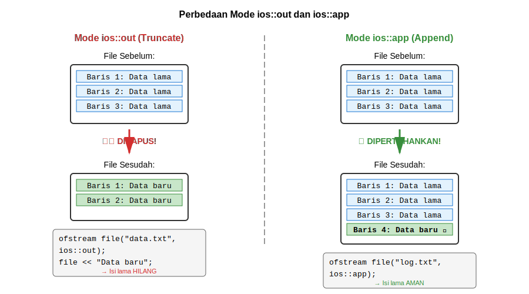
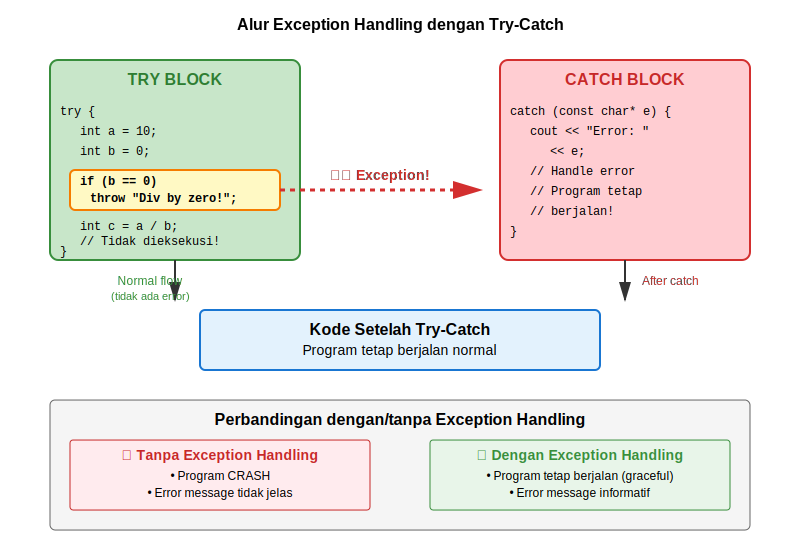

# BAB 15: FILE HANDLING DAN EXCEPTION HANDLING

## 15.1 Pendahuluan

Selamat datang di pertemuan kelima belas, pertemuan terakhir sebelum Ujian Akhir Semester mata kuliah Dasar-Dasar Pemrograman. Sepanjang perjalanan pembelajaran kita, kita telah membangun fondasi yang kuat dalam pemrograman C++, mulai dari konsep dasar seperti variabel dan tipe data, struktur kontrol, fungsi, array, pointer, struct, hingga pengenalan pemrograman berorientasi objek. Pada pertemuan ini, kita akan mempelajari dua topik yang sangat penting dalam pengembangan aplikasi yang robust dan profesional: File Handling dan Exception Handling.

Bayangkan Anda membuat aplikasi manajemen perpustakaan. Tanpa kemampuan menyimpan data ke file, semua informasi buku dan anggota akan hilang begitu program ditutup. Setiap kali aplikasi dijalankan, pengguna harus memasukkan semua data dari awal. Ini tentu tidak praktis. File handling memungkinkan kita untuk menyimpan data secara permanen di storage device, sehingga data tetap tersedia bahkan setelah program ditutup atau komputer dimatikan.

Sekarang bayangkan skenario lain: pengguna mencoba membuka file yang tidak ada, atau file rusak, atau disk penuh saat mencoba menyimpan data. Tanpa exception handling yang baik, program Anda bisa crash atau memberikan pesan error yang tidak jelas. Exception handling memungkinkan program untuk menangani situasi error dengan graceful, memberikan feedback yang informatif kepada pengguna, dan tetap berjalan dengan stabil.

Pada bab ini, kita akan mempelajari berbagai aspek file handling mulai dari membaca dan menulis file teks sederhana hingga operasi file binary yang lebih kompleks. Kita juga akan belajar bagaimana mengimplementasikan exception handling untuk membuat program yang lebih reliable dan user-friendly. Kedua topik ini akan sering digunakan bersama-sama, karena operasi file adalah salah satu sumber error yang paling umum dalam programming.

## 15.2 File Handling di C++

### 15.2.1 Konsep Dasar File Handling

File adalah kumpulan data yang disimpan di storage device dengan nama tertentu. Dalam pemrograman, file digunakan untuk menyimpan data secara permanen sehingga data tidak hilang ketika program berhenti berjalan. C++ menyediakan library `<fstream>` yang berisi class-class untuk operasi file.

Ada tiga class utama dalam file handling C++:
- **ifstream** (input file stream): Digunakan untuk membaca data dari file
- **ofstream** (output file stream): Digunakan untuk menulis data ke file
- **fstream** (file stream): Digunakan untuk membaca dan menulis data ke file

Setiap operasi file mengikuti pola yang sama:
1. Membuka file
2. Melakukan operasi (membaca/menulis)
3. Menutup file

Mari kita lihat diagram alur kerja file handling:


*Gambar 15.1: Alur kerja file handling - dari membuka file hingga menutup file*

### 15.2.2 Membuka dan Menutup File

Untuk bekerja dengan file, langkah pertama adalah membuka file. Ada beberapa cara untuk membuka file:

**Cara 1: Membuka file saat deklarasi**
```cpp
#include <fstream>
using namespace std;

int main() {
    // Membuka file untuk menulis
    ofstream fileOutput("data.txt");
    
    // Membuka file untuk membaca
    ifstream fileInput("data.txt");
    
    return 0;
}
```
*Kode 15.1: Membuka file dengan constructor*

**Cara 2: Membuka file dengan method open()**
```cpp
#include <fstream>
using namespace std;

int main() {
    ofstream fileOutput;
    fileOutput.open("data.txt");
    
    ifstream fileInput;
    fileInput.open("data.txt");
    
    return 0;
}
```
*Kode 15.2: Membuka file dengan method open()*

Setelah selesai bekerja dengan file, kita harus menutupnya menggunakan method `close()`:

```cpp
#include <fstream>
using namespace std;

int main() {
    ofstream fileOutput("data.txt");
    
    // Operasi file...
    
    fileOutput.close();  // Menutup file
    
    return 0;
}
```
*Kode 15.3: Menutup file dengan method close()*

Menutup file sangat penting karena:
- Memastikan semua data yang di-buffer ditulis ke file
- Membebaskan resource sistem
- Mencegah korupsi data
- Memungkinkan program lain mengakses file

### 15.2.3 File Modes

Saat membuka file, kita dapat menentukan mode pembukaan file. Mode ini menentukan bagaimana file akan digunakan:

| Mode | Keterangan |
|------|------------|
| `ios::in` | Membuka file untuk membaca (default untuk ifstream) |
| `ios::out` | Membuka file untuk menulis (default untuk ofstream) |
| `ios::app` | Append - menulis di akhir file tanpa menghapus isi lama |
| `ios::ate` | Set posisi awal di akhir file |
| `ios::trunc` | Truncate - menghapus isi file jika sudah ada (default untuk ios::out) |
| `ios::binary` | Membuka file dalam mode binary |

Mode-mode ini dapat dikombinasikan menggunakan operator bitwise OR (`|`):

```cpp
#include <fstream>
using namespace std;

int main() {
    // Membuka file untuk menulis dan append
    ofstream file1("log.txt", ios::out | ios::app);
    
    // Membuka file binary untuk membaca dan menulis
    fstream file2("data.bin", ios::in | ios::out | ios::binary);
    
    // Membuka file untuk menulis, mulai dari akhir
    ofstream file3("notes.txt", ios::out | ios::ate);
    
    return 0;
}
```
*Kode 15.4: Menggunakan berbagai file modes*

Mari kita lihat diagram yang mengilustrasikan perbedaan antara mode `ios::out` dan `ios::app`:



*Gambar 15.2: Perbedaan antara mode ios::out (menghapus isi lama) dan ios::app (menambah di akhir)*

### 15.2.4 Menulis ke File Teks

Menulis data ke file teks di C++ sangat mirip dengan menulis ke console menggunakan `cout`. Kita menggunakan operator `<<`:

```cpp
#include <iostream>
#include <fstream>
using namespace std;

int main() {
    ofstream fileOutput("mahasiswa.txt");
    
    // Cek apakah file berhasil dibuka
    if (!fileOutput) {
        cout << "Error: Tidak dapat membuka file!" << endl;
        return 1;
    }
    
    // Menulis data ke file
    fileOutput << "Nama: Budi Santoso" << endl;
    fileOutput << "NIM: 123456789" << endl;
    fileOutput << "Jurusan: Teknik Informatika" << endl;
    fileOutput << "IPK: 3.75" << endl;
    
    fileOutput.close();
    cout << "Data berhasil ditulis ke file!" << endl;
    
    return 0;
}
```
*Kode 15.5: Menulis data mahasiswa ke file teks*

Kita juga bisa menggunakan method `put()` untuk menulis karakter satu per satu:

```cpp
#include <fstream>
using namespace std;

int main() {
    ofstream file("output.txt");
    
    char teks[] = "Hello World!";
    for (int i = 0; teks[i] != '\0'; i++) {
        file.put(teks[i]);
    }
    
    file.close();
    return 0;
}
```
*Kode 15.6: Menulis karakter menggunakan method put()*

**Contoh Program: Sistem Log Sederhana**

```cpp
#include <iostream>
#include <fstream>
#include <ctime>
using namespace std;

void tulisLog(string pesan) {
    ofstream logFile("system.log", ios::app);
    
    if (!logFile) {
        cout << "Error: Tidak dapat membuka file log!" << endl;
        return;
    }
    
    // Mendapatkan waktu saat ini
    time_t now = time(0);
    char* dt = ctime(&now);
    
    // Menulis log dengan timestamp
    logFile << "[" << dt << "] " << pesan << endl;
    logFile.close();
}

int main() {
    tulisLog("Program dimulai");
    tulisLog("Membaca konfigurasi");
    tulisLog("Koneksi database berhasil");
    tulisLog("Program selesai");
    
    cout << "Log telah ditulis ke system.log" << endl;
    
    return 0;
}
```
*Kode 15.7: Program sistem log sederhana dengan timestamp*

### 15.2.5 Membaca dari File Teks

Untuk membaca data dari file, kita menggunakan `ifstream` dengan operator `>>` atau method seperti `getline()` dan `get()`.

**Membaca dengan Operator >>**

Operator `>>` membaca data terpisah oleh whitespace (spasi, tab, newline):

```cpp
#include <iostream>
#include <fstream>
using namespace std;

int main() {
    ifstream fileInput("data.txt");
    
    if (!fileInput) {
        cout << "Error: File tidak ditemukan!" << endl;
        return 1;
    }
    
    string kata;
    while (fileInput >> kata) {
        cout << kata << endl;
    }
    
    fileInput.close();
    return 0;
}
```
*Kode 15.8: Membaca file kata per kata*

**Membaca dengan getline()**

Method `getline()` membaca satu baris penuh termasuk spasi:

```cpp
#include <iostream>
#include <fstream>
#include <string>
using namespace std;

int main() {
    ifstream fileInput("mahasiswa.txt");
    
    if (!fileInput) {
        cout << "Error: File tidak ditemukan!" << endl;
        return 1;
    }
    
    string baris;
    while (getline(fileInput, baris)) {
        cout << baris << endl;
    }
    
    fileInput.close();
    return 0;
}
```
*Kode 15.9: Membaca file baris per baris*

**Membaca dengan get()**

Method `get()` membaca karakter satu per satu:

```cpp
#include <iostream>
#include <fstream>
using namespace std;

int main() {
    ifstream fileInput("data.txt");
    
    if (!fileInput) {
        cout << "Error: File tidak ditemukan!" << endl;
        return 1;
    }
    
    char karakter;
    while (fileInput.get(karakter)) {
        cout << karakter;
    }
    
    fileInput.close();
    return 0;
}
```
*Kode 15.10: Membaca file karakter per karakter*

**Contoh Program: Membaca Data Terstruktur**

```cpp
#include <iostream>
#include <fstream>
#include <string>
using namespace std;

struct Mahasiswa {
    string nama;
    string nim;
    string jurusan;
    double ipk;
};

int main() {
    ifstream fileInput("mahasiswa_data.txt");
    
    if (!fileInput) {
        cout << "Error: File tidak ditemukan!" << endl;
        return 1;
    }
    
    Mahasiswa mhs;
    string label;
    
    // Membaca data dengan format "Label: Nilai"
    while (fileInput >> label) {
        if (label == "Nama:") {
            getline(fileInput, mhs.nama);
            mhs.nama = mhs.nama.substr(1); // Hapus spasi awal
        } else if (label == "NIM:") {
            fileInput >> mhs.nim;
        } else if (label == "Jurusan:") {
            getline(fileInput, mhs.jurusan);
            mhs.jurusan = mhs.jurusan.substr(1);
        } else if (label == "IPK:") {
            fileInput >> mhs.ipk;
        }
    }
    
    // Menampilkan data yang dibaca
    cout << "Data Mahasiswa:" << endl;
    cout << "Nama: " << mhs.nama << endl;
    cout << "NIM: " << mhs.nim << endl;
    cout << "Jurusan: " << mhs.jurusan << endl;
    cout << "IPK: " << mhs.ipk << endl;
    
    fileInput.close();
    return 0;
}
```
*Kode 15.11: Membaca data terstruktur dari file*

### 15.2.6 Memeriksa Status File

C++ menyediakan beberapa method untuk memeriksa status file:

| Method | Keterangan |
|--------|------------|
| `eof()` | Mengembalikan true jika sudah mencapai end of file |
| `fail()` | Mengembalikan true jika operasi terakhir gagal |
| `bad()` | Mengembalikan true jika terjadi error serius |
| `good()` | Mengembalikan true jika tidak ada error |

```cpp
#include <iostream>
#include <fstream>
using namespace std;

int main() {
    ifstream file("data.txt");
    
    if (file.good()) {
        cout << "File dalam kondisi baik" << endl;
    }
    
    string data;
    while (!file.eof()) {
        file >> data;
        if (file.fail()) {
            cout << "Gagal membaca data" << endl;
            break;
        }
        cout << data << endl;
    }
    
    if (file.bad()) {
        cout << "Terjadi error serius pada file" << endl;
    }
    
    file.close();
    return 0;
}
```
*Kode 15.12: Memeriksa status file*

### 15.2.7 File Position Pointers

Setiap file stream memiliki pointer yang menunjuk ke posisi saat ini dalam file. Ada dua pointer:
- **get pointer**: Untuk posisi pembacaan
- **put pointer**: Untuk posisi penulisan

Method-method untuk mengatur posisi:

| Method | Keterangan |
|--------|------------|
| `seekg(offset, direction)` | Set posisi get pointer |
| `seekp(offset, direction)` | Set posisi put pointer |
| `tellg()` | Mengembalikan posisi get pointer saat ini |
| `tellp()` | Mengembalikan posisi put pointer saat ini |

Direction dapat berupa:
- `ios::beg`: Dari awal file
- `ios::cur`: Dari posisi saat ini
- `ios::end`: Dari akhir file

```cpp
#include <iostream>
#include <fstream>
using namespace std;

int main() {
    fstream file("data.txt", ios::in | ios::out);
    
    if (!file) {
        cout << "Error membuka file!" << endl;
        return 1;
    }
    
    // Pindah ke byte ke-5 dari awal file
    file.seekg(5, ios::beg);
    
    // Membaca posisi saat ini
    streampos posisi = file.tellg();
    cout << "Posisi saat ini: " << posisi << endl;
    
    // Pindah ke akhir file
    file.seekg(0, ios::end);
    
    // Mendapatkan ukuran file
    streampos ukuranFile = file.tellg();
    cout << "Ukuran file: " << ukuranFile << " bytes" << endl;
    
    file.close();
    return 0;
}
```
*Kode 15.13: Menggunakan file position pointers*


*Gambar 15.3: File position pointers dan arah pergerakan seekg/seekp*

### 15.2.8 Binary File Operations

File binary menyimpan data dalam format yang sama dengan representasi internal di memori. Ini berbeda dengan file teks yang menyimpan data sebagai karakter. File binary lebih efisien untuk menyimpan data numerik dan struktur kompleks.

**Menulis File Binary**

Untuk menulis data binary, kita menggunakan method `write()`:

```cpp
#include <iostream>
#include <fstream>
using namespace std;

struct Mahasiswa {
    char nama[50];
    int nim;
    float ipk;
};

int main() {
    ofstream fileBinary("mahasiswa.dat", ios::binary);
    
    if (!fileBinary) {
        cout << "Error membuka file!" << endl;
        return 1;
    }
    
    Mahasiswa mhs;
    strcpy(mhs.nama, "Andi Wijaya");
    mhs.nim = 123456;
    mhs.ipk = 3.85;
    
    // Menulis struct ke file binary
    fileBinary.write(reinterpret_cast<char*>(&mhs), sizeof(Mahasiswa));
    
    fileBinary.close();
    cout << "Data berhasil ditulis dalam format binary" << endl;
    
    return 0;
}
```
*Kode 15.14: Menulis data ke file binary*

**Membaca File Binary**

Untuk membaca data binary, kita menggunakan method `read()`:

```cpp
#include <iostream>
#include <fstream>
using namespace std;

struct Mahasiswa {
    char nama[50];
    int nim;
    float ipk;
};

int main() {
    ifstream fileBinary("mahasiswa.dat", ios::binary);
    
    if (!fileBinary) {
        cout << "Error membuka file!" << endl;
        return 1;
    }
    
    Mahasiswa mhs;
    
    // Membaca struct dari file binary
    fileBinary.read(reinterpret_cast<char*>(&mhs), sizeof(Mahasiswa));
    
    // Menampilkan data
    cout << "Data Mahasiswa:" << endl;
    cout << "Nama: " << mhs.nama << endl;
    cout << "NIM: " << mhs.nim << endl;
    cout << "IPK: " << mhs.ipk << endl;
    
    fileBinary.close();
    return 0;
}
```
*Kode 15.15: Membaca data dari file binary*

**Contoh Program: Database Mahasiswa Sederhana**

```cpp
#include <iostream>
#include <fstream>
#include <cstring>
using namespace std;

struct Mahasiswa {
    char nama[50];
    int nim;
    char jurusan[30];
    float ipk;
};

void tambahMahasiswa() {
    ofstream file("database.dat", ios::binary | ios::app);
    
    Mahasiswa mhs;
    cout << "\n=== Tambah Mahasiswa ===" << endl;
    cout << "Nama: "; cin.ignore(); cin.getline(mhs.nama, 50);
    cout << "NIM: "; cin >> mhs.nim;
    cout << "Jurusan: "; cin.ignore(); cin.getline(mhs.jurusan, 30);
    cout << "IPK: "; cin >> mhs.ipk;
    
    file.write(reinterpret_cast<char*>(&mhs), sizeof(Mahasiswa));
    file.close();
    
    cout << "Data berhasil ditambahkan!" << endl;
}

void tampilkanSemuaMahasiswa() {
    ifstream file("database.dat", ios::binary);
    
    if (!file) {
        cout << "Database kosong atau belum ada!" << endl;
        return;
    }
    
    Mahasiswa mhs;
    int nomor = 1;
    
    cout << "\n=== Daftar Mahasiswa ===" << endl;
    while (file.read(reinterpret_cast<char*>(&mhs), sizeof(Mahasiswa))) {
        cout << "\nMahasiswa #" << nomor++ << endl;
        cout << "Nama    : " << mhs.nama << endl;
        cout << "NIM     : " << mhs.nim << endl;
        cout << "Jurusan : " << mhs.jurusan << endl;
        cout << "IPK     : " << mhs.ipk << endl;
    }
    
    file.close();
}

void cariMahasiswa() {
    ifstream file("database.dat", ios::binary);
    
    if (!file) {
        cout << "Database kosong atau belum ada!" << endl;
        return;
    }
    
    int nimCari;
    cout << "\nMasukkan NIM yang dicari: ";
    cin >> nimCari;
    
    Mahasiswa mhs;
    bool ditemukan = false;
    
    while (file.read(reinterpret_cast<char*>(&mhs), sizeof(Mahasiswa))) {
        if (mhs.nim == nimCari) {
            cout << "\nData ditemukan:" << endl;
            cout << "Nama    : " << mhs.nama << endl;
            cout << "NIM     : " << mhs.nim << endl;
            cout << "Jurusan : " << mhs.jurusan << endl;
            cout << "IPK     : " << mhs.ipk << endl;
            ditemukan = true;
            break;
        }
    }
    
    if (!ditemukan) {
        cout << "Mahasiswa dengan NIM " << nimCari << " tidak ditemukan!" << endl;
    }
    
    file.close();
}

int main() {
    int pilihan;
    
    do {
        cout << "\n=== Database Mahasiswa ===" << endl;
        cout << "1. Tambah Mahasiswa" << endl;
        cout << "2. Tampilkan Semua Mahasiswa" << endl;
        cout << "3. Cari Mahasiswa" << endl;
        cout << "4. Keluar" << endl;
        cout << "Pilihan: ";
        cin >> pilihan;
        
        switch (pilihan) {
            case 1:
                tambahMahasiswa();
                break;
            case 2:
                tampilkanSemuaMahasiswa();
                break;
            case 3:
                cariMahasiswa();
                break;
            case 4:
                cout << "Terima kasih!" << endl;
                break;
            default:
                cout << "Pilihan tidak valid!" << endl;
        }
    } while (pilihan != 4);
    
    return 0;
}
```
*Kode 15.16: Program database mahasiswa menggunakan binary file*

## 15.3 Exception Handling di C++

### 15.3.1 Konsep Exception dan Error Handling

Exception adalah kejadian yang tidak normal atau error yang terjadi saat program berjalan. Tanpa exception handling yang baik, program bisa crash atau memberikan hasil yang tidak terduga. Exception handling adalah mekanisme untuk mendeteksi dan menangani error secara terstruktur.

Bayangkan Anda sedang menyetir mobil. Jika ban kempes (exception), ada beberapa cara untuk menanganinya:
1. **Tanpa handling**: Tetap menyetir dan mobil rusak (program crash)
2. **Basic handling**: Berhenti di pinggir jalan (program berhenti dengan error message)
3. **Good handling**: Berhenti, ganti ban, lanjut perjalanan (program recover dan lanjut)

Exception handling yang baik memungkinkan program untuk:
- Mendeteksi error dengan cepat
- Memisahkan kode normal dari kode error handling
- Memberikan informasi error yang jelas
- Recover dari error jika memungkinkan
- Membuat program lebih robust dan reliable

Mari kita lihat diagram alur exception handling:



*Gambar 15.4: Alur kerja exception handling dengan try-catch block*

### 15.3.2 Try-Catch Block

Try-catch adalah struktur dasar exception handling di C++. Sintaksnya:

```cpp
try {
    // Kode yang mungkin menghasilkan exception
} catch (TipeException e) {
    // Kode untuk menangani exception
}
```

**Contoh Sederhana:**

```cpp
#include <iostream>
using namespace std;

int main() {
    int angka1, angka2;
    
    cout << "Masukkan angka pertama: ";
    cin >> angka1;
    cout << "Masukkan angka kedua: ";
    cin >> angka2;
    
    try {
        if (angka2 == 0) {
            throw "Error: Pembagian dengan nol!";
        }
        
        double hasil = static_cast<double>(angka1) / angka2;
        cout << "Hasil: " << hasil << endl;
    }
    catch (const char* pesan) {
        cout << pesan << endl;
    }
    
    cout << "Program selesai." << endl;
    return 0;
}
```
*Kode 15.17: Try-catch block untuk menangani pembagian dengan nol*

### 15.3.3 Throw Statement

Statement `throw` digunakan untuk melempar (throwing) exception. Kita bisa throw berbagai tipe data:

```cpp
#include <iostream>
using namespace std;

double hitungAkarKuadrat(double angka) {
    if (angka < 0) {
        throw "Error: Tidak bisa menghitung akar kuadrat dari bilangan negatif!";
    }
    return sqrt(angka);
}

int akseArray(int arr[], int ukuran, int indeks) {
    if (indeks < 0 || indeks >= ukuran) {
        throw indeks;  // Throw integer
    }
    return arr[indeks];
}

int main() {
    // Contoh 1: Throw string
    try {
        double hasil = hitungAkarKuadrat(-9);
        cout << "Hasil: " << hasil << endl;
    }
    catch (const char* pesan) {
        cout << pesan << endl;
    }
    
    // Contoh 2: Throw integer
    int data[] = {10, 20, 30, 40, 50};
    try {
        int nilai = akseArray(data, 5, 10);
        cout << "Nilai: " << nilai << endl;
    }
    catch (int indeks) {
        cout << "Error: Indeks " << indeks << " di luar jangkauan!" << endl;
    }
    
    return 0;
}
```
*Kode 15.18: Menggunakan throw dengan berbagai tipe data*

### 15.3.4 Multiple Catch Blocks

Kita bisa memiliki beberapa catch block untuk menangani berbagai jenis exception:

```cpp
#include <iostream>
using namespace std;

void prosesData(int pilihan) {
    if (pilihan == 1) {
        throw 42;                    // Throw integer
    } else if (pilihan == 2) {
        throw 3.14;                  // Throw double
    } else if (pilihan == 3) {
        throw "Error String";        // Throw string
    } else {
        throw 'X';                   // Throw char
    }
}

int main() {
    int pilihan;
    
    cout << "Masukkan pilihan (1-4): ";
    cin >> pilihan;
    
    try {
        prosesData(pilihan);
    }
    catch (int e) {
        cout << "Caught integer exception: " << e << endl;
    }
    catch (double e) {
        cout << "Caught double exception: " << e << endl;
    }
    catch (const char* e) {
        cout << "Caught string exception: " << e << endl;
    }
    catch (...) {
        // Catch-all: menangani exception apapun yang tidak tertangani
        cout << "Caught unknown exception!" << endl;
    }
    
    return 0;
}
```
*Kode 15.19: Multiple catch blocks untuk berbagai tipe exception*

### 15.3.5 Standard Exception Classes

C++ menyediakan hierarki class exception standar yang dapat digunakan. Class-class ini didefinisikan di header `<exception>` dan `<stdexcept>`:

```
exception (base class)
├── bad_alloc          - alokasi memori gagal
├── bad_cast           - dynamic_cast gagal
├── bad_typeid         - typeid gagal
├── bad_exception      - unexpected exception
└── logic_error        - error logika program
    ├── invalid_argument   - argumen tidak valid
    ├── domain_error       - domain matematika tidak valid
    ├── length_error       - panjang terlalu besar
    └── out_of_range       - di luar jangkauan
└── runtime_error      - error saat runtime
    ├── range_error        - hasil di luar range
    ├── overflow_error     - arithmetic overflow
    └── underflow_error    - arithmetic underflow
```

**Contoh Penggunaan:**

```cpp
#include <iostream>
#include <stdexcept>
using namespace std;

double bagi(double a, double b) {
    if (b == 0) {
        throw invalid_argument("Pembagi tidak boleh nol!");
    }
    return a / b;
}

int akses(int arr[], int ukuran, int indeks) {
    if (indeks < 0 || indeks >= ukuran) {
        throw out_of_range("Indeks di luar jangkauan array!");
    }
    return arr[indeks];
}

int main() {
    // Contoh 1: invalid_argument
    try {
        double hasil = bagi(10, 0);
        cout << "Hasil: " << hasil << endl;
    }
    catch (invalid_argument& e) {
        cout << "Error: " << e.what() << endl;
    }
    
    // Contoh 2: out_of_range
    int data[] = {1, 2, 3, 4, 5};
    try {
        int nilai = akses(data, 5, 10);
        cout << "Nilai: " << nilai << endl;
    }
    catch (out_of_range& e) {
        cout << "Error: " << e.what() << endl;
    }
    
    return 0;
}
```
*Kode 15.20: Menggunakan standard exception classes*

### 15.3.6 Exception dalam File Operations

File operations adalah salah satu sumber error yang paling umum. Kita harus selalu siap menangani exception saat bekerja dengan file:

```cpp
#include <iostream>
#include <fstream>
#include <stdexcept>
#include <string>
using namespace std;

void bacaFile(string namaFile) {
    ifstream file(namaFile);
    
    if (!file.is_open()) {
        throw runtime_error("Tidak dapat membuka file: " + namaFile);
    }
    
    string baris;
    while (getline(file, baris)) {
        cout << baris << endl;
    }
    
    if (file.bad()) {
        throw runtime_error("Error saat membaca file!");
    }
    
    file.close();
}

void tulisFile(string namaFile, string konten) {
    ofstream file(namaFile);
    
    if (!file.is_open()) {
        throw runtime_error("Tidak dapat membuat file: " + namaFile);
    }
    
    file << konten;
    
    if (file.fail()) {
        throw runtime_error("Error saat menulis ke file!");
    }
    
    file.close();
}

int main() {
    try {
        // Coba baca file
        cout << "Membaca file..." << endl;
        bacaFile("data.txt");
        
        // Coba tulis file
        cout << "\nMenulis ke file..." << endl;
        tulisFile("output.txt", "Hello, File Handling!");
        
        cout << "Operasi file berhasil!" << endl;
    }
    catch (runtime_error& e) {
        cout << "Runtime Error: " << e.what() << endl;
    }
    catch (exception& e) {
        cout << "Exception: " << e.what() << endl;
    }
    
    return 0;
}
```
*Kode 15.21: Exception handling untuk file operations*

**Program Copy File dengan Exception Handling:**

```cpp
#include <iostream>
#include <fstream>
#include <stdexcept>
#include <string>
using namespace std;

void copyFile(string sumber, string tujuan) {
    ifstream fileInput(sumber, ios::binary);
    if (!fileInput.is_open()) {
        throw runtime_error("Tidak dapat membuka file sumber: " + sumber);
    }
    
    ofstream fileOutput(tujuan, ios::binary);
    if (!fileOutput.is_open()) {
        fileInput.close();
        throw runtime_error("Tidak dapat membuat file tujuan: " + tujuan);
    }
    
    // Copy isi file
    char buffer[1024];
    while (fileInput.read(buffer, sizeof(buffer)) || fileInput.gcount() > 0) {
        fileOutput.write(buffer, fileInput.gcount());
        
        if (fileOutput.fail()) {
            fileInput.close();
            fileOutput.close();
            throw runtime_error("Error saat menulis ke file tujuan!");
        }
    }
    
    if (fileInput.bad()) {
        fileInput.close();
        fileOutput.close();
        throw runtime_error("Error saat membaca file sumber!");
    }
    
    fileInput.close();
    fileOutput.close();
}

int main() {
    string fileSumber, fileTujuan;
    
    cout << "Program Copy File" << endl;
    cout << "File sumber: ";
    getline(cin, fileSumber);
    cout << "File tujuan: ";
    getline(cin, fileTujuan);
    
    try {
        copyFile(fileSumber, fileTujuan);
        cout << "File berhasil di-copy!" << endl;
    }
    catch (runtime_error& e) {
        cout << "Error: " << e.what() << endl;
        return 1;
    }
    catch (...) {
        cout << "Unknown error terjadi!" << endl;
        return 1;
    }
    
    return 0;
}
```
*Kode 15.22: Program copy file dengan comprehensive exception handling*

### 15.3.7 Custom Exception Classes

Kita bisa membuat class exception sendiri dengan mewarisi dari `std::exception`:

```cpp
#include <iostream>
#include <exception>
#include <string>
using namespace std;

class SaldoTidakCukupException : public exception {
private:
    string pesan;
public:
    SaldoTidakCukupException(double saldo, double penarikan) {
        pesan = "Saldo tidak cukup! Saldo: " + to_string(saldo) + 
                ", Penarikan: " + to_string(penarikan);
    }
    
    const char* what() const noexcept override {
        return pesan.c_str();
    }
};

class PinSalahException : public exception {
private:
    int percobaan;
public:
    PinSalahException(int p) : percobaan(p) {}
    
    const char* what() const noexcept override {
        return "PIN yang dimasukkan salah!";
    }
    
    int getPercobaan() const { return percobaan; }
};

class ATM {
private:
    double saldo;
    string pin;
    
public:
    ATM(double saldoAwal, string pinAwal) : saldo(saldoAwal), pin(pinAwal) {}
    
    void tarikTunai(string inputPin, double jumlah) {
        if (inputPin != pin) {
            throw PinSalahException(1);
        }
        
        if (jumlah > saldo) {
            throw SaldoTidakCukupException(saldo, jumlah);
        }
        
        saldo -= jumlah;
        cout << "Penarikan berhasil! Saldo sekarang: " << saldo << endl;
    }
    
    double cekSaldo(string inputPin) {
        if (inputPin != pin) {
            throw PinSalahException(1);
        }
        return saldo;
    }
};

int main() {
    ATM atm(1000000, "1234");
    
    try {
        // Cek saldo
        cout << "Saldo: " << atm.cekSaldo("1234") << endl;
        
        // Tarik tunai normal
        atm.tarikTunai("1234", 200000);
        
        // Tarik tunai melebihi saldo
        atm.tarikTunai("1234", 2000000);
    }
    catch (SaldoTidakCukupException& e) {
        cout << "Error: " << e.what() << endl;
    }
    catch (PinSalahException& e) {
        cout << "Error: " << e.what() << endl;
        cout << "Percobaan ke-" << e.getPercobaan() << endl;
    }
    
    return 0;
}
```
*Kode 15.23: Custom exception classes untuk sistem ATM*

### 15.3.8 Best Practices Exception Handling

Berikut adalah best practices dalam menggunakan exception handling:

**1. Catch by Reference**
```cpp
try {
    // kode
}
catch (exception& e) {  // BAIK: catch by reference
    cout << e.what() << endl;
}

// Hindari:
catch (exception e) {   // BURUK: catch by value (ada overhead copy)
    cout << e.what() << endl;
}
```

**2. Catch Specific Exceptions First**
```cpp
try {
    // kode
}
catch (out_of_range& e) {       // Lebih spesifik
    cout << "Out of range: " << e.what() << endl;
}
catch (logic_error& e) {        // Kurang spesifik
    cout << "Logic error: " << e.what() << endl;
}
catch (exception& e) {          // Paling umum
    cout << "Exception: " << e.what() << endl;
}
```

**3. Jangan Throw Exception di Destructor**
```cpp
class Resource {
public:
    ~Resource() {
        // JANGAN throw exception di destructor
        // Bisa menyebabkan program terminate
    }
};
```

**4. Gunakan RAII (Resource Acquisition Is Initialization)**
```cpp
// BAIK: Menggunakan RAII
void prosesFile() {
    ifstream file("data.txt");  // Resource acquired
    // Jika exception terjadi, destructor akan menutup file
    // ...
}  // File otomatis ditutup

// BURUK: Manual resource management
void prosesFile() {
    ifstream* file = new ifstream("data.txt");
    // Jika exception terjadi sebelum delete, memory leak!
    // ...
    delete file;
}
```

**5. Throw by Value, Catch by Reference**
```cpp
void fungsi() {
    throw runtime_error("Error!");  // Throw by value
}

int main() {
    try {
        fungsi();
    }
    catch (runtime_error& e) {      // Catch by reference
        cout << e.what() << endl;
    }
}
```

## 15.4 Studi Kasus Terintegrasi

Mari kita buat program lengkap yang menggabungkan file handling dan exception handling untuk membuat sistem perpustakaan sederhana:

```cpp
#include <iostream>
#include <fstream>
#include <string>
#include <vector>
#include <stdexcept>
#include <iomanip>
using namespace std;

// Custom Exception Classes
class BukuTidakDitemukanException : public exception {
private:
    string isbn;
public:
    BukuTidakDitemukanException(string i) : isbn(i) {}
    const char* what() const noexcept override {
        return "Buku tidak ditemukan!";
    }
    string getISBN() const { return isbn; }
};

class BukuSudahDipinjamException : public exception {
public:
    const char* what() const noexcept override {
        return "Buku sudah dipinjam!";
    }
};

// Struct untuk Buku
struct Buku {
    string isbn;
    string judul;
    string pengarang;
    int tahun;
    bool dipinjam;
};

// Class Perpustakaan
class Perpustakaan {
private:
    vector<Buku> daftarBuku;
    string namaFile;
    
    void muatDariFile() {
        ifstream file(namaFile, ios::binary);
        
        if (!file.is_open()) {
            // File belum ada, buat baru
            return;
        }
        
        Buku buku;
        while (file.read(reinterpret_cast<char*>(&buku), sizeof(Buku))) {
            daftarBuku.push_back(buku);
        }
        
        if (file.bad()) {
            throw runtime_error("Error saat membaca database!");
        }
        
        file.close();
    }
    
    void simpanKeFile() {
        ofstream file(namaFile, ios::binary | ios::trunc);
        
        if (!file.is_open()) {
            throw runtime_error("Tidak dapat menyimpan database!");
        }
        
        for (const auto& buku : daftarBuku) {
            file.write(reinterpret_cast<const char*>(&buku), sizeof(Buku));
            
            if (file.fail()) {
                throw runtime_error("Error saat menulis ke database!");
            }
        }
        
        file.close();
    }
    
public:
    Perpustakaan(string file) : namaFile(file) {
        try {
            muatDariFile();
            cout << "Database berhasil dimuat!" << endl;
        }
        catch (exception& e) {
            cout << "Warning: " << e.what() << endl;
            cout << "Membuat database baru..." << endl;
        }
    }
    
    ~Perpustakaan() {
        try {
            simpanKeFile();
            cout << "Database berhasil disimpan!" << endl;
        }
        catch (exception& e) {
            cout << "Error: " << e.what() << endl;
        }
    }
    
    void tambahBuku(const Buku& buku) {
        // Cek duplikasi ISBN
        for (const auto& b : daftarBuku) {
            if (b.isbn == buku.isbn) {
                throw invalid_argument("ISBN sudah ada dalam database!");
            }
        }
        
        daftarBuku.push_back(buku);
        cout << "Buku berhasil ditambahkan!" << endl;
    }
    
    void tampilkanSemuaBuku() {
        if (daftarBuku.empty()) {
            cout << "Perpustakaan kosong!" << endl;
            return;
        }
        
        cout << "\n" << string(80, '=') << endl;
        cout << setw(15) << left << "ISBN"
             << setw(30) << left << "Judul"
             << setw(20) << left << "Pengarang"
             << setw(6) << left << "Tahun"
             << setw(10) << left << "Status" << endl;
        cout << string(80, '=') << endl;
        
        for (const auto& buku : daftarBuku) {
            cout << setw(15) << left << buku.isbn
                 << setw(30) << left << buku.judul
                 << setw(20) << left << buku.pengarang
                 << setw(6) << left << buku.tahun
                 << setw(10) << left << (buku.dipinjam ? "Dipinjam" : "Tersedia")
                 << endl;
        }
        cout << string(80, '=') << endl;
    }
    
    void pinjamBuku(string isbn) {
        for (auto& buku : daftarBuku) {
            if (buku.isbn == isbn) {
                if (buku.dipinjam) {
                    throw BukuSudahDipinjamException();
                }
                buku.dipinjam = true;
                cout << "Buku '" << buku.judul << "' berhasil dipinjam!" << endl;
                return;
            }
        }
        throw BukuTidakDitemukanException(isbn);
    }
    
    void kembalikanBuku(string isbn) {
        for (auto& buku : daftarBuku) {
            if (buku.isbn == isbn) {
                if (!buku.dipinjam) {
                    throw invalid_argument("Buku tidak sedang dipinjam!");
                }
                buku.dipinjam = false;
                cout << "Buku '" << buku.judul << "' berhasil dikembalikan!" << endl;
                return;
            }
        }
        throw BukuTidakDitemukanException(isbn);
    }
    
    void cariBuku(string kata) {
        bool ditemukan = false;
        
        cout << "\nHasil pencarian untuk: " << kata << endl;
        cout << string(80, '=') << endl;
        
        for (const auto& buku : daftarBuku) {
            if (buku.judul.find(kata) != string::npos ||
                buku.pengarang.find(kata) != string::npos ||
                buku.isbn.find(kata) != string::npos) {
                
                cout << "ISBN      : " << buku.isbn << endl;
                cout << "Judul     : " << buku.judul << endl;
                cout << "Pengarang : " << buku.pengarang << endl;
                cout << "Tahun     : " << buku.tahun << endl;
                cout << "Status    : " << (buku.dipinjam ? "Dipinjam" : "Tersedia") << endl;
                cout << string(80, '-') << endl;
                ditemukan = true;
            }
        }
        
        if (!ditemukan) {
            cout << "Tidak ada buku yang ditemukan!" << endl;
        }
    }
};

void tampilkanMenu() {
    cout << "\n=== SISTEM PERPUSTAKAAN ===" << endl;
    cout << "1. Tambah Buku" << endl;
    cout << "2. Tampilkan Semua Buku" << endl;
    cout << "3. Pinjam Buku" << endl;
    cout << "4. Kembalikan Buku" << endl;
    cout << "5. Cari Buku" << endl;
    cout << "6. Keluar" << endl;
    cout << "Pilihan: ";
}

int main() {
    try {
        Perpustakaan perpus("perpustakaan.dat");
        int pilihan;
        
        do {
            tampilkanMenu();
            cin >> pilihan;
            cin.ignore();
            
            try {
                switch (pilihan) {
                    case 1: {
                        Buku buku;
                        buku.dipinjam = false;
                        
                        cout << "\n=== Tambah Buku Baru ===" << endl;
                        cout << "ISBN: "; getline(cin, buku.isbn);
                        cout << "Judul: "; getline(cin, buku.judul);
                        cout << "Pengarang: "; getline(cin, buku.pengarang);
                        cout << "Tahun: "; cin >> buku.tahun;
                        
                        perpus.tambahBuku(buku);
                        break;
                    }
                    case 2:
                        perpus.tampilkanSemuaBuku();
                        break;
                        
                    case 3: {
                        string isbn;
                        cout << "ISBN buku yang akan dipinjam: ";
                        getline(cin, isbn);
                        perpus.pinjamBuku(isbn);
                        break;
                    }
                    case 4: {
                        string isbn;
                        cout << "ISBN buku yang akan dikembalikan: ";
                        getline(cin, isbn);
                        perpus.kembalikanBuku(isbn);
                        break;
                    }
                    case 5: {
                        string kata;
                        cout << "Kata kunci pencarian: ";
                        getline(cin, kata);
                        perpus.cariBuku(kata);
                        break;
                    }
                    case 6:
                        cout << "Terima kasih!" << endl;
                        break;
                        
                    default:
                        cout << "Pilihan tidak valid!" << endl;
                }
            }
            catch (BukuTidakDitemukanException& e) {
                cout << "Error: " << e.what() << endl;
                cout << "ISBN: " << e.getISBN() << endl;
            }
            catch (BukuSudahDipinjamException& e) {
                cout << "Error: " << e.what() << endl;
            }
            catch (invalid_argument& e) {
                cout << "Error: " << e.what() << endl;
            }
            catch (exception& e) {
                cout << "Error: " << e.what() << endl;
            }
            
        } while (pilihan != 6);
    }
    catch (exception& e) {
        cout << "Fatal Error: " << e.what() << endl;
        return 1;
    }
    
    return 0;
}
```
*Kode 15.24: Sistem perpustakaan lengkap dengan file handling dan exception handling*

Program di atas mendemonstrasikan:
- Binary file operations untuk menyimpan dan memuat data
- Custom exception classes untuk error spesifik domain
- Exception handling pada berbagai level (fungsi, method, main)
- RAII pattern dengan constructor/destructor
- Comprehensive error handling untuk semua operasi

## 15.5 Rangkuman

Pada bab ini, kita telah mempelajari dua topik penting dalam pengembangan aplikasi C++:

**File Handling:**
- Stream classes: ifstream, ofstream, fstream
- Membuka dan menutup file dengan berbagai mode
- Menulis dan membaca file teks
- File position pointers (seekg, seekp, tellg, tellp)
- Binary file operations untuk efisiensi penyimpanan
- Memeriksa status file (eof, fail, bad, good)

**Exception Handling:**
- Konsep exception dan error handling
- Try-catch block untuk menangani exception
- Throw statement untuk melempar exception
- Multiple catch blocks untuk berbagai tipe exception
- Standard exception classes dari C++ library
- Custom exception classes untuk kebutuhan spesifik
- Best practices dalam exception handling
- Integrasi exception handling dengan file operations

Kemampuan menangani file dan exception dengan baik adalah tanda programmer yang profesional. File handling memungkinkan aplikasi kita menyimpan dan memuat data secara persisten, sementara exception handling membuat aplikasi kita robust dan user-friendly. Kombinasi keduanya menghasilkan aplikasi yang reliable dan production-ready.

## 15.6 Soal Latihan

**Soal Konseptual:**

1. Jelaskan perbedaan antara file teks dan file binary. Kapan sebaiknya menggunakan masing-masing?

2. Apa yang terjadi jika kita tidak menutup file setelah selesai menggunakannya? Mengapa menutup file itu penting?

3. Jelaskan perbedaan antara mode `ios::out` dan `ios::app`. Berikan contoh kasus penggunaan masing-masing.

4. Apa keuntungan menggunakan exception handling dibandingkan dengan error code tradisional?

5. Jelaskan apa itu RAII (Resource Acquisition Is Initialization) dan bagaimana konsep ini membantu dalam exception handling.

6. Mengapa kita tidak boleh throw exception di dalam destructor?

7. Jelaskan perbedaan antara `logic_error` dan `runtime_error`. Berikan contoh masing-masing.

8. Apa yang dimaksud dengan "throw by value, catch by reference"? Mengapa ini adalah best practice?

**Soal Pemrograman:**

9. Buatlah program yang membaca file teks dan menghitung:
   - Jumlah baris
   - Jumlah kata
   - Jumlah karakter
   Program harus menggunakan exception handling untuk menangani file yang tidak ditemukan.

10. Buatlah program log system yang:
    - Menyimpan log dengan timestamp
    - Memiliki berbagai level log (INFO, WARNING, ERROR)
    - Menggunakan mode append agar log tidak tertimpa
    - Menangani exception jika disk penuh atau permission denied

11. Buatlah program untuk merge dua file teks menjadi satu file output. Program harus menangani exception jika:
    - File input tidak ditemukan
    - File output tidak bisa dibuat
    - Terjadi error saat membaca atau menulis

12. Buatlah class `Matrix` yang:
    - Dapat menyimpan dan memuat matrix dari file binary
    - Melempar exception jika ukuran matrix tidak sesuai
    - Melempar exception jika operasi matrix tidak valid (misalnya perkalian matrix dengan ukuran tidak kompatibel)

## 15.7 Pertanyaan Diskusi

1. Dalam skenario apa file binary lebih baik daripada file teks? Sebaliknya, kapan file teks lebih disukai?

2. Diskusikan trade-off antara menggunakan exception handling versus error codes. Dalam kasus apa error codes mungkin lebih tepat?

3. Bagaimana mendesain hierarki exception classes yang baik untuk aplikasi besar? Apa prinsip-prinsipnya?

4. Diskusikan bagaimana exception handling dapat mempengaruhi performa program. Apakah ada overhead yang signifikan?

5. Bagaimana cara menangani cleanup resources (seperti menutup file atau free memory) ketika exception terjadi di tengah-tengah proses?

## Referensi

1. Deitel, P. J., & Deitel, H. M. (2016). *C++ How to Program* (10th Edition). Chapter 14: File Processing, Chapter 16: Exception Handling. Pearson.

2. Savitch, W. (2017). *Problem Solving with C++* (10th Edition). Chapter 12: Streams and File I/O, Chapter 16: Exception Handling. Pearson.

3. Stroustrup, B. (2022). *Programming: Principles and Practice Using C++* (3rd Edition). Chapter 10: Input and Output Streams, Chapter 11: Customizing Input and Output. Addison-Wesley Professional.

4. Lippman, S. B., Lajoie, J., & Moo, B. E. (2012). *C++ Primer* (5th Edition). Chapter 8: The IO Library, Chapter 5.6: Exception Handling. Addison-Wesley Professional.

5. Stroustrup, B. (2013). *The C++ Programming Language* (4th Edition). Chapter 38: I/O Streams, Chapter 13: Exception Handling. Addison-Wesley Professional.
