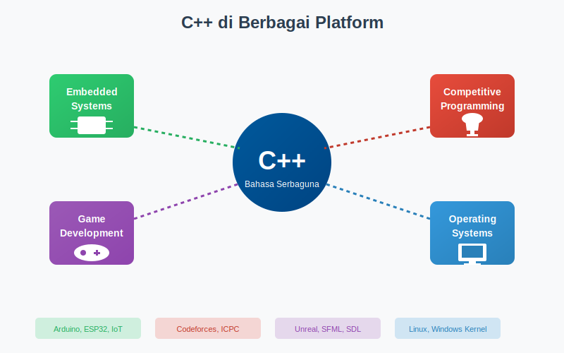
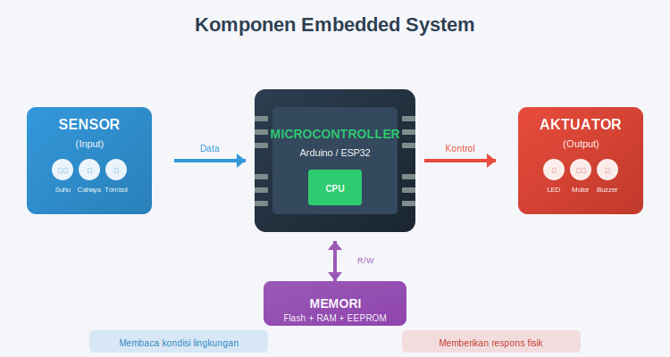
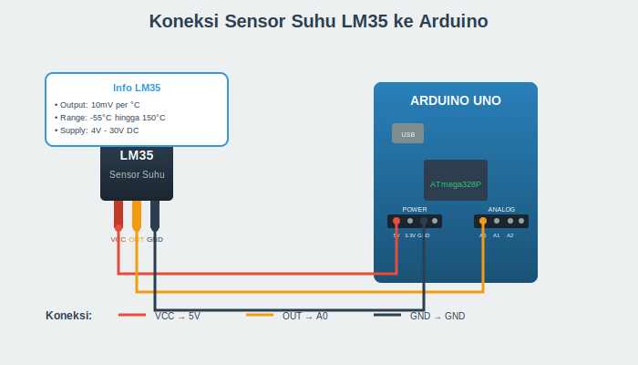
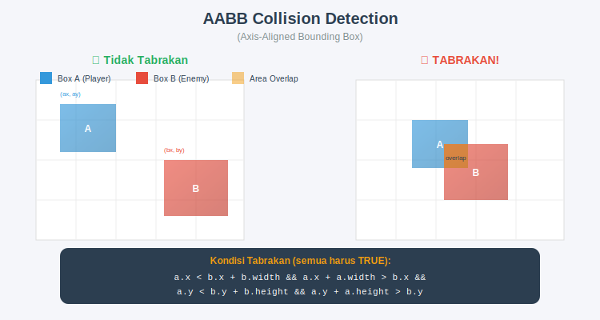
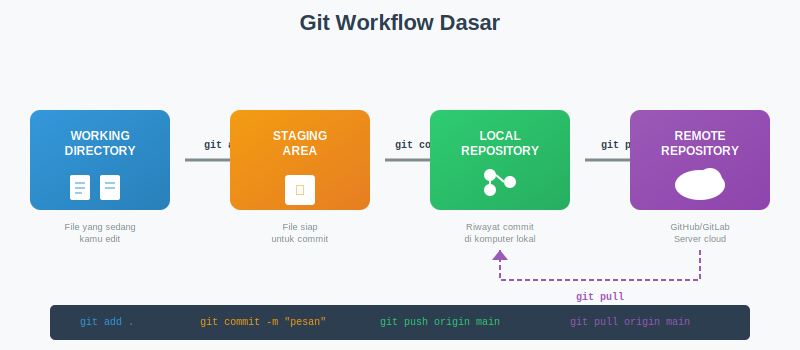

# BAB 15: C++ DI PLATFORM LAIN DAN REVIEW UAS

## 15.1 Pendahuluan

Selamat datang di pertemuan kelima belas, pertemuan terakhir sebelum Ujian Akhir Semester (UAS). Sepanjang empat belas pertemuan sebelumnya, Anda telah mempelajari dasar-dasar pemrograman C++ dengan fokus pada pengembangan aplikasi konsol menggunakan Code::Blocks. Namun, tahukah Anda bahwa C++ adalah salah satu bahasa pemrograman paling serbaguna yang digunakan di berbagai industri dan platform?

Bayangkan Anda memegang remote control televisi. Di dalam perangkat kecil itu terdapat microcontroller yang kemungkinan besar diprogram menggunakan C atau C++. Ketika Anda bermain video game AAA seperti Unreal Engine games, render grafis yang memukau itu diproses oleh kode C++. Saat Anda mengikuti kompetisi pemrograman online, sebagian besar peserta menggunakan C++ karena kecepatannya yang luar biasa. Bahkan sistem operasi yang Anda gunakan sehari-hari sebagian besar ditulis dalam C dan C++.

Pertemuan ini memiliki dua tujuan utama. Pertama, membuka wawasan Anda tentang berbagai domain aplikasi C++ di dunia nyata, mulai dari embedded systems, competitive programming, hingga game development. Kedua, mempersiapkan Anda menghadapi UAS dengan review komprehensif materi pertemuan 9 hingga 14. Dengan memahami keluasan aplikasi C++, diharapkan Anda semakin termotivasi untuk mendalami bahasa pemrograman yang powerful ini.



*Gambar 15.1: C++ digunakan di berbagai platform dan domain, mulai dari embedded systems, game development, competitive programming, hingga sistem operasi.*

## 15.2 C++ untuk Embedded Systems

### 15.2.1 Pengenalan Embedded Systems

Embedded systems atau sistem tertanam adalah sistem komputer khusus yang dirancang untuk menjalankan fungsi tertentu di dalam perangkat yang lebih besar. Berbeda dengan komputer desktop yang bersifat general-purpose, embedded systems fokus pada satu atau beberapa tugas spesifik dengan batasan sumber daya yang ketat.

Contoh embedded systems ada di mana-mana dalam kehidupan kita: mesin cuci modern, oven microwave, kunci pintu digital, sensor suhu ruangan, lampu lalu lintas, hingga sistem kontrol pesawat terbang. Semua perangkat ini memiliki kesamaan: mereka menjalankan program komputer untuk mengontrol fungsi hardware tertentu.

C++ sangat populer untuk pemrograman embedded karena beberapa alasan. Pertama, C++ memberikan kontrol langsung terhadap hardware melalui pointer dan manipulasi bit. Kedua, program C++ sangat efisien dalam penggunaan memori dan kecepatan eksekusi. Ketiga, C++ mendukung pemrograman berorientasi objek yang memudahkan pengorganisasian kode untuk sistem yang kompleks.



*Gambar 15.2: Komponen dasar embedded system terdiri dari microcontroller, sensor untuk input, aktuator untuk output, dan memori untuk menyimpan program.*

### 15.2.2 Platform Arduino

Arduino adalah platform open-source yang sangat populer untuk belajar embedded systems. Platform ini terdiri dari dua komponen utama: board hardware (papan mikrokontroler) dan software IDE untuk menulis dan mengunggah program. Arduino menggunakan bahasa pemrograman berbasis C++ yang disederhanakan, membuatnya ideal untuk pemula.

Board Arduino yang paling umum adalah Arduino Uno, yang menggunakan mikrokontroler ATmega328P. Board ini memiliki 14 pin digital input/output (6 di antaranya dapat digunakan sebagai PWM output), 6 pin analog input, koneksi USB untuk pemrograman, dan jack power. Dengan harga yang terjangkau dan dokumentasi yang melimpah, Arduino menjadi pilihan pertama bagi banyak hobbyist dan pelajar.

Struktur program Arduino berbeda dengan program C++ console yang biasa kita tulis. Program Arduino tidak memiliki fungsi `main()`. Sebagai gantinya, ada dua fungsi utama yang wajib ada: `setup()` dan `loop()`. Fungsi `setup()` dijalankan sekali ketika board dinyalakan atau di-reset, biasanya digunakan untuk inisialisasi. Fungsi `loop()` dijalankan berulang-ulang setelah `setup()` selesai, inilah tempat logika utama program berada.

```cpp
// Struktur dasar program Arduino
// Caption: Program Arduino memiliki struktur berbeda dari C++ console. 
// Fungsi setup() untuk inisialisasi dan loop() untuk logika utama yang berjalan terus-menerus.

void setup() {
    // Kode inisialisasi
    // Dijalankan sekali saat board menyala
    Serial.begin(9600);  // Inisialisasi komunikasi serial
}

void loop() {
    // Kode utama program
    // Dijalankan berulang-ulang selamanya
    Serial.println("Hello from Arduino!");
    delay(1000);  // Tunggu 1 detik
}
```

### 15.2.3 Digital I/O pada Arduino

Pin digital pada Arduino dapat dikonfigurasi sebagai input (untuk membaca sensor atau tombol) atau output (untuk mengontrol LED atau relay). Konfigurasi ini dilakukan menggunakan fungsi `pinMode()` di dalam `setup()`.

Untuk output digital, nilai yang dikirim adalah HIGH (5V atau 3.3V tergantung board) atau LOW (0V). Untuk input digital, Arduino membaca apakah pin menerima tegangan HIGH atau LOW. Konsep ini sederhana namun powerful, memungkinkan kontrol berbagai perangkat elektronik.

```cpp
// Program Blink LED - Hello World untuk Arduino
// Caption: Program ini membuat LED built-in pada Arduino berkedip setiap detik.
// Pin 13 biasanya terhubung ke LED built-in pada board Arduino Uno.

const int LED_PIN = 13;  // Pin LED built-in

void setup() {
    pinMode(LED_PIN, OUTPUT);  // Konfigurasi pin sebagai output
}

void loop() {
    digitalWrite(LED_PIN, HIGH);  // Nyalakan LED (tegangan HIGH)
    delay(1000);                   // Tunggu 1000ms (1 detik)
    digitalWrite(LED_PIN, LOW);   // Matikan LED (tegangan LOW)
    delay(1000);                   // Tunggu 1 detik
}
```

Program di atas adalah "Hello World" dalam dunia embedded systems. Meskipun sederhana, program ini mendemonstrasikan konsep fundamental: mengontrol hardware fisik melalui software.

### 15.2.4 Membaca Input dan Serial Communication

Input digital sering digunakan untuk membaca status tombol (push button). Ketika tombol ditekan, sirkuit tertutup dan pin membaca nilai tertentu. Serial communication memungkinkan Arduino berkomunikasi dengan komputer melalui kabel USB, sangat berguna untuk debugging.

```cpp
// Program membaca tombol dan menampilkan status via Serial
// Caption: Program ini membaca status tombol dan mengirimkan informasi ke komputer
// melalui Serial Monitor. Berguna untuk debugging dan interaksi dengan user.

const int BUTTON_PIN = 2;  // Pin untuk tombol
const int LED_PIN = 13;    // Pin LED built-in

void setup() {
    pinMode(BUTTON_PIN, INPUT_PULLUP);  // Input dengan resistor pull-up internal
    pinMode(LED_PIN, OUTPUT);
    Serial.begin(9600);  // Inisialisasi serial dengan baud rate 9600
    Serial.println("Sistem siap. Tekan tombol!");
}

void loop() {
    int buttonState = digitalRead(BUTTON_PIN);  // Baca status tombol
    
    if (buttonState == LOW) {  // LOW karena menggunakan pull-up
        digitalWrite(LED_PIN, HIGH);
        Serial.println("Tombol ditekan - LED menyala");
    } else {
        digitalWrite(LED_PIN, LOW);
        Serial.println("Tombol dilepas - LED mati");
    }
    
    delay(100);  // Delay kecil untuk debouncing sederhana
}
```

### 15.2.5 Analog Input untuk Sensor

Arduino Uno memiliki 6 pin analog input (A0-A5) yang dapat membaca tegangan dalam rentang 0-5V dan mengkonversinya menjadi nilai digital 0-1023 (resolusi 10-bit). Fitur ini memungkinkan pembacaan sensor analog seperti sensor suhu, cahaya, atau potensiometer.

```cpp
// Program membaca sensor suhu LM35
// Caption: Program ini membaca nilai analog dari sensor suhu LM35 dan mengkonversinya
// menjadi suhu dalam Celcius. Hasil ditampilkan di Serial Monitor.

const int TEMP_PIN = A0;  // Sensor terhubung ke pin A0

void setup() {
    Serial.begin(9600);
    Serial.println("Monitoring Suhu dengan LM35");
    Serial.println("===========================");
}

void loop() {
    int nilaiAnalog = analogRead(TEMP_PIN);  // Baca nilai 0-1023
    
    // Konversi ke tegangan (0-5V)
    float tegangan = nilaiAnalog * (5.0 / 1023.0);
    
    // LM35 menghasilkan 10mV per derajat Celcius
    float suhuCelcius = tegangan * 100.0;
    
    Serial.print("Nilai ADC: ");
    Serial.print(nilaiAnalog);
    Serial.print(" | Tegangan: ");
    Serial.print(tegangan, 3);
    Serial.print("V | Suhu: ");
    Serial.print(suhuCelcius, 1);
    Serial.println(" C");
    
    delay(1000);  // Update setiap 1 detik
}
```



*Gambar 15.3: Diagram koneksi sensor suhu LM35 ke Arduino. Sensor memiliki tiga kaki: VCC (5V), GND, dan Output yang terhubung ke pin analog.*

## 15.3 C++ untuk Competitive Programming

### 15.3.1 Apa itu Competitive Programming?

Competitive programming adalah olahraga pemikiran di mana peserta ditantang untuk menyelesaikan masalah algoritmik dalam waktu terbatas. Platform seperti Codeforces, LeetCode, HackerRank, dan Kattis menyediakan ribuan soal dengan berbagai tingkat kesulitan. Kompetisi pemrograman bergengsi seperti ACM ICPC (International Collegiate Programming Contest) dan IOI (International Olympiad in Informatics) telah melahirkan banyak programmer top dunia.

C++ menjadi bahasa favorit dalam competitive programming karena beberapa alasan. Pertama, C++ adalah bahasa tercepat di antara bahasa yang umum digunakan. Kedua, Standard Template Library (STL) menyediakan struktur data dan algoritma siap pakai. Ketiga, C++ memberikan kontrol penuh atas penggunaan memori, penting untuk optimasi program.

### 15.3.2 Fast I/O Techniques

Dalam competitive programming, input/output yang lambat dapat menyebabkan TLE (Time Limit Exceeded) meskipun algoritma sudah benar. C++ menyediakan beberapa teknik untuk mempercepat operasi I/O.

```cpp
// Template dasar competitive programming dengan fast I/O
// Caption: Template ini mengoptimalkan kecepatan input/output yang krusial
// dalam competitive programming. Perbedaannya bisa mencapai 10x lebih cepat.

#include <bits/stdc++.h>  // Header all-in-one (hanya untuk competitive programming!)
using namespace std;

int main() {
    // Matikan sinkronisasi dengan C stdio
    ios_base::sync_with_stdio(false);
    
    // Lepaskan tie antara cin dan cout
    cin.tie(NULL);
    
    // Untuk output lebih cepat lagi
    cout.tie(NULL);
    
    int n;
    cin >> n;
    
    vector<int> arr(n);
    for (int i = 0; i < n; i++) {
        cin >> arr[i];
    }
    
    // Proses data...
    
    // Gunakan '\n' bukan endl (endl flush buffer, lebih lambat)
    cout << "Hasil: " << n << '\n';
    
    return 0;
}
```

Penjelasan optimasi I/O di atas: fungsi `ios_base::sync_with_stdio(false)` mematikan sinkronisasi antara stream C++ dengan stream C, yang secara default aktif untuk kompatibilitas. Fungsi `cin.tie(NULL)` melepaskan pengikatan antara cin dan cout yang biasanya memastikan cout di-flush sebelum cin membaca input. Penggunaan `'\n'` daripada `endl` menghindari flush buffer yang tidak perlu.

### 15.3.3 Standard Template Library (STL)

STL adalah kekuatan utama C++ untuk competitive programming. Library ini menyediakan container (vector, set, map, queue, stack), algoritma (sort, binary_search, lower_bound), dan iterator yang sudah dioptimasi.

```cpp
// Demonstrasi penggunaan STL untuk competitive programming
// Caption: Program ini menunjukkan berbagai container dan algoritma STL yang sering
// digunakan dalam competitive programming untuk menyelesaikan masalah dengan efisien.

#include <bits/stdc++.h>
using namespace std;

int main() {
    ios_base::sync_with_stdio(false);
    cin.tie(NULL);
    
    // === VECTOR - Array dinamis ===
    vector<int> v = {5, 2, 8, 1, 9};
    
    // Sorting O(n log n)
    sort(v.begin(), v.end());  // v = {1, 2, 5, 8, 9}
    
    // Binary search O(log n) - harus sudah sorted
    bool found = binary_search(v.begin(), v.end(), 5);  // true
    
    // Lower bound - elemen pertama >= x
    auto it = lower_bound(v.begin(), v.end(), 5);
    int idx = it - v.begin();  // idx = 2
    
    // === SET - Elemen unik terurut ===
    set<int> s;
    s.insert(5);
    s.insert(2);
    s.insert(5);  // Diabaikan karena sudah ada
    // s = {2, 5}
    
    // === MAP - Key-value pairs ===
    map<string, int> freq;
    freq["apple"] = 3;
    freq["banana"] = 2;
    freq["apple"]++;  // freq["apple"] = 4
    
    // === PRIORITY QUEUE - Max heap ===
    priority_queue<int> maxHeap;
    maxHeap.push(3);
    maxHeap.push(7);
    maxHeap.push(1);
    int top = maxHeap.top();  // 7 (elemen terbesar)
    
    // Min heap
    priority_queue<int, vector<int>, greater<int>> minHeap;
    minHeap.push(3);
    minHeap.push(7);
    minHeap.push(1);
    int minTop = minHeap.top();  // 1 (elemen terkecil)
    
    cout << "Vector sorted: ";
    for (int x : v) cout << x << " ";
    cout << '\n';
    
    return 0;
}
```

### 15.3.4 Algoritma Klasik

Competitive programming menuntut pemahaman mendalam tentang algoritma klasik. Berikut beberapa contoh implementasi yang sering digunakan.

```cpp
// Implementasi Binary Search manual
// Caption: Binary search adalah algoritma pencarian O(log n) yang membagi
// ruang pencarian menjadi setengah pada setiap iterasi. Sangat efisien untuk data terurut.

#include <bits/stdc++.h>
using namespace std;

// Binary search untuk mencari posisi target dalam array terurut
int binarySearch(vector<int>& arr, int target) {
    int left = 0, right = arr.size() - 1;
    
    while (left <= right) {
        int mid = left + (right - left) / 2;  // Hindari overflow
        
        if (arr[mid] == target) {
            return mid;  // Ditemukan
        } else if (arr[mid] < target) {
            left = mid + 1;  // Cari di bagian kanan
        } else {
            right = mid - 1;  // Cari di bagian kiri
        }
    }
    
    return -1;  // Tidak ditemukan
}

// Two pointers technique untuk mencari dua angka dengan jumlah tertentu
pair<int, int> twoSum(vector<int>& arr, int target) {
    int left = 0, right = arr.size() - 1;
    
    while (left < right) {
        int sum = arr[left] + arr[right];
        
        if (sum == target) {
            return {left, right};
        } else if (sum < target) {
            left++;
        } else {
            right--;
        }
    }
    
    return {-1, -1};  // Tidak ditemukan
}

int main() {
    ios_base::sync_with_stdio(false);
    cin.tie(NULL);
    
    vector<int> arr = {1, 3, 5, 7, 9, 11, 13, 15};
    
    // Test binary search
    cout << "Posisi 7: " << binarySearch(arr, 7) << '\n';  // 3
    cout << "Posisi 6: " << binarySearch(arr, 6) << '\n';  // -1
    
    // Test two pointers
    auto [i, j] = twoSum(arr, 12);  // Cari dua angka dengan jumlah 12
    cout << "Two sum 12: indeks " << i << " dan " << j << '\n';  // 2 dan 4 (5+7=12)
    
    return 0;
}
```

### 15.3.5 Tips dan Strategi Competitive Programming

Berikut beberapa tips penting untuk sukses dalam competitive programming:

Pertama, kuasai kompleksitas waktu. Dalam kompetisi, biasanya ada batasan waktu 1-2 detik. Sebagai patokan, komputer modern dapat melakukan sekitar 10^8 operasi sederhana per detik. Jika n = 10^5, algoritma O(n^2) akan terlalu lambat, perlu O(n log n) atau lebih baik.

Kedua, perhatikan batasan memori. Biasanya 256MB hingga 512MB. Array integer dengan 10^7 elemen memakan sekitar 40MB. Hindari rekursi yang terlalu dalam karena dapat menyebabkan stack overflow.

Ketiga, baca soal dengan teliti. Banyak kesalahan terjadi karena salah memahami soal, bukan karena tidak bisa menyelesaikannya.

```cpp
// Contoh soal: mencari frekuensi elemen dalam array
// Caption: Program ini menunjukkan solusi tipikal competitive programming
// dengan input/output yang efisien dan penggunaan struktur data yang tepat.

#include <bits/stdc++.h>
using namespace std;

int main() {
    ios_base::sync_with_stdio(false);
    cin.tie(NULL);
    
    int n, q;
    cin >> n >> q;
    
    // Gunakan map untuk menghitung frekuensi O(n log n)
    map<int, int> freq;
    for (int i = 0; i < n; i++) {
        int x;
        cin >> x;
        freq[x]++;
    }
    
    // Jawab q query, masing-masing O(log n)
    while (q--) {
        int x;
        cin >> x;
        cout << freq[x] << '\n';  // 0 jika tidak ada
    }
    
    return 0;
}

/*
Contoh Input:
5 3
1 2 2 3 2
2
3
4

Contoh Output:
3
1
0
*/
```


*Gambar 15.4: Strategi menyelesaikan soal competitive programming: analisis kompleksitas, pilih algoritma yang tepat, implementasi dengan hati-hati, dan uji dengan berbagai kasus.*

## 15.4 C++ untuk Game Development

### 15.4.1 Mengapa C++ untuk Game?

Industri game menggunakan C++ secara luas karena beberapa alasan krusial. Pertama, performa adalah segalanya dalam game. Game modern memerlukan ratusan ribu perhitungan per frame untuk rendering grafis, simulasi fisika, dan AI. C++ memberikan kecepatan yang diperlukan untuk mencapai 60 FPS (frame per second) atau lebih.

Kedua, game engine terbesar ditulis dalam C++. Unreal Engine, yang digunakan untuk game AAA seperti Fortnite dan PUBG, ditulis dalam C++. Unity, meskipun menggunakan C# untuk scripting, core engine-nya juga C++. Bahkan engine custom yang digunakan studio besar seperti EA, Ubisoft, dan Rockstar berbasis C++.

Ketiga, C++ memberikan kontrol tingkat rendah yang diperlukan untuk optimasi performa. Developer dapat mengelola memori secara manual, mengakses hardware secara langsung, dan melakukan optimasi mikroskopis yang tidak mungkin di bahasa lain.

### 15.4.2 Konsep Game Loop

Setiap game memiliki struktur fundamental yang disebut game loop. Ini adalah loop tak terbatas yang terus berjalan selama game aktif, menangani input, memperbarui logika game, dan merender grafis. Konsep ini mirip dengan fungsi `loop()` pada Arduino.

```cpp
// Pseudocode Game Loop dasar
// Caption: Game loop adalah jantung dari setiap game. Tiga fase utama dijalankan
// berulang-ulang: proses input, update logika game, dan render ke layar.

#include <iostream>
using namespace std;

// Struktur data pemain sederhana
struct Player {
    float x, y;
    float velocityX, velocityY;
    int health;
    bool isAlive;
};

// Inisialisasi game
void initGame(Player& player) {
    player.x = 400.0f;  // Posisi awal X
    player.y = 300.0f;  // Posisi awal Y
    player.velocityX = 0.0f;
    player.velocityY = 0.0f;
    player.health = 100;
    player.isAlive = true;
}

// Proses input dari keyboard/controller
void processInput(Player& player, char input) {
    switch (input) {
        case 'w': player.velocityY = -5.0f; break;  // Atas
        case 's': player.velocityY = 5.0f; break;   // Bawah
        case 'a': player.velocityX = -5.0f; break;  // Kiri
        case 'd': player.velocityX = 5.0f; break;   // Kanan
        case ' ': /* Aksi tembak */ break;
        case 'q': player.isAlive = false; break;    // Quit
    }
}

// Update logika game
void updateGame(Player& player, float deltaTime) {
    // Update posisi berdasarkan kecepatan
    player.x += player.velocityX * deltaTime;
    player.y += player.velocityY * deltaTime;
    
    // Batasi posisi dalam layar (800x600)
    if (player.x < 0) player.x = 0;
    if (player.x > 800) player.x = 800;
    if (player.y < 0) player.y = 0;
    if (player.y > 600) player.y = 600;
    
    // Reset velocity (untuk input berbasis frame)
    player.velocityX = 0;
    player.velocityY = 0;
}

// Render game ke layar (disederhanakan)
void renderGame(const Player& player) {
    // Dalam game sesungguhnya, ini akan menggambar ke layar
    cout << "\r";  // Carriage return untuk update di tempat
    cout << "Player di (" << player.x << ", " << player.y << ") ";
    cout << "HP: " << player.health << "   ";
    cout.flush();
}

// Demonstrasi konsep (tidak dapat dijalankan sepenuhnya di console)
int main() {
    Player player;
    initGame(player);
    
    cout << "Game Loop Demo (konsep)" << endl;
    cout << "Gunakan W/A/S/D untuk bergerak, Q untuk keluar" << endl;
    
    // Dalam game nyata, ini adalah loop tak terbatas
    // dengan timing yang presisi
    float deltaTime = 0.016f;  // ~60 FPS
    
    while (player.isAlive) {
        // 1. Process Input
        char input;
        cout << "\nInput: ";
        cin >> input;
        processInput(player, input);
        
        // 2. Update Game Logic
        updateGame(player, deltaTime);
        
        // 3. Render
        renderGame(player);
    }
    
    cout << "\nGame Over!" << endl;
    return 0;
}
```

### 15.4.3 Library SFML untuk Game 2D

SFML (Simple and Fast Multimedia Library) adalah library C++ yang populer untuk membuat game 2D. SFML menyediakan modul untuk grafis, audio, input, dan networking. Dibandingkan SDL, SFML lebih object-oriented dan memiliki API yang lebih C++-friendly.

```cpp
// Contoh window dan sprite dengan SFML (pseudocode konseptual)
// Caption: SFML menyederhanakan pembuatan game 2D dengan menyediakan class
// untuk window, sprite, input, dan rendering. Kode ini adalah template dasar.

/*
NOTE: Kode ini memerlukan instalasi SFML library.
Compile dengan: g++ game.cpp -lsfml-graphics -lsfml-window -lsfml-system
*/

#include <SFML/Graphics.hpp>

int main() {
    // Buat window 800x600 pixel
    sf::RenderWindow window(sf::VideoMode(800, 600), "Game Pertama Saya");
    
    // Load texture (gambar) untuk player
    sf::Texture playerTexture;
    if (!playerTexture.loadFromFile("player.png")) {
        return -1;  // Error loading texture
    }
    
    // Buat sprite dari texture
    sf::Sprite player;
    player.setTexture(playerTexture);
    player.setPosition(400.f, 300.f);  // Posisi tengah layar
    
    // Variabel untuk kecepatan
    float speed = 200.f;  // 200 pixel per detik
    
    // Clock untuk delta time
    sf::Clock clock;
    
    // Game loop
    while (window.isOpen()) {
        // Hitung delta time
        float deltaTime = clock.restart().asSeconds();
        
        // 1. Process Events (input)
        sf::Event event;
        while (window.pollEvent(event)) {
            if (event.type == sf::Event::Closed) {
                window.close();
            }
        }
        
        // 2. Update - Gerakan dengan keyboard
        if (sf::Keyboard::isKeyPressed(sf::Keyboard::W)) {
            player.move(0.f, -speed * deltaTime);
        }
        if (sf::Keyboard::isKeyPressed(sf::Keyboard::S)) {
            player.move(0.f, speed * deltaTime);
        }
        if (sf::Keyboard::isKeyPressed(sf::Keyboard::A)) {
            player.move(-speed * deltaTime, 0.f);
        }
        if (sf::Keyboard::isKeyPressed(sf::Keyboard::D)) {
            player.move(speed * deltaTime, 0.f);
        }
        
        // 3. Render
        window.clear(sf::Color::Black);  // Hapus layar dengan warna hitam
        window.draw(player);              // Gambar sprite player
        window.display();                 // Tampilkan ke layar
    }
    
    return 0;
}
```

### 15.4.4 Konsep Dasar Game

Selain game loop, ada beberapa konsep penting dalam pengembangan game:

**Collision Detection** adalah proses mendeteksi apakah dua objek dalam game bersentuhan. Untuk objek persegi (rectangle), deteksi sederhana dapat dilakukan dengan membandingkan koordinat:

```cpp
// Collision detection sederhana untuk rectangle
// Caption: AABB (Axis-Aligned Bounding Box) collision detection adalah teknik
// paling sederhana untuk mendeteksi tabrakan antara dua objek persegi.

struct Rectangle {
    float x, y;          // Posisi (pojok kiri atas)
    float width, height; // Ukuran
};

bool checkCollision(const Rectangle& a, const Rectangle& b) {
    // AABB Collision Detection
    return (a.x < b.x + b.width &&
            a.x + a.width > b.x &&
            a.y < b.y + b.height &&
            a.y + a.height > b.y);
}

// Penggunaan
int main() {
    Rectangle player = {100.f, 100.f, 50.f, 50.f};
    Rectangle enemy = {130.f, 120.f, 40.f, 40.f};
    
    if (checkCollision(player, enemy)) {
        cout << "TABRAKAN! Player terkena damage!" << endl;
    } else {
        cout << "Aman, tidak ada tabrakan." << endl;
    }
    
    return 0;
}
```



*Gambar 15.5: AABB Collision Detection memeriksa apakah dua bounding box saling overlap dengan membandingkan koordinat X dan Y dari kedua objek.*

## 15.5 Development Tools dan Build Systems

### 15.5.1 IDE dan Debugging

Sepanjang kuliah ini, Anda telah menggunakan Code::Blocks sebagai IDE utama. Code::Blocks menyediakan fitur debugging yang powerful untuk membantu menemukan dan memperbaiki bug dalam program.

Fitur debugging utama Code::Blocks meliputi breakpoints (titik henti), step-by-step execution (eksekusi baris per baris), watches (pemantau variabel), dan call stack inspection. Untuk menggunakan debugger, Anda perlu mengkompilasi program dalam mode Debug, bukan Release.

```cpp
// Program untuk demonstrasi debugging
// Caption: Program ini sengaja memiliki bug untuk latihan debugging.
// Gunakan breakpoint dan watches untuk menemukan masalah.

#include <iostream>
using namespace std;

int hitungFaktorial(int n) {
    if (n < 0) return -1;  // Error handling
    if (n <= 1) return 1;
    
    int hasil = 1;
    for (int i = 2; i <= n; i++) {  // Bug: seharusnya i <= n
        hasil *= i;
    }
    return hasil;
}

int main() {
    // Pasang breakpoint di sini untuk mulai debugging
    int angka = 5;
    
    cout << "Menghitung faktorial dari " << angka << endl;
    
    int faktorial = hitungFaktorial(angka);
    
    cout << angka << "! = " << faktorial << endl;
    
    // Test dengan beberapa nilai
    for (int i = 0; i <= 10; i++) {
        cout << i << "! = " << hitungFaktorial(i) << endl;
    }
    
    return 0;
}
```

### 15.5.2 Build Systems dengan CMake

Untuk proyek yang lebih besar, mengelola kompilasi secara manual menjadi tidak praktis. CMake adalah build system yang sangat populer untuk proyek C++. CMake menggunakan file konfigurasi bernama `CMakeLists.txt` yang mendeskripsikan struktur proyek.

```cmake
# CMakeLists.txt - Contoh konfigurasi sederhana
# Caption: File CMakeLists.txt mendeskripsikan cara membangun proyek.
# CMake akan menghasilkan Makefile atau project file IDE secara otomatis.

# Versi minimum CMake yang diperlukan
cmake_minimum_required(VERSION 3.10)

# Nama proyek
project(ProyekKu VERSION 1.0)

# Standar C++ yang digunakan
set(CMAKE_CXX_STANDARD 17)
set(CMAKE_CXX_STANDARD_REQUIRED True)

# Executable dari source files
add_executable(program_ku 
    main.cpp 
    modul1.cpp 
    modul2.cpp
)

# Jika menggunakan library eksternal (contoh: SFML)
# find_package(SFML 2.5 COMPONENTS graphics window system REQUIRED)
# target_link_libraries(program_ku sfml-graphics sfml-window sfml-system)
```

Langkah penggunaan CMake:
1. Buat folder `build` dalam direktori proyek
2. Jalankan `cmake ..` dari dalam folder build
3. Jalankan `make` (Linux/Mac) atau buka project file yang dihasilkan (Windows)

### 15.5.3 Version Control dengan Git

Git adalah sistem version control yang memungkinkan Anda melacak perubahan kode, berkolaborasi dengan orang lain, dan mengelola berbagai versi proyek. Hampir semua developer profesional menggunakan Git.

```bash
# Perintah Git dasar
# Caption: Command line Git untuk inisialisasi, commit, dan push ke repository remote.

# Inisialisasi repository Git baru
git init

# Tambahkan file ke staging area
git add main.cpp
git add .  # Tambahkan semua file

# Commit perubahan dengan pesan
git commit -m "Implementasi fitur login"

# Hubungkan ke repository remote (GitHub)
git remote add origin https://github.com/username/repo.git

# Push ke remote
git push -u origin main

# Pull perubahan dari remote
git pull origin main

# Lihat status file
git status

# Lihat history commit
git log --oneline
```



*Gambar 15.6: Workflow Git dasar: working directory → staging area → local repository → remote repository.*

## 15.6 Review Materi untuk UAS

Bagian ini merangkum materi penting dari pertemuan 9 hingga 14 yang akan diujikan dalam UAS. Gunakan bagian ini sebagai panduan belajar dan evaluasi pemahaman Anda.

### 15.6.1 Array (Pertemuan 9-10)

Array adalah struktur data yang menyimpan elemen-elemen dengan tipe data sama secara berurutan di memori. Array sangat penting karena menjadi dasar untuk banyak struktur data lain dan algoritma.

**Konsep Kunci:**
Array 1D dideklarasikan dengan menentukan tipe data, nama, dan ukuran dalam kurung siku. Indeks array dimulai dari 0 hingga n-1. Array 2D (matriks) adalah array dari array, diakses dengan dua indeks [baris][kolom].

```cpp
// Review: Operasi array fundamental
// Caption: Kode ini merangkum operasi-operasi dasar array yang harus dikuasai
// untuk UAS: deklarasi, inisialisasi, traversal, dan operasi matriks.

#include <iostream>
using namespace std;

int main() {
    // === ARRAY 1D ===
    
    // Deklarasi dan inisialisasi
    int nilai[5] = {85, 90, 78, 92, 88};
    
    // Traversal dengan for loop
    cout << "Nilai: ";
    for (int i = 0; i < 5; i++) {
        cout << nilai[i] << " ";
    }
    cout << endl;
    
    // Mencari nilai terbesar
    int maksimum = nilai[0];
    for (int i = 1; i < 5; i++) {
        if (nilai[i] > maksimum) {
            maksimum = nilai[i];
        }
    }
    cout << "Nilai tertinggi: " << maksimum << endl;
    
    // === ARRAY 2D (MATRIKS) ===
    
    // Deklarasi matriks 3x3
    int matriks[3][3] = {
        {1, 2, 3},
        {4, 5, 6},
        {7, 8, 9}
    };
    
    // Traversal matriks
    cout << "\nMatriks:" << endl;
    for (int i = 0; i < 3; i++) {
        for (int j = 0; j < 3; j++) {
            cout << matriks[i][j] << " ";
        }
        cout << endl;
    }
    
    // Jumlah diagonal utama
    int sumDiagonal = 0;
    for (int i = 0; i < 3; i++) {
        sumDiagonal += matriks[i][i];
    }
    cout << "Jumlah diagonal: " << sumDiagonal << endl;
    
    return 0;
}
```

**Algoritma Penting:**
Linear search untuk mencari elemen secara sekuensial, bubble sort untuk mengurutkan array dengan membandingkan elemen berdekatan, dan operasi matriks seperti penjumlahan dan transpose.

### 15.6.2 Pointer dan Memori Dinamis (Pertemuan 11)

Pointer adalah variabel yang menyimpan alamat memori dari variabel lain. Memahami pointer adalah kunci untuk memahami bagaimana C++ mengelola memori dan bagaimana data dilewatkan dalam program.

**Konsep Kunci:**
Operator `&` mendapatkan alamat variabel, operator `*` mendereference pointer (mengakses nilai di alamat yang ditunjuk). Alokasi memori dinamis menggunakan `new` dan `delete`.

```cpp
// Review: Pointer dan memori dinamis
// Caption: Contoh ini merangkum konsep pointer dan alokasi memori dinamis
// yang sering keluar dalam soal UAS.

#include <iostream>
using namespace std;

int main() {
    // === POINTER DASAR ===
    
    int angka = 42;
    int* ptr = &angka;  // ptr menyimpan alamat angka
    
    cout << "Nilai angka: " << angka << endl;
    cout << "Alamat angka: " << &angka << endl;
    cout << "Nilai ptr: " << ptr << endl;
    cout << "Nilai yang ditunjuk ptr: " << *ptr << endl;
    
    // Mengubah nilai melalui pointer
    *ptr = 100;
    cout << "Setelah *ptr = 100, angka = " << angka << endl;
    
    // === POINTER DAN ARRAY ===
    
    int arr[5] = {10, 20, 30, 40, 50};
    int* pArr = arr;  // Nama array adalah pointer ke elemen pertama
    
    cout << "\nTraversal array dengan pointer:" << endl;
    for (int i = 0; i < 5; i++) {
        cout << "arr[" << i << "] = " << *(pArr + i) << endl;
    }
    
    // === MEMORI DINAMIS ===
    
    // Alokasi variabel tunggal
    int* dinamis = new int;
    *dinamis = 999;
    cout << "\nNilai dinamis: " << *dinamis << endl;
    delete dinamis;  // WAJIB! Cegah memory leak
    
    // Alokasi array dinamis
    int n = 5;
    int* arrDinamis = new int[n];
    
    for (int i = 0; i < n; i++) {
        arrDinamis[i] = (i + 1) * 10;
    }
    
    cout << "Array dinamis: ";
    for (int i = 0; i < n; i++) {
        cout << arrDinamis[i] << " ";
    }
    cout << endl;
    
    delete[] arrDinamis;  // Gunakan delete[] untuk array
    
    return 0;
}
```

**Hal Penting:**
Selalu pasangkan `new` dengan `delete` dan `new[]` dengan `delete[]`. Pointer yang tidak diinisialisasi (dangling pointer) berbahaya. Setelah `delete`, set pointer ke `nullptr`.

### 15.6.3 Struct, Union, dan Typedef (Pertemuan 12)

Struct memungkinkan kita mengelompokkan data berbagai tipe menjadi satu kesatuan. Ini adalah langkah awal menuju pemrograman berorientasi objek.

**Konsep Kunci:**
Struct diakses dengan operator titik (.) untuk variabel biasa dan operator panah (->) untuk pointer ke struct. Union mirip struct tapi semua anggota berbagi memori yang sama. Typedef membuat alias untuk tipe data.

```cpp
// Review: Struct dan penggunaannya
// Caption: Contoh komprehensif struct yang mencakup deklarasi, akses member,
// array of struct, dan nested struct yang sering muncul di UAS.

#include <iostream>
#include <string>
using namespace std;

// Definisi struct Mahasiswa
struct Mahasiswa {
    string nama;
    string nim;
    float ipk;
    int semester;
};

// Struct dengan nested struct
struct Alamat {
    string jalan;
    string kota;
    int kodePos;
};

struct Karyawan {
    string nama;
    int id;
    double gaji;
    Alamat alamat;  // Nested struct
};

// Fungsi dengan parameter struct
void tampilkanMahasiswa(const Mahasiswa& mhs) {
    cout << "Nama: " << mhs.nama << endl;
    cout << "NIM: " << mhs.nim << endl;
    cout << "IPK: " << mhs.ipk << endl;
    cout << "Semester: " << mhs.semester << endl;
}

int main() {
    // === STRUCT DASAR ===
    
    Mahasiswa mhs1;
    mhs1.nama = "Budi Santoso";
    mhs1.nim = "2024001";
    mhs1.ipk = 3.75;
    mhs1.semester = 3;
    
    // Inisialisasi langsung
    Mahasiswa mhs2 = {"Ani Wijaya", "2024002", 3.90, 3};
    
    tampilkanMahasiswa(mhs1);
    cout << endl;
    
    // === ARRAY OF STRUCT ===
    
    Mahasiswa kelas[3] = {
        {"Andi", "001", 3.5, 2},
        {"Budi", "002", 3.7, 2},
        {"Cici", "003", 3.9, 2}
    };
    
    cout << "Daftar Mahasiswa:" << endl;
    for (int i = 0; i < 3; i++) {
        cout << i+1 << ". " << kelas[i].nama 
             << " (IPK: " << kelas[i].ipk << ")" << endl;
    }
    
    // === POINTER KE STRUCT ===
    
    Mahasiswa* pMhs = &mhs1;
    cout << "\nAkses via pointer:" << endl;
    cout << "Nama: " << pMhs->nama << endl;  // Gunakan -> untuk pointer
    cout << "IPK: " << pMhs->ipk << endl;
    
    // === NESTED STRUCT ===
    
    Karyawan k1;
    k1.nama = "John Doe";
    k1.id = 12345;
    k1.gaji = 10000000;
    k1.alamat.jalan = "Jl. Merdeka No. 17";
    k1.alamat.kota = "Jakarta";
    k1.alamat.kodePos = 12345;
    
    cout << "\nData Karyawan:" << endl;
    cout << "Nama: " << k1.nama << endl;
    cout << "Alamat: " << k1.alamat.jalan << ", " 
         << k1.alamat.kota << " " << k1.alamat.kodePos << endl;
    
    return 0;
}
```

### 15.6.4 Object-Oriented Programming (Pertemuan 13)

OOP adalah paradigma pemrograman yang mengorganisir kode ke dalam objek yang menggabungkan data (atribut) dan fungsi (method) yang beroperasi pada data tersebut.

**Konsep Kunci:**
Class adalah blueprint/cetakan untuk membuat objek. Encapsulation menyembunyikan detail implementasi dengan access modifier (public, private, protected). Constructor dijalankan saat objek dibuat, destructor saat objek dihancurkan.

```cpp
// Review: OOP dasar
// Caption: Contoh class lengkap dengan constructor, destructor, encapsulation,
// dan method yang mendemonstrasikan konsep OOP fundamental.

#include <iostream>
#include <string>
using namespace std;

class BankAccount {
private:
    string nomorRekening;
    string namaPemilik;
    double saldo;
    
public:
    // Constructor default
    BankAccount() {
        nomorRekening = "";
        namaPemilik = "";
        saldo = 0.0;
    }
    
    // Constructor dengan parameter
    BankAccount(string noRek, string nama, double saldoAwal) {
        nomorRekening = noRek;
        namaPemilik = nama;
        saldo = (saldoAwal >= 0) ? saldoAwal : 0;
    }
    
    // Destructor
    ~BankAccount() {
        cout << "Akun " << nomorRekening << " ditutup." << endl;
    }
    
    // Getter
    double getSaldo() const {
        return saldo;
    }
    
    string getNama() const {
        return namaPemilik;
    }
    
    // Method setor
    void setor(double jumlah) {
        if (jumlah > 0) {
            saldo += jumlah;
            cout << "Setor " << jumlah << " berhasil. Saldo: " << saldo << endl;
        } else {
            cout << "Jumlah setor tidak valid!" << endl;
        }
    }
    
    // Method tarik
    bool tarik(double jumlah) {
        if (jumlah > 0 && jumlah <= saldo) {
            saldo -= jumlah;
            cout << "Tarik " << jumlah << " berhasil. Saldo: " << saldo << endl;
            return true;
        } else {
            cout << "Penarikan gagal!" << endl;
            return false;
        }
    }
    
    // Method info
    void tampilkanInfo() const {
        cout << "=========================" << endl;
        cout << "No. Rekening: " << nomorRekening << endl;
        cout << "Pemilik: " << namaPemilik << endl;
        cout << "Saldo: Rp " << saldo << endl;
        cout << "=========================" << endl;
    }
};

int main() {
    // Membuat objek dengan constructor berparameter
    BankAccount akun1("1234567890", "Budi Santoso", 1000000);
    
    akun1.tampilkanInfo();
    
    akun1.setor(500000);
    akun1.tarik(200000);
    akun1.tarik(2000000);  // Gagal, saldo tidak cukup
    
    cout << "\nSaldo akhir: " << akun1.getSaldo() << endl;
    
    return 0;
}  // Destructor dipanggil otomatis di sini
```

### 15.6.5 File Handling dan Exception Handling (Pertemuan 14)

File handling memungkinkan program menyimpan dan membaca data secara permanen. Exception handling menangani error yang mungkin terjadi saat runtime.

**Konsep Kunci:**
`ifstream` untuk membaca file, `ofstream` untuk menulis file, `fstream` untuk keduanya. Selalu periksa apakah file berhasil dibuka. Exception ditangkap dengan blok `try-catch`.

```cpp
// Review: File handling dan exception handling
// Caption: Contoh lengkap operasi file dan penanganan exception
// yang merupakan materi krusial untuk UAS.

#include <iostream>
#include <fstream>
#include <string>
#include <stdexcept>
using namespace std;

// Struktur untuk data
struct Produk {
    int id;
    string nama;
    double harga;
    int stok;
};

// Fungsi tulis ke file
void simpanProduk(const string& namaFile, Produk produk[], int jumlah) {
    ofstream file(namaFile);
    
    if (!file.is_open()) {
        throw runtime_error("Gagal membuka file untuk menulis!");
    }
    
    for (int i = 0; i < jumlah; i++) {
        file << produk[i].id << ","
             << produk[i].nama << ","
             << produk[i].harga << ","
             << produk[i].stok << endl;
    }
    
    file.close();
    cout << "Data berhasil disimpan ke " << namaFile << endl;
}

// Fungsi baca dari file
int bacaProduk(const string& namaFile, Produk produk[], int maxJumlah) {
    ifstream file(namaFile);
    
    if (!file.is_open()) {
        throw runtime_error("Gagal membuka file untuk membaca!");
    }
    
    int count = 0;
    string line;
    
    while (getline(file, line) && count < maxJumlah) {
        // Parse CSV sederhana
        size_t pos1 = line.find(',');
        size_t pos2 = line.find(',', pos1 + 1);
        size_t pos3 = line.find(',', pos2 + 1);
        
        produk[count].id = stoi(line.substr(0, pos1));
        produk[count].nama = line.substr(pos1 + 1, pos2 - pos1 - 1);
        produk[count].harga = stod(line.substr(pos2 + 1, pos3 - pos2 - 1));
        produk[count].stok = stoi(line.substr(pos3 + 1));
        
        count++;
    }
    
    file.close();
    return count;
}

// Fungsi dengan exception handling
double hitungDiskon(double harga, double persen) {
    if (persen < 0 || persen > 100) {
        throw invalid_argument("Persentase diskon harus 0-100!");
    }
    if (harga < 0) {
        throw invalid_argument("Harga tidak boleh negatif!");
    }
    return harga * (1 - persen / 100);
}

int main() {
    // === FILE HANDLING ===
    
    Produk inventory[10] = {
        {1, "Laptop", 15000000, 5},
        {2, "Mouse", 250000, 20},
        {3, "Keyboard", 500000, 15}
    };
    
    try {
        // Simpan ke file
        simpanProduk("produk.txt", inventory, 3);
        
        // Baca dari file
        Produk loaded[10];
        int jumlah = bacaProduk("produk.txt", loaded, 10);
        
        cout << "\nData yang dibaca:" << endl;
        for (int i = 0; i < jumlah; i++) {
            cout << loaded[i].id << " | " 
                 << loaded[i].nama << " | Rp "
                 << loaded[i].harga << " | Stok: "
                 << loaded[i].stok << endl;
        }
        
    } catch (const runtime_error& e) {
        cerr << "Error: " << e.what() << endl;
    }
    
    // === EXCEPTION HANDLING ===
    
    cout << "\n=== Test Exception Handling ===" << endl;
    
    try {
        double hargaAsli = 100000;
        double diskon = 20;
        
        double hargaDiskon = hitungDiskon(hargaAsli, diskon);
        cout << "Harga setelah diskon " << diskon << "%: Rp " << hargaDiskon << endl;
        
        // Ini akan throw exception
        hitungDiskon(100000, 150);  // Invalid: > 100%
        
    } catch (const invalid_argument& e) {
        cerr << "Argument Error: " << e.what() << endl;
    } catch (const exception& e) {
        cerr << "General Error: " << e.what() << endl;
    }
    
    cout << "\nProgram selesai dengan normal." << endl;
    
    return 0;
}
```

## 15.7 Latihan Soal Review UAS

### Soal Level 1: Array dan Pointer

**Soal 1.1**
Buatlah fungsi yang menerima array integer dan mengembalikan selisih antara nilai maksimum dan minimum dalam array tersebut.

**Soal 1.2**
Diberikan array 2D yang merepresentasikan nilai ujian mahasiswa (baris = mahasiswa, kolom = mata kuliah). Hitunglah rata-rata nilai untuk setiap mahasiswa dan tampilkan mahasiswa dengan rata-rata tertinggi.

**Soal 1.3**
Tulis program yang menggunakan pointer untuk menukar nilai dua variabel tanpa menggunakan variabel temporary tambahan.

### Soal Level 2: Struct dan OOP

**Soal 2.1**
Buatlah struct `Buku` dengan atribut judul, penulis, tahunTerbit, dan harga. Implementasikan fungsi untuk mencari buku termahal dari array of Buku.

**Soal 2.2**
Buatlah class `Lingkaran` dengan atribut jariJari (private) dan method untuk menghitung luas dan keliling. Implementasikan constructor, getter, dan setter yang memvalidasi jari-jari tidak boleh negatif.

**Soal 2.3**
Modifikasi class dari soal 2.2 untuk mendukung operasi membandingkan dua lingkaran berdasarkan luasnya (lingkaran mana yang lebih besar).

### Soal Level 3: Integrasi

**Soal 3.1**
Buatlah program pengelolaan data karyawan yang dapat menyimpan dan membaca data dari file. Data karyawan meliputi ID, nama, jabatan, dan gaji. Program harus menggunakan struct dan mendukung operasi tambah, tampil, dan cari karyawan.

**Soal 3.2**
Implementasikan program yang membaca matriks dari file, melakukan operasi transpose, dan menyimpan hasilnya ke file baru. Gunakan exception handling untuk menangani error file tidak ditemukan atau format data tidak valid.

## 15.8 Ringkasan Bab

Pada bab terakhir ini, kita telah mempelajari penerapan C++ di berbagai platform dan domain yang berbeda dari pemrograman console yang biasa kita pelajari. Embedded systems dengan Arduino menunjukkan bagaimana C++ digunakan untuk mengontrol hardware fisik dengan struktur program yang unik berupa fungsi `setup()` dan `loop()`. Competitive programming mendemonstrasikan pentingnya optimasi kode dan penguasaan algoritma untuk menyelesaikan masalah dengan efisien. Game development memperkenalkan konsep game loop dan library multimedia seperti SFML.

Selain itu, kita juga mempelajari tools profesional seperti CMake untuk build system dan Git untuk version control, yang merupakan standar industri dalam pengembangan software. Debugging yang efektif menggunakan IDE seperti Code::Blocks juga merupakan skill penting yang akan membantu Anda dalam menyelesaikan masalah coding.

Bagian review UAS merangkum materi-materi krusial dari pertemuan 9 hingga 14, meliputi array, pointer, struct, OOP, file handling, dan exception handling. Pemahaman yang solid terhadap konsep-konsep ini adalah kunci sukses dalam UAS dan juga dalam perjalanan Anda sebagai programmer.

C++ adalah bahasa yang powerful dan serbaguna. Dengan dasar yang telah Anda bangun sepanjang kuliah ini, Anda memiliki fondasi yang kuat untuk mengeksplorasi berbagai jalur karir di dunia teknologi, baik itu embedded systems, game development, competitive programming, atau pengembangan software skala enterprise.

## 15.9 Referensi

Deitel, P., & Deitel, H. (2016). *C++ How to Program* (10th ed.). Pearson.

Halim, S., & Halim, F. (2013). *Competitive Programming 3*. Lulu.

Dawson, M. (2014). *Beginning C++ Through Game Programming* (4th ed.). Cengage Learning.

Margolis, M. (2011). *Arduino Cookbook* (2nd ed.). O'Reilly Media.

Martin, R. C. (2008). *Clean Code: A Handbook of Agile Software Craftsmanship*. Prentice Hall.

SFML Documentation. (n.d.). Retrieved from https://www.sfml-dev.org/documentation/

Arduino Reference. (n.d.). Retrieved from https://www.arduino.cc/reference/en/

CMake Documentation. (n.d.). Retrieved from https://cmake.org/documentation/

## 15.10 Soal Latihan

1. Jelaskan perbedaan struktur program Arduino dengan program C++ console biasa. Mengapa Arduino tidak menggunakan fungsi `main()`?

2. Apa yang dimaksud dengan analog input pada Arduino? Berikan contoh sensor yang menggunakan analog input dan jelaskan bagaimana cara membacanya.

3. Mengapa C++ menjadi bahasa pilihan utama dalam competitive programming? Sebutkan minimal tiga alasan beserta penjelasannya.

4. Jelaskan fungsi dari `ios_base::sync_with_stdio(false)` dan `cin.tie(NULL)` dalam competitive programming.

5. Apa yang dimaksud dengan game loop? Jelaskan tiga fase utama dalam game loop dan fungsi masing-masing.

6. Jelaskan perbedaan antara SFML dan SDL sebagai library untuk game development. Apa kelebihan dan kekurangan masing-masing?

7. Apa itu CMake dan mengapa diperlukan untuk proyek C++ yang besar? Jelaskan komponen dasar file CMakeLists.txt.

8. Sebutkan dan jelaskan tiga perintah Git dasar yang paling sering digunakan dalam pengembangan software.

## 15.11 Soal Diskusi

1. Menurut Anda, dalam kondisi apa sebaiknya menggunakan C++ dibandingkan bahasa tingkat tinggi seperti Python untuk pengembangan aplikasi? Diskusikan trade-off antara kecepatan development dan kecepatan eksekusi.

2. Embedded systems semakin banyak digunakan dalam kehidupan sehari-hari (IoT). Apa implikasi keamanan dan privasi dari banyaknya perangkat yang terhubung ini? Bagaimana programmer dapat berkontribusi untuk membuat embedded systems yang lebih aman?

3. Competitive programming sering dikritik karena tidak merepresentasikan pekerjaan software engineer yang sebenarnya. Setuju atau tidak setuju? Argumenkan pendapat Anda dengan mempertimbangkan skill apa saja yang dikembangkan melalui competitive programming.

4. Game development modern melibatkan tim besar dengan berbagai spesialisasi. Sebagai programmer C++, bagaimana Anda akan berkolaborasi dengan designer, artist, dan sound engineer? Apa tantangan komunikasi yang mungkin muncul?

5. Dengan semakin banyaknya bahasa pemrograman baru (Rust, Go, Swift), apakah menurut Anda C++ akan tetap relevan dalam 10-20 tahun ke depan? Dalam domain apa C++ akan tetap dominan dan domain apa yang mungkin diambil alih bahasa lain?

6. Version control seperti Git sangat penting dalam pengembangan software kolaboratif. Namun, konflik merge sering menjadi masalah. Diskusikan strategi dan best practices untuk meminimalkan konflik dalam tim development.

7. Mempersiapkan diri untuk UAS, strategi belajar apa yang menurut Anda paling efektif untuk mata kuliah pemrograman? Bagaimana cara terbaik menyeimbangkan antara memahami teori dan praktik coding?

8. Setelah menyelesaikan mata kuliah Dasar-Dasar Pemrograman ini, jalur spesialisasi apa yang paling menarik minat Anda (embedded systems, competitive programming, game development, web development, data science, dll.)? Jelaskan alasan dan rencana Anda untuk mengembangkan skill di bidang tersebut.
